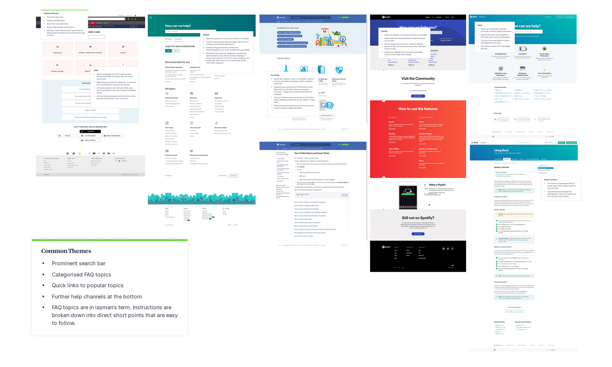

### Background

The product we were working on was a visual AI and AR-powered tool to assist users in problem identification, and specifically the task in hand was to improve the experience of Customer Support Center.

The Customer Delight(CD) team deals with the customer complaints and operational issues on a daily basis. As we were getting more clients, it soon became clear that we needed to improve our Customer Support Center channel to deal with the number of customer enquiries/day. There was a clear need to implement strategies to educate the customers to deal with their pain points by new methods.

### Pain points

1. Limited FAQ

2. No central location to house FAQ

3. No way for users to raise tickets/enquiries

### Problem statement

The existing FAQ is outdated. As the number of our users grow, there was a need to have an  informative Help Centre that manages FAQ as well as enquiry tickets, which doesn’t exist currently. The goal is to reduce the number of tickets in General Enquiry, so CD Team can focus on solving more complex, technical issues, e.g. account inaccessible etc.

### Research

#### UX Mood board

I started with a UX mood board to look at some help centres of the world’s most user-centric, visually powered companies. 

The common themes are: 

- Prominent search bar

- Categorised FAQ topics

- Quick links to popular topics

- Further help channels at the bottom

- FAQ topics presented in layman terms

- Instructions are broken down into direct short points that are easy to follow

- Screengrabs/Short videos to explain solutions visually

#### Design process

Working closely with the Tech Team, I collated the new FAQ content and created the IA for the Help Centre as well as the enquiry ticket submission flows. Since this was the first time we were setting this up, we wanted to get into the minds of our users and think of all scenarios where an issue may rise, so we ran a “Design Thinking” exercise to proceed with this.

We created a laundry-list of items to create content on and then classified it as L1  (Needed, common issue) and L2 (Needed, not a common issue).

L1 items consisted of -

- Troubleshooting
- “As a presenter, how do I..”
- Basic Features

The approach to UI designing was to support and articulate the content in the best possible manner. For providing the most efficiency, personalisation was brought into picture.

There was a signed-out default content also articulated, majorly FAQs and a rounded idea of the product.

The next steps involved working with developers to test it out for internal user-testing of inital design, and to finally roll it out.