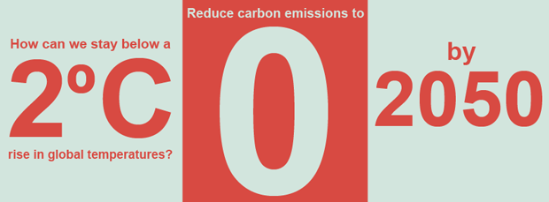
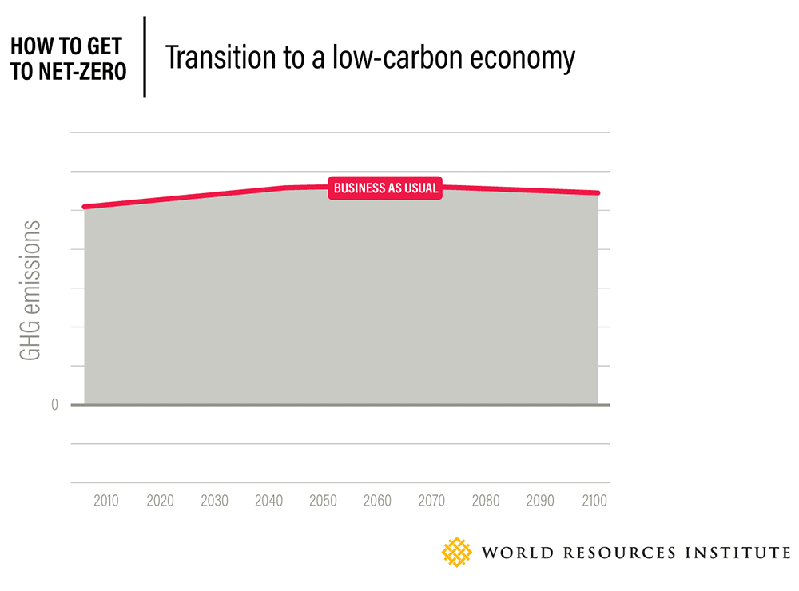

A growing number of countries are setting targets to end their contribution to global warming, leading to devising national strategies focusing on becoming carbon-free.
 
Carbon neutrality has been a trending term for some time and while it's not a new concept, the idea of an organization taking responsibility for its own carbon footprint is resonating strongly since the signing of the Paris Agreement. 

Since consumers are increasingly becoming aware about climate change and are starting to look at the environmental impact of their consumption, we're able to see more businesses and organizations focusing on this, leading to the term "carbon neutral" popping up in product descriptions and marketing campaigns.

## What exactly is carbon neutrality ?

So according to the [NZ Commerce Commission’s Guidelines For Carbon Claims](https://www.commscouncil.nz/downloads/Guidelines_for_carbon_claims_and_the_Fair_Trading_Act.pdf), there is no universally accepted definition of carbon neutrality. 
However, the basic premise is as follows: 

Measure emissions, reduce them, and offset what’s remaining.

Net calculated carbon emissions equal zero.

This means that net-zero refers to reaching zero through reduction and offsetting. It does not mean that no emissions were produced in the activity, because let's be honest, that is impossible to achieve.

## Can carbon neutrality be achieved by mid-century?

An [IPCC report](https://www.climatecommuniques.com/Trillion-Tonne-Communique.aspx)(Intergovernmental Panel on Climate Change) states that we need to limit carbon emissions to around one trillion tonnes. Around half of this has been emitted already. At current rates, we will be able to pass the one trillion cap in around 30 years. This means the transition to a virtually zero-emissions economy has to start now and be substantially in place by mid-century.

This timeframe seems very ambitious, to be quite honest but it is technically feasible. This will require an unprecedented level of political will and cooperation – but something that is unprecedented doesn't mean that it is impossible.

## How to become carbon neutral?

We need to realise that it’s not only the fossil fuel-intensive sectors that are facing challenges in reducing their emissions. The land use sector is also increasingly under the spotlight. The nature of the food, agriculture and land use system means it is trickier to navigate political, ideological, social and environmental issues to put pressure on these sectors to reduce their emissions. 

The growing need is to also focus on ramping up the ‘carbon absorption’ capabilities of forests, soil, oceans and other natural sinks means it is time to address this challenge. It is a simple scientific fact that if the global goal of carbon neutrality by 2050 is to be met, the role of natural carbon sinks (forests, oceans and soils, as well as other natural systems that ‘suck up’ carbon) will play an increasingly important role.

There are two main ways we can achieve carbon neutrality by 2050 -

1. **Shifting to 100% renewable energy**
Utilising energy efficiency at scale to reduce energy demand, and simultaneously decentralising and decarbonising power generation and transmission so renewables can make a stable contribution

2. **Using technologies that result in ‘negative emissions’. **
This concept has emerged recently that describes the possible use of bio-energy with carbon capture and storage (BECCS) to produce negative carbon dioxide emissions by combining biomass use with geologic carbon capture and storage (CCS). 
In layman terms, crops absorb carbon dioxide as they grow. When burned in a power station, the resulting carbon dioxide is captured and then buried in wells, mines or geologic formations underground or under the sea. Electricity generation using BECCS then becomes a net absorber of CO2 rather than a net emitter.
From what we understand, in theory, achieving carbon neutrality could be easier if this process could be scaled up cost-effectively. But in real life there are very few projects that show this to be the case. 
The enormous amount of land and water needed to grow crops to burn could also worsen food and water security, especially for the world’s poor – adding to climate injustice.

### Focus on auto industry
  
Some of the more significant attempts at carbon neutrality have been made in electricity and transportation which, combined, make up almost half of global emissions, according to the [Centre for Climate and Energy Solutions](https://www.c2es.org/content/international-emissions/), a non-profit organisation forging practical solutions to climate change. 

As transport is increasingly electrified through battery or hydrogen-powered vehicles, electricity generation will play an even bigger role in decarbonisation. Although the automotive industry still faces a fair bit of challenges particularly with EVs particularly pricing and developing a robust charging infrastructure. 

## China's 2060 carbon neutral plan

China became the newest addition to the list of 30 countries who have vowed to become carbon neutral (these countries account for about 43 per cent of the world's carbon dioxide emissions from the burning of fossil fuels.) 

Considering that China has been the world's biggest carbon emitter for a while, far greater than the US and European nations combined, there are many experts who believe this is going to significantly affect the world's carbon emissions. China released the equivalent of 10 billion tons of carbon dioxide, or CO2, into the atmosphere in 2018, according to the Global Carbon Project that tracks emissions worldwide. That was almost twice as much as the United States and three times as much as the European Union.
 
We look at China specifically, who says that it has good reasons for its high numbers, calling out foreign nations for outsourcing their polluting industries to China, or to developing countries. China agrees to it for the sole purpose of earning money and leading better lives. And only after citizens protesting this - No air pollution, no carbon emissions, no plastic, did China take a stand
 
The uplifting thing is China is also the biggest investor in green energy.

[China has taken a lead in renewable energy](https://www.forbes.com/sites/dominicdudley/2019/01/11/china-renewable-energy-superpower/#bc218a0745a2) and is now the world’s largest producer, exporter and installer of solar panels, wind turbines, batteries and electric vehicles. 

And experts say that the transition to renewable sources of energy wouldn't be easy as they will need to be able to generate 2x or 3x times than current numbers, to reach that goal of carbon neutrality.
 
The goal will be a challenge for China, which actually makes me wonder about how China may possibly go about this decision.

1. **Does China plan to phase out coal?**

To achieve carbon neutrality by 2060, China would need to stop burning coal. 

China heavily relies on coal, one of the most carbon-intensive fossil fuels for its electricity production and it is a major ask for a country that is [home to half of the world’s coal power capacity](https://climateactiontracker.org/countries/china/). 

2. **Does the target apply to all greenhouse gas emissions?**

China has pledged “carbon neutrality” rather than “climate neutrality” (What is climate neutrality ?), a less stringent target than that adopted by the EU and UK. It takes much longer to get to climate neutrality than carbon neutrality, usually around 10-20 years as non-CO2 emissions are hard to eliminate and need to be offset by removing carbon dioxide from the air.

3. **Will this goal also be applicable to the “belt and road” investments?**

China is also financing a quarter of coal plants under development in other countries through its ground-breaking “belt and road” initiative, with a capacity of 102 GW.

If stricter implementation at home country leads to outsourcing of pollution, it will undermine the climate benefits. On the other hand, if China encourages other countries to join the net zero club, it will further amplify them.

4. **Will Chinese cities and companies set net zero targets?**

It is fairly optimistic to believe that a national-level policy could act as an important catalyst for companies and cities, encouraging them to declare their own net zero targets.

Earlier this year many Chinese energy and industry companies launched a [“Zero Carbon China” initiative](https://zero-carbon.org.cn/) which signalled confidence to the government to adopt the carbon neutrality target.

If China manages to fulfill Xi's goal, it could prevent 0.4 to 0.7 degrees (0.2 to 0.4 degrees Celsius) further warming for the world, according to "very rough estimates" by MIT management professor [John Sterman](https://www.business-standard.com/article/current-affairs/china-s-jinping-top-global-emitter-aims-to-go-carbon-neutral-by-2060-120092300101_1.html), who models and tracks emission reductions and pledges with Climate Interactive

Achieving carbon neutrality by 2050 is ambitious but consistent with what climate scientists are saying: To peak global emissions by around 2020 and reduce them to net zero by around mid-century, to have a good chance of staying below the globally agreed limit of a 2 degree Celsius rise in global temperatures. 

Any higher and the impacts are devastating, especially for the poor and most vulnerable who have contributed little to global warming and stand to lose the most.
