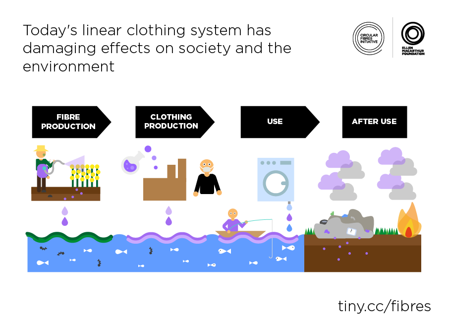

 

"How much clean water does it take to make one pair of jeans?" - That is the question that made me delve into the textile industry and the disastrous effect it has on the environment. I was baffled, I am one of those people who won't repeat their fancy clothes, after wearing them once. I felt responsible for all the times I had splurged money on discount sales. By the way, the answer to that question is 3,781 litres, from the production of the cotton to the final product. To bring some context, a person needs an average of 20 litres, to take care of basic hygiene and food needs ([according to WHO](https://www.who.int/water_sanitation_health/emergencies/qa/emergencies_qa5/en/)), which would mean this amount of water could help the water scarcity crisis, and help alleviate the needs of 189 people. 

    

Moreover this whole process leads to emission of around [33.4 kilograms of carbon equivalent](https://www.bbc.com/future/article/20200310-sustainable-fashion-how-to-buy-clothes-good-for-the-climate#:~:text=Jeans%20manufacturer%20Levi%20Strauss%20estimates,in%20the%20average%20US%20car.).

Let's deep dive and look at the whole process of manufacturing clothes - 

    

### RAW MATERIALS 
If you take any item out of your wardrobe and check the materials tag, I bet you will find a significant amount of synthetic materials like Polyester,etc. in it. Let's go on to a detailed analysis of the major materials found in clothes -

1. COTTON

 Cotton is the most common natural fibre, used to make clothing which accounts for more than 33% of all fibres that is found in textiles. From the outside, it may seem like anything natural isn't necessarily bad, but that's not entirely true. The concerning thing is, cotton is also a very thirsty crop, it requires around 2700 Litres of water - what one person drinks in two and a half years - which is used to make one cotton shirt.
	
It's considered even more problematic because it consumes huge quantities of land, pesticides and fertilisers to produce. 

	

2. POLYESTER

 Polyester production has a lower environmental impact than natural fibres production in terms of water usage and wastewater. However, the energy required to produce polyester (125 MJ of energy per kilogram produced) and the greenhouse gas emitted (14.2 kg of CO 2 per kilogram produced) make it a high-impact process. 
	
Factories who are producing polyester without proper wastewater treatment systems has the potential to release dangerous substances including antimony, cobalt, manganese salts, sodium bromide and titanium dioxide into the environment. 

	
3. CELLUSLOSICS

 Viscose, lyocell, acetate and modal are all examples of man-made cellulosics. As a plant-based fiber, man-made cellulosics have the potential to be a more sustainable choice because they are renewable.  It’s safe to say that of the man-made cellulosic options, lyocell is considered best in class as it is made in a closed-loop system that recycles most of the solvent used so that no chemicals enter the waste stream. 

### PROCESSING AND GARMENT PRODUCTION
More than 1,900 chemicals are used in the production of clothing, of which 165 has been classified by EU as hazardous to health or the environment.
The textile industry uses high volumes of water throughout its operational activities, from the washing of fibres to bleaching, dyeing and washing of finished products. On average, approximately 200 litres of water is required to produce l kg of textiles. Moreover, this whole process generates large volumes of wastewater that contains a wide variety of chemicals. The chemicals that cause concern when left in the environment can show subsequent characteristics: durability (not easily degraded), bio-accumulation (collect in living organisms) and poisonousness. 

In most of the countries in which garments are produced, untreated toxic-water from textiles factories are dumped directly into the rivers. This wastewater contains toxic substances such as lead, mercury, and arsenic, among others, which is obviously extremely harmful for the aquatic life and the health of the millions people living by those rivers banks. Moreover, fish, shellfish and other aquatic creatures ingest the microplastics from these cloth fabrics, which accumulate, concentrating toxins up the food chain. These can enter human food chains and pass into the wider environment.

Because of limited transparency in the early value chain and a plethora of different chemicals with varying levels of hazardous impact, it is difficult to choose a proxy that captures impacts ranging from pollution of waterways to the health effects of airborne chemicals. 

    

### TRANSPORT AND DISTRIBUTION
This step isn't very concerning, by only accounting for 2 % of the climate-change impact of the industry, as most large players have optimised the flow of goods. However, this stage is also characterised by waste generated through packaging, tags, hangers and bags, as well as by a large proportion of products that never reach consumers as the unsold leftovers are thrown away.

### END OF LIFE

In India, the end of the line for our garments is limited to charity, which eventually fill up local landfills, where they release methane. 

Ironically, instead of recycling the fabrics and textiles that are over-loading India's landfills, the country is importing huge quantities of second-hand clothing from countries all over the world. In 2015, India emerged as the world’s largest importer of worn clothing and used textiles. US, UK and Germany were the top 3 exporters. 

As a resort, we look into recycling, but that also faces a number of issues, meaning that globally, only less than one percent of all materials that are used in clothing is recycled back into clothing This reflects a lack of technologies for sorting the collected clothing, separating blended fibres. This is why most clothes are recycled mechanically; they are cut up and shredded, which means that the fibres are shorter, lower quality and lose 75 % of their value. They are therefore not usually used to manufacturing new clothes, but are rather 'down-cycled' into insulation material, wiping cloths or mattress stuffing, which is still a better step to ensure minimal wastage. Technologies for chemical recycling that produce virgin fibres of a high quality are available for polyester and nylon and are slowly becoming available, but are not yet fully economically viable, for cotton and blends.

As mentioned earlier, we know that most clothes now are either polyester or part polyester, we are still a long way from ‘closing the loop’ - it's a pain. The majority of recycled polyester yarn and fabrics comes from recycled plastic – rPET – in particular from plastic bottles. This seems a more environmentally sustainable solution to virgin polyester – [it uses between 30 and 50 per cent less energy, reduces the need for primary extraction of crude oil and cuts the amount disposed in landfills](https://www.commonobjective.co/article/fibre-briefing-polyester). But then again, each time plastic is reheated for recycling it degrades, so there's a constraint on recycling it indefinitely (though researchers and start-up businesses are developing some innovative ideas and solutions to this). 

The base colour of the plastic chips from the recycled plastic can make dyeing more difficult, so more dye and more water are needed – although inconsistent coloration can still occur.  WHat's good about polyester also causes problems later on - polyester can be blended with other fibres but it causes problems with recycling. Of all the polyester produced each year, more gets used in poly-cotton blends than in 100 per cent polyester fabric. It is not currently possible to commercially separate poly-cotton and recycle the constituent fibres, although there are some innovative developments in this area. Most poly-cotton fabrics that do enter recycling, rather than just being landfilled, get [‘downcycled’](https://www.oberk.com/packaging-crash-course/downcycling-temp).

## THE SOLUTION?

First let's answer - **What does sustainable clothing even mean?**
This term essentially means that the materials used to make the final clothing is maybe organic, biodegradable, eco-friendly, recycled, upcycled, ethical and/or promotes fair trade.

There are three ways to look at this - What can companies do? What can we, as individuals do? What can the government do ?

Various ways to address these issues have been proposed, including developing new business models for clothing rental and changing consumer behavior that focuses more on recylcing and re-using.

1. Slow fashion

 In the  world of everyone running after tech companies, 'Fast Fashion' was the saviour for the retail industry. This was after a long time of witnessing no innovation in the industry. Don't get me wrong, this is a brilliant concept, but it grew too fast, too soon, without anyone to regulate the companies. 

On the other side is slow fashion, an attempt to convince consumers to buy fewer clothes of better quality and to keep them for a longer time. The philosophy includes reliance on trusted supply chains, traditional crafting techniques, small-scale production and using local materials. It calls for a change in the economic model, towards selling fewer clothes. 

	
	
2. Improved collection and recycling

 Producers and importers can be made legally responsible for ensuring that used clothes are reused or recycled, with companies either organising their own programmes or contributing financially to an accredited collectively responsible organisation. Like H&M runs a voluntary collection scheme to accept used clothes of any brand, regardless of whether they are still usable or not, in their shops in return for a small reward.
	
Regulatory bodies or the government can step in and intervene to push companies to take that step. France is the only EU Member State to have an EPR law for clothes, in place since 2006. 

	
3. Fashion as a service

 Principles of the sharing economy can be used by new business models could increase the number of wears of particular item. Some brands already offer clothes as a service – leasing their clothes instead of selling them – taking their example from already well-established services of renting wedding and special occasion wear, protective clothes and newer services of renting maternity and baby clothes. 

Other businesses operate clothing subscription services, which involves consumers paying a monthly fee to rent a fixed number of garments at a time, enabling them to change their wardrobe frequently without buying new clothes. Ex - Krate, Sugar Box etc. 

	
### Sustainable clothing brands
Sustainable brands in a way, is a bit of an oxymoron. 

**To be sustainable in an actually meaningful way, the best thing to do is buying shop second hand/thrift, repair old clothes, to basically buy only what you need.** 

But I don't disappoint, brands who are ethically sourcing and producing clothes in a way that leads to a decrease in CO2 production, waste, water usage, is still better than most brands (not H&M's Conscious line, it's widely accused of greenwashing).  How to make sustainable fashion affordable? Well, you can't.

**So why is sustainable clothing expensive?** 

    

For a variety of reasons, but I'll try to explain this briefly. Two major cost buckets include - cost of fabric and cost of labour. As we have discussed above, if companies want to produce fibres, they have to invest heavily to ensure minimal wastage and reduce pollution, while also ensuring fair wage to their farmers and weavers. (You may have heard about the infamous [Rana Plaza factory collapse](https://en.wikipedia.org/wiki/2013_Dhaka_garment_factory_collapse) or about [Zara's factory working conditions and how it's workers are under-paid](https://www.cbc.ca/news/business/zara-inditex-workers-still-unpaid-1.4414831). Also, it's [response to the pandemic](https://www.wionews.com/world/zara-steps-into-another-controversy-workers-in-myanmar-fired-for-demanding-masks-297512) has been extremely disappointing.) 
	
There's a concept called "Economies of scale", which basically means the more you buy, the cheaper something is. So bigger companies like Zara can pay less for materials - even sustainable ones - because they're buying in bulk. But ethical brands are usually smaller, and can't take advantage of this concept.
	
Affordability is a massive block for accessible sustainable clothing, and if you want lower prices you're going to need to lower production costs which is what makes fashion so unethical and exploitative in the first place.
	
**Fun fact: Expensive clothing is not always sustainable, but sustainable clothing is always expensive**
	
Following is a list of sustianable fashion brands in India -

1. [Doodlage](https://doodlage.in/)
2. [The Summer House](https://thesummerhouse.in/)
3. [Venn](https://www.wearvenn.com/#) (Hella expensive, but they have a thrift store, worth checking out)
4. [Ninety Percent](https://ninetypercent.com/) (UK brand, but ships to India)
5. [Nool By Hand](https://noolbyhand.com/)
6. [KaSha](https://ka-shaindia.com/)
7. [No nasties](https://www.nonasties.in/)
8. [Anokhi](https://www.anokhi.com/)
9. [Upasana](https://www.upasana.in/)
10. [Pomogrenade](https://www.pomogrenade.com/)

Almost all of the brands I have mentioned here, religiously engage in recycling and downcycling extensively and/or engage in fair trade practices.

Here, find a curated [list of brands](https://www.reddit.com/r/ethicalfashion/comments/aqvexd/2019_master_list_for_ethical_fashion_brands/) created by people around the globe. 

(*Compiling this list took a long time, and if I was a consumer looking to buy a product, I think having a specialized, easy-to-use platform will really help me to find and compare ethical fashion brands on the internet -  *Notes down business idea* *)

Making a personal commitment to only shop for sustainable clothes is not a concession, but rather a way of living your values, creating more individuality and uniqueness in your wardrobe. As more people make the choice to put their money into independent, sustainable, ethical, or secondhand fashion brands rather than fast fashion, the fashion industry’s major players will eventually realize they need to change.

