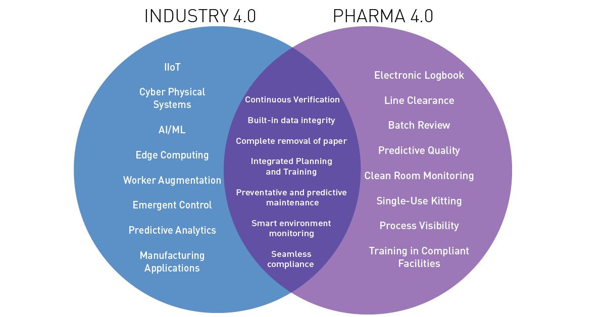
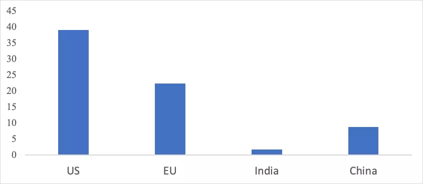

Since some time, the pharmaceutical supply chain has been struggling to cope. Companies rely on China heavily for manufacturing or for sourcing raw materials, and since global trade is suffering with stagnation, so has the pharmaceutical industry, which is also why countries around the world are making this their number 1 priority to manufacture locally, as much as they possibly can.

### API dependence on China

In India particularly, where the pharma industry is responsible for supplying over 50% of the global demand for various vaccines. According to a report about the Indian pharma industry, sourcing and procurement of **APIs (active pharmaceutical ingredients (APIs) and key starting materials (KSMs)** is a crucial part of the strategic plan to combat the COVID-19 pandemic. 

A major portion of the APIs for generic drug manufacturing across the globe are sourced from countries like India and China. To give some context, these 2 nations account for about 80% of the chemicals used to make drugs sold in Europe. And the glaring problem that arose was the fact that, Indian manufacturers rely heavily on APIs from China for the production of their medicine formulations, procuring around 70 percent from China, who is the top global producer and exporter of APIs, by volume.

The impact of the SARS-CoV-2 coronavirus outbreak, exposed the dependency of the pharma sector on China for its API procurement. The disrupted supply chain along with the increased restrictions on exports due to manpower shortages in China’s manufacturing plants, had a devastating effect. Supplies were impacted by the disruption of logistic and transportation systems, restricting access and movement of products to and from ports. 

Prior to 1991, the Indian pharmaceutical industry only imported 0.3% of its API requirements from China; then globalisation came into picture which led to a rise in large-scale formulation manufacturing prompted the increase in API procurement from China. 

The primary driver towards this choice was the **low cost of production.**

Currently, the Indian pharma and medical manufacturing firms have taken a hit and have fallen to [50-60% of their capacity](https://www.moneycontrol.com/news/business/pharma-companies-capacity-utilisation-stood-at-50-60-till-may-17-report-5281371.html), transport and shipping, and a labour shortage as migrant workers returned to their villages for lockdown, shipment costs increased two folds for cargo containers and around 4 times more for air freights.

Many experts from the pharmaceutical industry and NITI Aayog suggested that **fostering the approvals of pharmaceutical infrastructure development, obtaining clearance from the environment department to convert brownfield units, alongwith a separate financial scheme and providing tax exemptions and subsidies** for the development and promotion of the pharmaceutical industry hubs could all be beneficial in tackling this crisis. The govt. announced production linked incentive (PLI) schemes to incentivise the production of APIs, but it is just not possible for every company to get benefited as there are various provisions which will be taken into consideration on priority, like, companies involved in backward integration, new age technology adoption etc. The government wants companies to innovate and adopt new technologies.

### Technologies that will help companies fight the pandemic
1. **Using digital technologies for quality control**

Implementing advanced analytics and automation for quality control, can reduce manual errors and improve quality, thus increasing productivity by 30-40%, according to [this study](https://www.mckinsey.com/industries/pharmaceuticals-and-medical-products/our-insights/digitization-automation-and-online-testing-the-future-of-pharma-quality-control).

Pharma companies sit on a wealth of data, usually locked away in different technical and organizational silos. Some are already linking and mining their data sets to improve their pipelines, products, and strategies, but there still remains a huge opportunity to create further value. 

A great example of this digital transformation is [Cipla’s API manufacturing plant](https://www.expresscomputer.in/industries/pharma/how-cipla-is-embedding-digital-into-its-business-planning-and-execution/35007/) in Kurukambh, India, which has fully embraced the power of digital technology.

This includes using real time data and tools like advanced analytics to identify KPIs, which then provides insights, for making strategic decisions. Use of digital information management systems, is helping in automating material flow and accurately capture cost-information with a paperless workflow. Moreover, they are also embracing the use of augmented reality and virtual reality technologies for employee training and plant maintenance. 

2. **Embracing IT services to boost manufacturing**

The pharmaceutical industry has the reputation of being cautious about implementing new technology and slow to make changes. This conservatism is more or less due to regulatory requirements, to prove that any process modifications will not have a detrimental effect on product quality.

Research shows that [investing in IT](https://www.semanticscholar.org/paper/Information-Technology-Investments-and-Export-of-A-Bhat/b51a4d25798001368685103f5a0d19e20a8c2e2b) can, for example, boost the export performance of pharma firms. For Indian pharma firms that invest in building digital capabilities, exports make up 45% of sales, on average. For those that are digital followers rather than digital leaders, and invest less in new technology, exports make up only 28% of sales, on average.

Digitalisation in manufacturing can help raise productivity and output, which will positively help in boosting exports. Digital platforms can provide better access to new markets through online sales channels and digital marketing. Plus, digital inventory management can further use valuable customer data in business models and can strengthen customer relationships through direct and quick communication.

3. **Investing in Research & Development**

While observing the patenting activity in the pharma sector, it’s clear that India accounts for less than 2% of global pharmaceutical patents, significantly lower than China (at 8.75%), the U.S. (at 40% ) and the EU (at 22%).

Growth in this area could be driven by a renewed appetite for business-risks, and a better approach to the research and development environment. Seeking uniformity between products produced in different states will be a helpful step, plus a step taken in  reskilling the India pharma workforce through new work incentives, training and resources will be fruitful. Being able to intelligently search vast data sets of patents, scientific publications, and clinical trials data should, in theory, help accelerate the discovery of new drugs by enabling researchers to examine previous results of tests.

A noteworthy example to look into is -  [Lupin](https://www.qlik.com/us/company/press-room/press-releases/1206-lupin-pharmaceuticals-prescribes-qlik-for-healthier-decision-making), which is now using data science and analytics almost everywhere, including research and development, sales, finance, IT, manufacturing, quality and human resources. 

The coronavirus pandemic has [accelerated its adoption of digitalization](https://cio.economictimes.indiatimes.com/news/strategy-and-management/covid-19-will-increase-digitisation-in-pharma-firms-lupin-cio/76417037), with the firm now digitizing access control systems through facial recognition and temperature measurements, while also using an online medium for training its employees.

Firms need to invest in digital innovation to make services more personalized, physicians and patients more engaged, decisions more data driven and business practices more immediate. The industry and government leaders have to work hand-in-hand actively to maximize productivity gains and create employment opportunities to overcome the economic and social impacts of COVID-19 crisis. 
