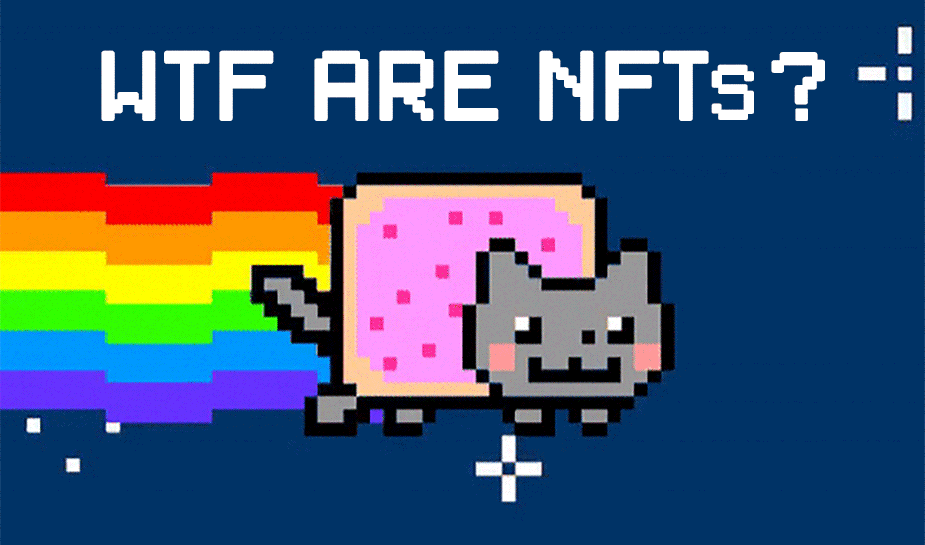
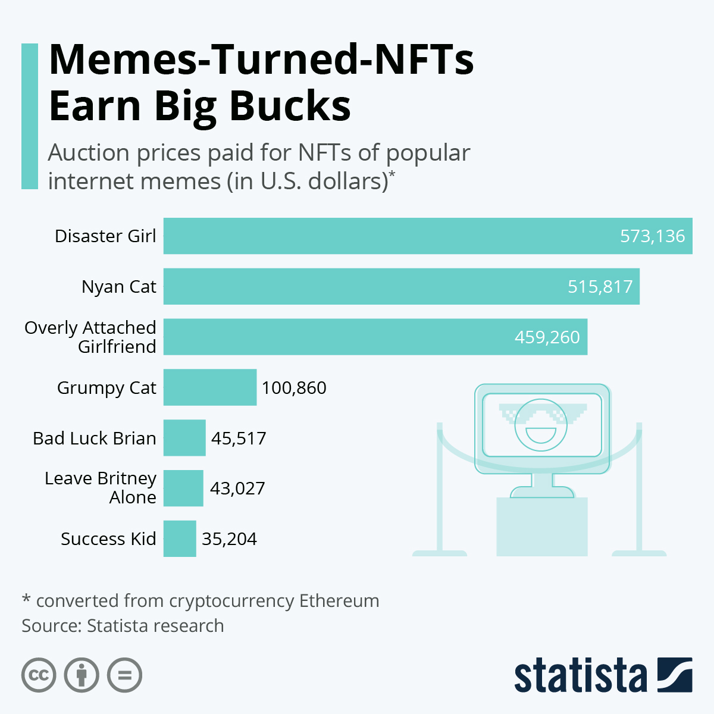
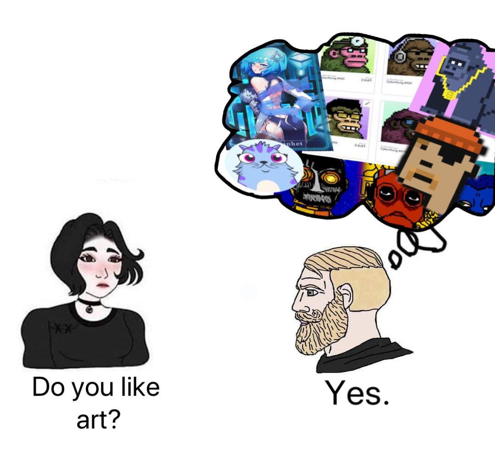

So, Nyan cat's gif here seemed like a perfect way to start this article, and if you didn't already know the Nyan's cat NFt sold for around 300 ETH recently. And that opened the road to the "Meme Economy".

With the rise in popularity of Non-fungible Tokens (NFT) that happened this year, I decided to research and make this extensive guide in order to introduce this new growing market to those who may not be familiar with it, with that said let's start.

## What exactly is a Non-Fungible Token or NFT?

A non-fungible token (NFT) is a unique, individual token existing on a blockchain such as Ethereum. Unlike cryptocurrencies like bitcoin, each NFT token contains unique data meaning non-fungible tokens are not interchangeable with each other. This makes the greatly different from their fungible counterparts.

A good example here is a dollar - if you and I both have a dollar - we can swap dollars and it wouldn’t matter, neither of us lose/win, i.e., they are equal. Whereas, with NFTs, these are unique tokens, meaning if we both have an NFT, mine could be a Pokemon trading card and yours could be your birth certificate- obviously we cannot exchange these two >equally. Therefore making our tokens non-fungible.

## A little bit of history

NFTs are a thing [since 2012](https://medium.com/@Andrew.Steinwold/the-history-of-non-fungible-tokens-nfts-f362ca57ae10), developers experimented with the technology over the years but the first projects that got exposure and found their way to the mainstream were CryptoKitties (you could adopt, raise, and trade virtual cats) and CryptoPunks (you could bought unique digital characters), since then there was a big progress in the NFTs space and lately you hear about it on every crypto related place and even on art and music magazines.

Dragon, the [most expensive CryptoKitty](https://www.cryptokitties.co/kitty/896775) today priced 600 ETH (~ 1.1mn USD)

The [most expensive CryptoPunk](https://www.one37pm.com/nft/art/most-expensive-nft-sales), recently sold for 800 ETH (~ 1.5mn USD)

NFT in the headlines

[NBA Top Shot](https://nbatopshot.com/) - Officially Licensed Digital Collectibles ( $230 million spent on Lebron James highlights video)

In December 2019, [Nike filed a patent for Cryptokick Tokens](https://thenextweb.com/news/nike-blockchain-sneakers-cryptokick-patent) as NFTs

## What gives an NFT its value?

There are a ton of reasons to buy NFTs.

- **Unique** - Each NFT is unique, it's the only one of its kind. You cannot make another NFT that is the same token number on the same smart contract. Meaning there will only ever be one of that token. This is verified by the blockchain and can be seen by anyone.

- **Rare** - Since they are unique and cannot be copied, they are rare. Most of the time, there are very few NFTs from an artist or seller - very rarely do they have 1000s of NFTs. Therefore, you can safely assume you would be one of the few people in the world that owns a collectible item.

- **Collectible** - These NFTs/items are collectibles. You can hold onto them, and their value will only go up in price since there are little ways to dilute the collection. Buying them to resell them can earn you thousands of dollars. There are plenty of people who do it everyday and earn a living from it.

- **Forever** - NFTs are forever. Because the data doesn't change, and because the blockchain is forever, you will always have that token if you buy it. You can always resell that token if you want. It's like buying a bar of gold - you own it, and you can do with it what you want.

- **Resellable** - You can always resell your NFT. You SHOULD resell your NFT and trade it. You can make some serious cash trading NFTs. Some NFTs have gone for 20,000 USD + when the original buyer only bought it for a few thousand dollars. 

- **Immutable** - No one can change the metadata on the token, no one can remove your image, or the name of the token, etc. This means it will never change, it will never be removed, it cannot be taken down off the blockchain. This is what gives it so much value and collectibility

## What’s special about NFTs and why they can change industries like music or art?

For the buyers, NFTs provide a secure certificate of ownership over the asset it represents, protecting its value.

For sellers, NFTs make it not only possible to sell something today, but also to keep earning in the future. Artists in particular have struggled to earn rewards if their work appreciates in value. NFTs can be coded to allow the original creator to collect money each time the token moves hands.

NFTs are used in several specific applications that require unique digital items. This has initially proven popular for blockchain games and collectibles like CryptoKitties on the Ethereum blockchain. 

Artwork is another example of how powerful NFTs can be. By allowing artists to create artwork on the blockchain as NFTs, it means their content now becomes sellable globally, on decentralized marketplaces. Providing a means to collect, earn, and make a living off crypto.

NFTs are valuable

## How do I get started with Buying/Trading NFTs?

**Step 1** : You need ETH and an ethereum wallet to get started. The most common is [Metamask.io](https://metamask.io/) - then you add some ETH into that wallet. This is required by all sites in order to interact with an Ethereum application.

**Step 2** : Find a marketplace.

The top NFT marketplaces are currently:

[Mintable.app](https://mintable.app/)

[Opensea](https://opensea.io/)

[SuperRare](https://superrare.co/)

[Rarible](https://rarible.com/)

There are more NFT marketplaces but these are the leading open marketplaces, others may not be open to all NFTs and only select items

Some of these let you create your own NFTs (if you're a creator) and some of them are closed like SuperRare, where only approved artists can create items.

### Why are NFTs so expensive?

Like any asset or coin, supply and demand are driving the price. Due to the scarce nature of NFTs and the high demand for them people are often prepared to pay a lot of money for them.

Also, a lot of people see those NFTs as an investment opportunity, they can resell the NFT they bought for a higher price.

### How do I get started minting NFTs?

To answer this, we will take an example of any marketplace to look at the costs involved and options available. Of course, you are free to research  If you are a content creator, whether its artwork, graphic designs, 3D models, videos, PDF, research - it can all be turned into an NFT using platforms like Mintable.app. Mintable is the most flexible and has the most possibilities so we will be using it and discussing how you can use it.

Note: there are plenty of places to make NFTs, but they either are: more expensive, have file size limits below 50mb, don't let you control your contracts, or do not offer decentralization.
Minting on Mintable.app

On Mintable you can sign up for an account and then it's free to start Minting NFTs. You have three options to select from when you choose to mint:

- **Your own store**
- **Mint in Mintables store**
- **Gasless minting**

1. Your own store:

When you create your own store, you are making a smart contract on the blockchain - that you own, you control, your the only person who owns it. This is the preferred method for creating NFTs but there is one single downside....

Deploying a smart contract COSTS a ton if gas prices are above 50 gwei. Around $100 initial investment to deploy the smart contract - but after that, you can mint hundreds of NFTs for as little as $10 using Mintable's batch minting.

If you think of it as an 'operational cost' to get an online business going, $100 isn't that bad. But if you're struggling to pay that - then you can mint under Mintable's store, where everyone shares the contract and can mint NFTs (that still are owned by you!) but don't need to worry about deploying your own store.

2. Mintable's Store

You save on transaction fees when you use Mintable's store as you don't need to pay the initial overhead of deploying your own store to the blockchain. Everyone can use Mintable's store for free, and can mint thousands of NFTs in a single transaction doing so. This is one of the reasons Mintable.app is the most flexible platform for creating NFTs, no where else can you make so many NFTs for so cheap.

3. Gasless Minting

You are able to mint directly on Mintable's store without needing to submit a single transaction, meaning no transaction fees from the blockchain.

This is the best way to get started. You can do it at [here](https://mintable.app/gasless)

### Minting the NFT

Once you've decided what store your NFT will be minted on - the next step is actually Minting!

There are a ton of possibilities when minting on mintable, so here is a more in depth breakdown of everything that is happening Creating an item

Once you click sell - you will be taken to a page to create your listing for your NFT and then mint it on the blockchain. It's very similar to listing an item for sale on ebay, etsy, or amazon.

You can create your title, the subtitle, add a description (make it good and tell a story behind your NFT!)

## The part that sucks

1. The NFT may unlock some functionality, features, etc. when connected to some external system.

So, for example, if the CryptoKitties site/etc. goes down, your CryptoKitty tokens are now meaningless/function-less.

Your NFT is basically just a trade-able serial number that represents a 'Moment' or 'CryptoKitty' on their servers, and allows you to interact with said 'Moment' or 'Kitty' via their application.

2. The creator of some media (or physical thing) may sell legal rights to the media along with the sale of an NFT.

Now, this one gets problematic, fast, and is where many people are getting scammed.

There is no guarantee the user you are buying the NFT from actually owns rights to the thing represented/linked to by the NFT.

What if someone screenshots someone's art, and uploads it to make a new NTF but no one knows you are doing this until you have sold 50 and cashed out into fiat?

If you have two entries of the same item, then I am guessing the one to log in the item first gets to own the rights to the collectible. Take Sir Isaac Newton for example, in many circles it is believed that people had discovered the law of gravity long before him. However, Sir Isaac Newton was the first to publish it comprehensively enough to make it his own discovery.

So in order to legally transfer rights/ownership/etc. you must put it on paper/document it. (And for larger items like a house or business, this requires significant legal information in the documentation).

What this means, is that if you want to buy 'ownership' of some linked asset via its NFT, you have to do your own diligence to ensure:

- They are the current copyright owner.

- They are consenting, in writing, to selling the rights to you with/via the NFT, and included whatever legal documentation is necessary, if any additional is required.

At that point you can guarantee you've at least bought ownership rights of the thing. 

However, there's no reason you can't simply sell those ownership rights independent of the NFT in the future.

In short, ***there is nothing legally tying NFTs to digital rights ownership at present.***

### How you are going to get scammed

- Buying an NFT for 'ownership' of a thing when the seller doesn't own the thing to start with.
- Buying an NFT for 'ownership' of the thing without ever actually getting it in writing/legally enforceable.
- Buying an NFT for 'ownership' of the thing and getting non-exclusive rights (instead of exclusive rights to the thing), meaning the author can continue to mint infinite more NFTs of exactly the same thing.
- Buying a 'collectible' NFT and the collectible site/host/system goes under/pulls the rug.
- Buying an NFT for 'investment', only for that NFT to have an exorbitant (50-100%) royalty fee. Meaning most or all of the proceeds of your investment go to the creator, instead of you, when you re-sell the NFT.
- Buying NFT art/etc. and having the url host of the digital media go down, (or they maliciously change it) so your NFT no longer shows what you bought. ( But at least you still have ownership rights if you didn't get burned on #1/#2 ... )

## The part that’s good

NFTs have big potential for game item marketplaces as the company can issue their items with some royalty rate (ex. 1%), and always get a cut of sales if their game (and trade of its items) takes off.

NFTs can also make for good 'proof of attendance'/historical proof type tokens, which is to say, you could be given one for attending a concert as proof you were there.

In the same vein, NFTs are perfect for digital ticket sales. They can't directly be copied/cloned, and even if they're resold on a secondary market, you will get a cut of it. (At least, as long as the scalpers play within the system, and don't, say, just sell the ETH address that owns the token, or take cash as payment then transfer the token for 'free'.)

As far as ownership of real unbound digital assets, or physical objects, there is certainly interesting potential there, but right now, they're legally useless.

It's also worth noting there's a little more nuance into interesting things NFTs can do in terms of smart-contract-esque stuff that's a little too technical for this post, but might show up in future use cases for them.

Also, as mentioned earlier, NFTs can be great for artists. NFTs are one of the best ways to actually earn crypto over time, without needing to invest in it directly. (unlike scams that say the same thing, NFTs are legit. It's like opening a store on ebay or etsy, trading your time and work for money).

NFTs can return the power and control back into the hands of the artists!

Oh, yeah, they're also great for money laundering, since if you're buying some nonsense collectable picture of a hat on the internet, it's impossible to say you 'overpayed', so that's a thing.

Extra links :

[NFT Bible](https://opensea.io/blog/guides/non-fungible-tokens/#Whats_next_for_NFTs_Our_2020_predictions)

[NFT Guide](https://opensea.io/blog/guides/non-fungible-tokens/)

