There are a lot of best practices for SaaS pricing pages out there, with giants like [HubSpot](https://www.hubspot.com/), [Snowflake](https://www.snowflake.com/) being the authorities. Recently, I was working on changing our pricing strategy and landing page strategy,  for which I though of looking at experts.

The SaaS pricing page is usually the final factor in the decision chain whether to buy your product or not. That’s why you should pay a lot of attention to it and optimize it to get more conversions. 

I thought the best way would be to look at the pricing pages of [The Cloud 100](https://www.forbes.com/cloud100/#4632170c5f94) — a list compiled by Forbes of the most successful SaaS products in the world. It’s safe to say, then, that this group knows a thing or two about growth.

To see this data in the form of an infographic, you can skip straight down to the bottom on this page.

## Highlights

There is quite a bit of data here so this is a overview of insights I found from this study, which will be easier for you to get some perspective -
 
 - Average number of packages was 3.5
 - Only 10% of the companies recommended their highest package as the best option
 - 72% companies listed their packages from Low to High
 - 76% companies sell their benefits on page
 - Most common CTA was “Try for free”, followed by “Contact Sales”
 - 82% companies had a contrasting CTA color
 - 64% companies offer a free trial with the most common trial duration being 30 days
 - 94% companies had named packages, with the most common names being “Free, Pro, Enterprise” etc.
 - 50% companies offer a freemium model for their services
 - 74% companies have their pricing details publicly available
 - 36% companies had a detailed feature table in their pricing pages

## Outcome

Now, a more detailed dive into the study to understand the commonalities among the best SaaS pricing pages

#### Average number of packages was 3.5

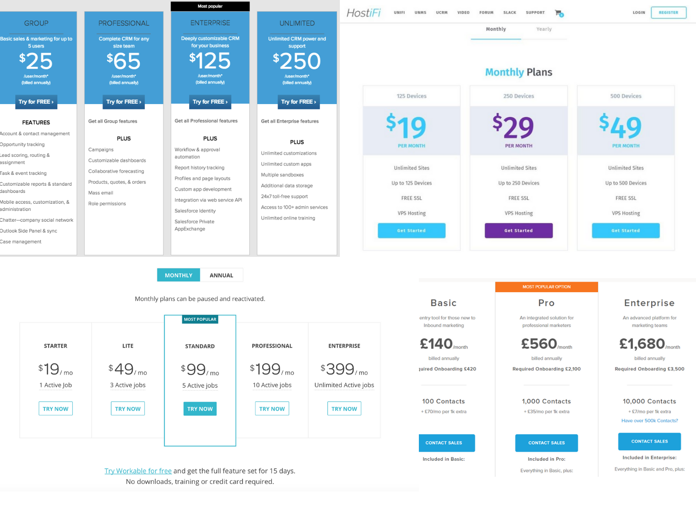

My results show that the most common number of packages found was 3 and 4. 

Why?

The human brain can't comprehend a lot of options. Research shows that it's better to provide just [7 ± 2](https://medium.com/stylumia/the-magical-number-7-2-how-to-grab-attention-8864e0f5592b) options (5-9 rule) at a time, as humans are able to retain only about 7 things at a time in their short term memory.

Simple is better here.

#### Only 10% of the companies recommended their highest package as the best option

SaaS pricing pages highlight one particular package as the best option and they often leverage the “[Center Stage effect](https://www.cobloom.com/blog/saas-pricing-models)” in some form to do so.

[Pipedrive](https://www.pipedrive.com/) has a clear, effective application on their pricing page and their “Pro” plan has a “Most Popular” label, and the columns are slightly offset from the others to further highlight it. The way Pipedrive highlights their middle option is interesting, and well designed : 

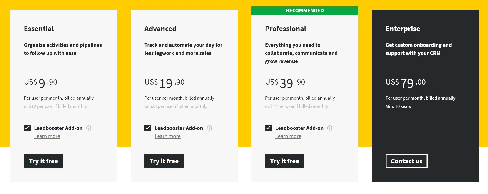

#### 72% companies listed their packages from Low to High

People normally read from left to right, as we expect prices to escalate from left to right. When prices are unevenly displayed, it can throw us off, so this is purely from a UX point of view. 

For example, [Github](https://github.com/) :

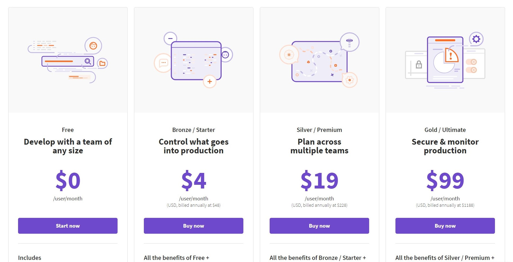

Some experts argue though, that one should put prices from High to Low. High-low pricing uses price anchoring to leverage sales, as the product value is associated with the original “premium” price, so when a discount is applied, people think it’s a great deal (similar to what happens in retail industry). Which is why, there’s 12% of companies that did price their plans as High to Low.

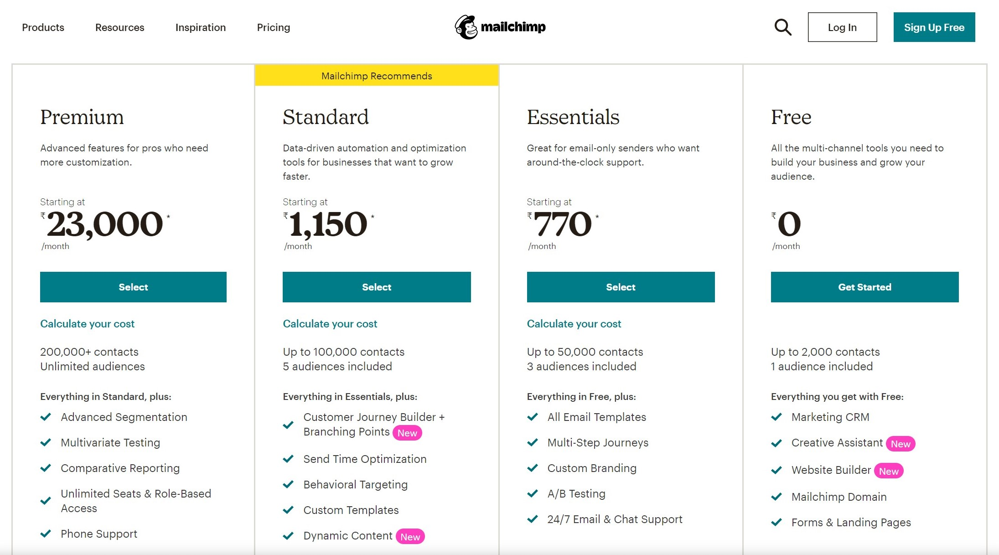

#### 76% companies sell their benefits on page

It's a fairly obvious thing to mention additional information along with the pricing details as a common search query for Saas companies is [Company Name] + [Pricing]. 

[Zapier](https://zapier.com/) has their FAQ section along with the plans, addressing key questions relevant to making a buying decision. They talk about offering discounts here and the platform’s no-coding capability.

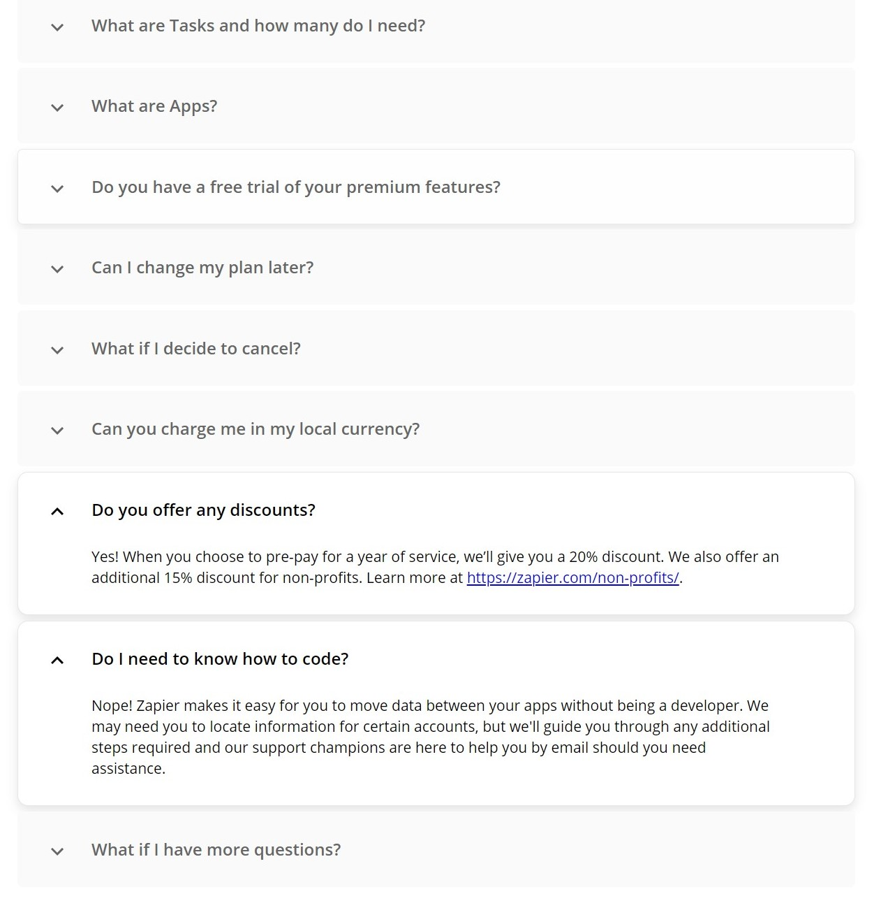

#### Most common CTA was “Try for free”, followed by “Contact Sales”

Your calls-to-action should be in bold colors so that they’re easy to read. The most popular CTAs were, in order  :
1. Try for free (26%)
2. Contact Sales (18%)
3. Sign Up (12%)
4. Get a Demo (10%)
5. Others including Buy Now, I’m interested etc. (34%)

So, there’s definitely an increase in companies who have started providing a free trial option to their services. 

Look at [Notion’s](https://www.notion.so/product) pricing page :

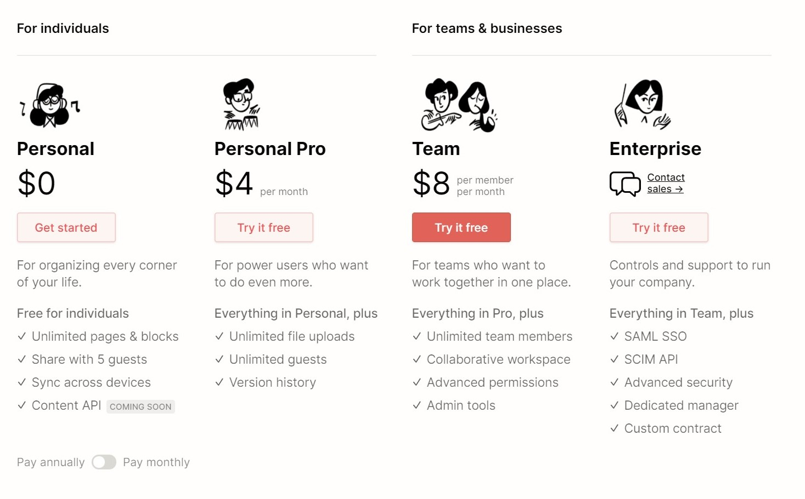

As you can see, startups seem to be pushing self-service free trials instead of demos with sales staff.

#### 82% companies had a contrasting CTA color

Determining what color combinations can be used to match a company’s branding and create the psychological triggers necessary to convert an audience.

According to Unbounce, a rule of thumb for CTA color is to “look for the dominant hue of your page and pick its contrasting color for your call to action”, which is what most Saas companies are doing.

Here’s a weird example, [Amplitude](https://amplitude.com/), chose not to highlight their Free plan’s CTA with a contrasting color, so when you open the page for the first time, you’re going to look at the two “Contact Us” options because they stand out. Normally, when you have a “Free” plan, companies tend to use it as a top-of-the-funnel package to get leads from, but Amplitude wants to focus on the “Growth” and “Enterprise” plans.

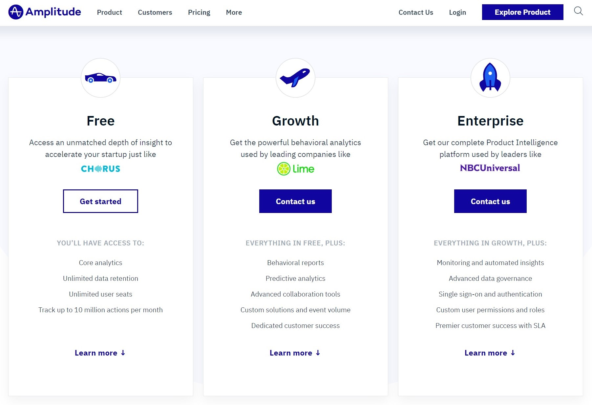

#### 64% companies offer a free trial with the most common trial duration being 30 days

Offering a free trial allows users to see the value of a service and to influence their buying decisions, while creating an urgency to purchase. Free trial is a lead generation technique that can be powerful for Saas software.

For example, here [Sumologic](https://www.sumologic.com/), has a clear “Start 30-day free trial” CTA button, influencing people to try and understand all of their products features, giving user ample amount of time to reach that “aha!” moment.

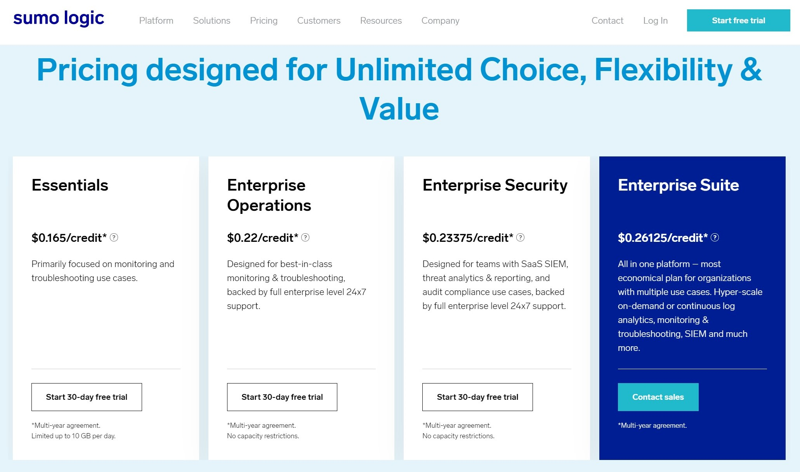

Here are some interesting numbers from the study :
- 64% offer a Free Online Trial
- 41% offer a 30-day free trial
- 18% offer a 2-week free trial

#### 94% companies had named packages, with the most common names being “Free, Pro, Enterprise” etc.

While some SaaS companies choose to name their packages in relation to their price (with names like ‘Basic’, ‘Premium’, etc.), some grab the opportunity to target segments of their visitors and name the packages by who they’re for.

However, it’s common to get packages targeted at businesses at specific stages of growth, or, to have packages based on number of users.

For example, here’s [Carta](https://carta.com/) for reference :

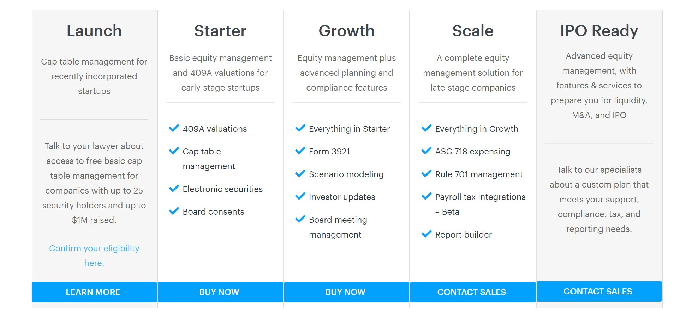

and [Lucidchart](https://www.lucidchart.com/pages/) :

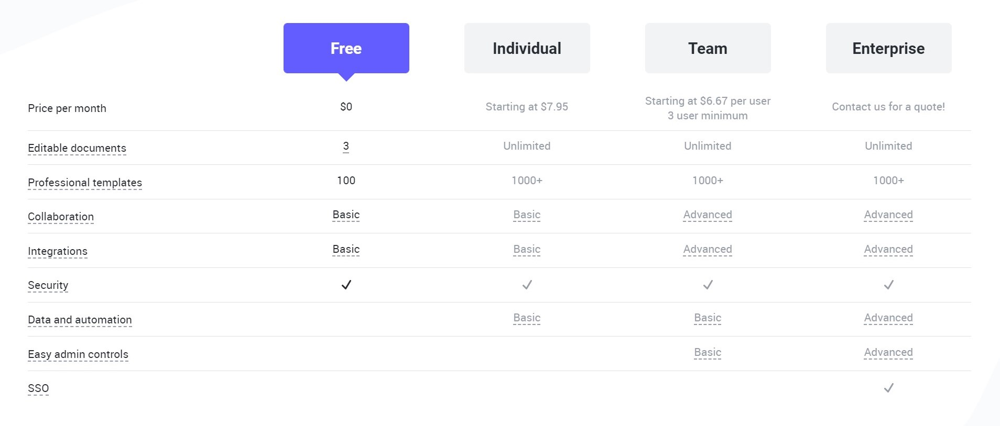

#### 50% companies offer a freemium model for their services

That’s right, 50% in the Forbes list operate on a freemium model, with the vast majority of the rest relying on free trials. 

According to Weekly Growth, early stage SaaS startups are [best off with a freemium model](http://weeklygrowth.com/saas-freemium-or-free-trial-complete-guide/) because it is more likely to attract early adopters, Offering a freemium product opens up a business’s top-of-funnel much more than any trial or sales demo could.

Freemium is a good tactic for products with “rising consumption” like here, in the case with [Canva](https://www.canva.com/) :

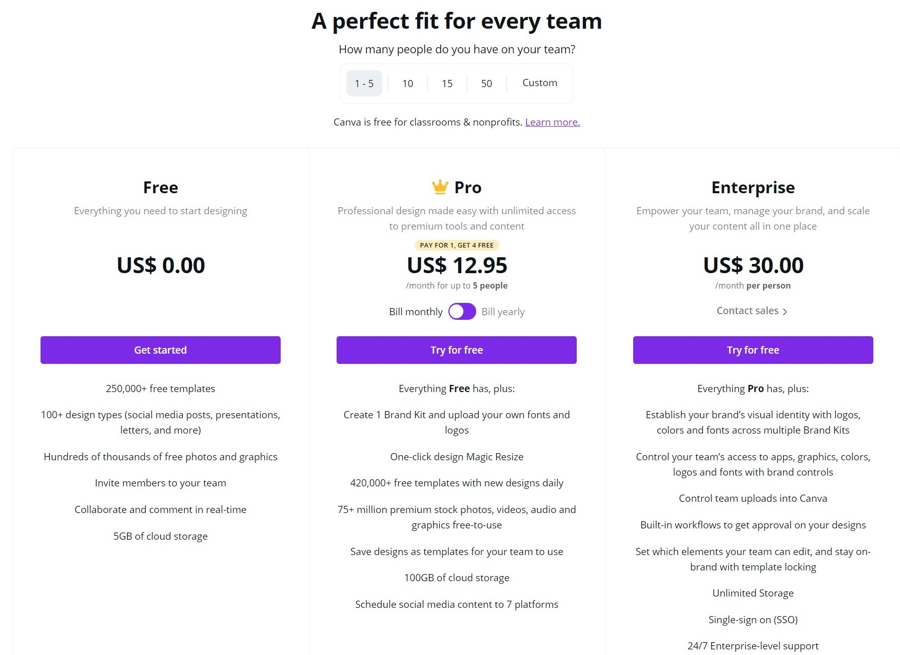

#### 74% companies have their pricing details publicly available

Of all the companies that had a landing page, 74% of the companies chose to show their pricing details available publicly, for some/all plans. The rest had no pricing available and all of the prices were available on request by contacting the sales people.

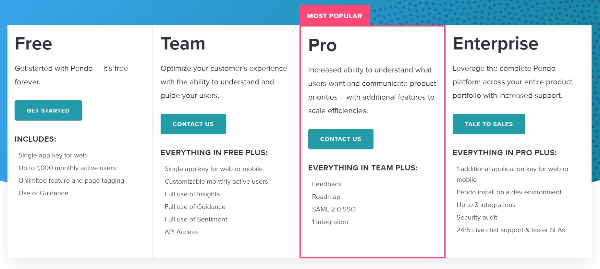

Here, [Pendo](https://www.pendo.io/), is showing all of its pricing plans and packages but it’s not displaying the actual prices.

#### 36% companies had a detailed feature table in their pricing pages

At a glance, features tables look like an odd choice for software companies — they take up a lot of space and they are much easier for a machine to process than a human. Yet, companies choose to have it included in their pricing pages.
 
I looked at other companies, and they had additional information with their pricing and plans, like feature tables, sliding meter, etc.

In the case of [Toast](https://pos.toasttab.com/), they have an optional pop-up feature table along with the existing list of essential features.

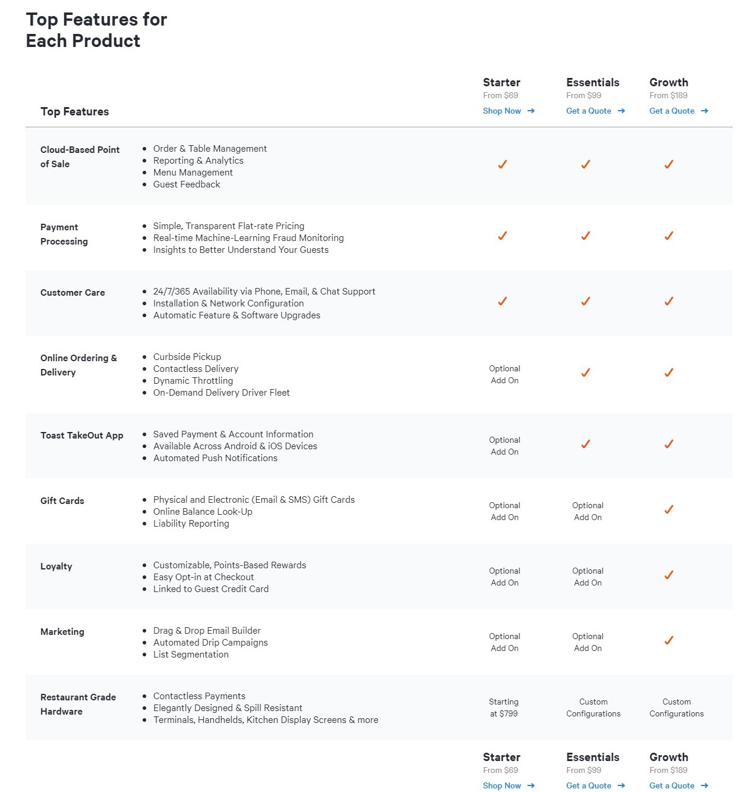

## Difference between enterprise and startup SAAS pricing pages

The most striking difference is that a SaaS startup is almost twice as likely to show its pricing than an enterprise SaaS company.

Also, startups are more likely to have a mixture of priced and 'contact us' packages. By having both transparent pricing for smaller companies and a 'contact us' package, they appeal to both markets - enterprises and startups.

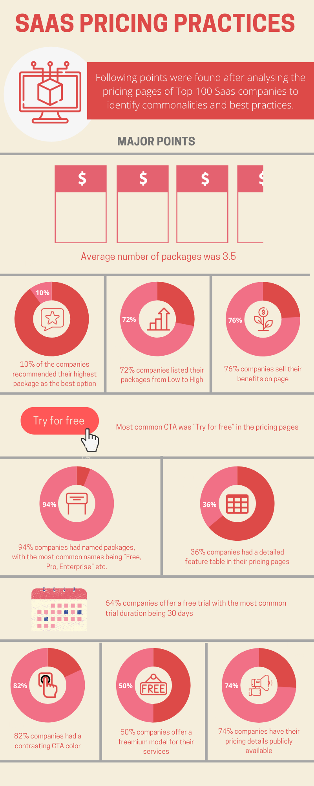

