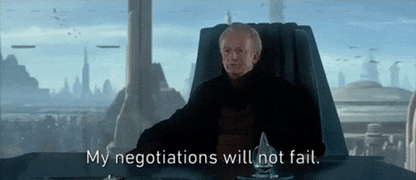

So let’s head into the other milestones one will encounter while looking for jobs, while I want to stress again on how mentally daunting it is.

If you came to this page directly, you may want to refer to this [post](https://catwomaniya.io/Step-by-Step-guide-to-job-hunting-part-one/) for more resources and insights in the job hunting process.

Let’s dive into the next step - the **DREADED** interviews.

## How to prepare for an interview

### 1. Before the interview

#### Keep applying

So just because, you are having hearing back from companies to schedule interviews, doesn’t mean you should stop applying to other companies

#### Practice with a lot of mock interviews

Write down answers to common questions and practice them , up to a point it doesn’t sound rehearsed and comes naturally to you. Cannot stress this enough. 
Personally, I see around 40-50 generic questions that anyone can prepare for. For example - [Link](https://novoresume.com/career-blog/interview-questions-and-best-answers-guide)

#### Research the company. 

Go through their website, social media handles, news, etc. Also, check with your network for someone who knows about the company or is an employee there, to understand their business well. Also, think of areas that you could suggest for improvement and brainstorm solutions around it, to articulate your understanding of what the company’s offerings are. Also, write all of these down somewhere

#### Setup the interview time

If you can, try to get your interview to happen in the middle of the week and earlier in the day. Mondays are notoriously busy with catching up after the weekends, while Fridays have the negative aspect of a possible loss of interest in you over the weekend. Aim for earlier interviews, like an hour before lunch, at least, but not as soon as the office hours begin; both you and your interviewer will be less likely to feel hungry, grouchy, and tired.

#### What to bring 

Assuming, interviews are still mostly being conducted virtually now, the bottom line is that not to carry anything extra to the interview. 

Keep your notes from researching the company handy. 

Also, keep copies of whatever application you sent to the company with yourself.

Also, have a glass of water near you, in case you are stuck on a question in the middle of the interview, and you want to naturally take a break, to think.

Have a backup plan, in case your Wi-Fi is spotty, and you need to switch to another network immediately.

#### 30 minutes before the interview

Join the link (or arrive at the location) 5-10 minutes before the meeting starts.

Switch off your phone (or put it on silent)

Stay calm and take deep breaths. At the end of the day, it’s just a friendly conversation, where both parties want to see if they are a good fit for another.

### 2. During the interview

Interviewing virtually has its benefits (wearing pyjamas to interviews) but it also has its flaws - less room to communicate with another person, as other communication traits like body language and gestures aren’t comprehensible. So it’s essential to get the basics right, like speaking coherently and maintaining eye contact every now and then with a mild smile is great.

It’s a good practice to not interrupt the interviewer, and to take a few seconds to answer when a question has been asked, to show that you have thought through the question.

It’s also very important to ask questions because at the end of every interview, good or bad, it’s a standard practice when recruiters ask candidates if they have any questions. Prepare for at least 3 of them. 

[Good site for finding relevant questions](https://www.keyvalues.com/culture-queries)

[Guide](https://www.businessinsider.in/careers/news/34-brilliant-questions-to-ask-at-the-end-of-every-job-interview/slidelist/77662033.cms#slideid=77662351)

[Another guide](https://www.reddit.com/r/AskReddit/comments/95s26w/what_are_great_questions_to_ask_your_interviewer/)

Thank the interviewer for his/her time

### 3. After the interview

#### Thank you note

Immediately send a thank you email to the person who interviewed you (probably sooner and definitely by the end of the day) . It’s not that this will save you from a bad interview, but it’s a good practice, in general. And even if it was a legitimate bad interview, this note can help explain in very minimal words, for your abysmal performance. 

Here’s an [example](https://www.themuse.com/advice/how-to-write-an-interview-thankyou-note-an-email-template).

#### Analyse your performance

Log the interview details in your job hunting tracker (maybe on the spreadsheet)

Also, take some time to analyse how you performed in the interview, and if there was something you could have done better (details, questions you couldn’t answer etc.). Do note down the mistakes that you made, why they happened and how to avoid them in the next interview, you could even ask the interviewer for feedback if they say you failed

#### Follow up

If you don’t hear from them by the deadline (the date they will reply back) then follow up after a week (even earlier if you know that they were looking for an immediate hire)

Again, keep sending applications and still do job hunting, just because you aced the interview does not mean you got the job, and besides two job offers are better than one

### Additional links :
1. https://brandyourself.com/blog/career/interview-questions/43-tips-for-job-interview-before-during-and-after/
2. https://www.experisjobs.us/exp_us/en/career-advice/20-tips-job-interviews.htm
3. https://zety.com/blog/job-interview-questions-and-answers

## When you actually get an offer

Well, amazing! Now, the negotiation dance begins. Also, this specifically means when you have an official document for a job offer and not something that was verbally mentioned.

### How to negotiate your salary

Firstly, you should never give a number when they ask you for it. If it’s an online form just fill in NA or the lowest possible value. If they ask what you have in mind in terms of salary, say: "well, I was curious what your budget is for this role as I'm wondering if we are on the same page when it comes to compensation".

If they refuse to give you any numbers or give a vague answer then -

- Try saying: "Well, I'm not really sure, it depends on a lot of factors like my responsibilities, and who I will be working with that will be needed to give an appropriate answer to this question... what do you think?"

Sometimes recruits directly reject candidates based on their very high salary demand so it’s better to not give a number, at least, not in the first meeting directly. 

Also, giving a salary range is not useful. For example, if you say your salary requirement is in the range of INR 20-24 LPA, then you would be thinking your earning potential here is INR 24 LPA but the recruiter thinks that he can hire you for INR 20 LPA. If you are probed for a salary range, quote a wide range like INR 15-30 LPA.

- You could bluff and give a high number, at least 15-25% more than you earn at your current/last job, since they will undercut you

But what if they say: "oh but your last employer said that you were paid $$$ at your last job, so why should we pay more?"

Well, you could then say: "well just because they valued me at that number, does not mean that's what I'm worth right now, and there were multiple factors at play such as them not having enough budget, so now are you willing to meet me at this salary?"

## How to manage multiple job offers

Well, it’s not easy. But you can ask companies to take maximum 2-3 days to think about an offer, before confirming it. 

You can also use this offer letter to fast track any current interview process. It’s not a fool-proof method, but if a company thinks you’re resourceful and hireable, and will be suddenly going out of the market, then they may try to finish off their process sooner. 

Remember, **two offers are always better than one**.

*I did a lot of research and made sure that everything is correct and accurate. But mistakes do happen. so if you feel that there is something wrong or you want to give feedback, feel free to contact me through my Twitter handle or directly email me.*
