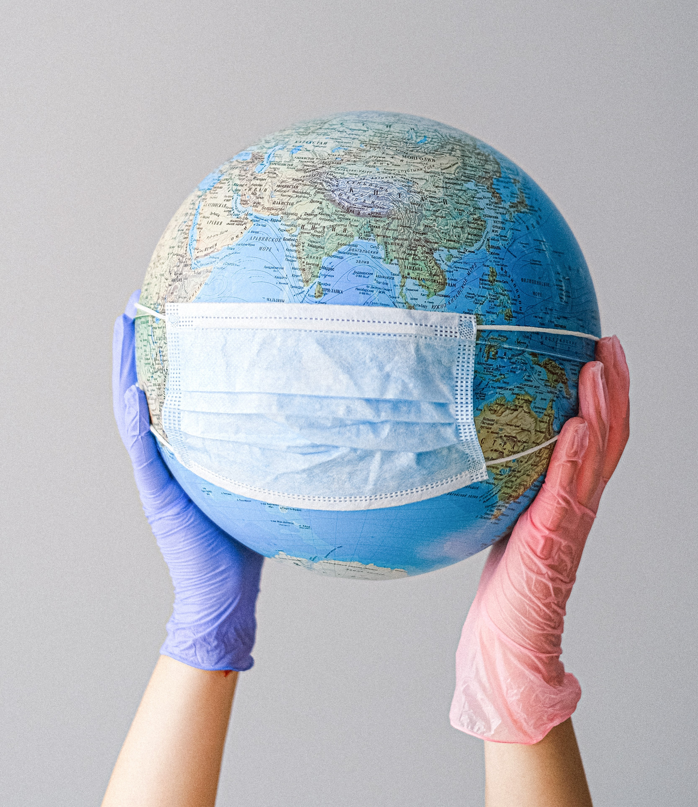
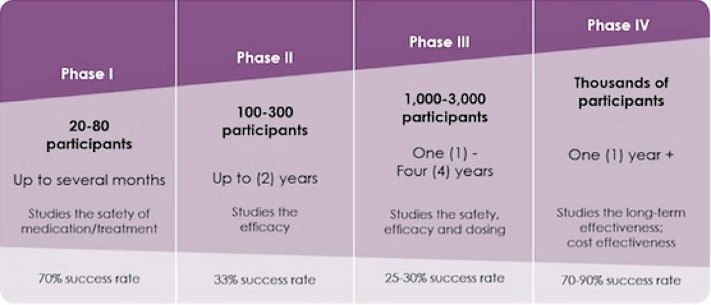
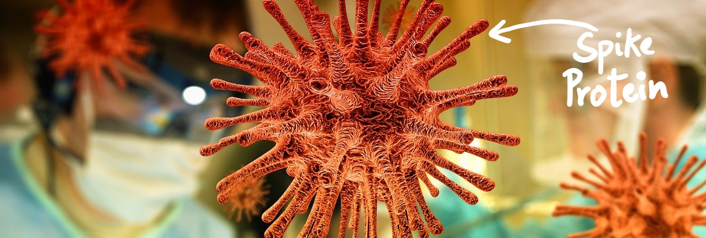
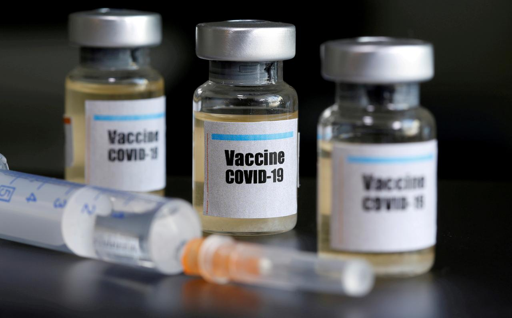

 

    

I will go out on a limb and state here that the Covid-19 pandemic is the most defining aeon of our lifetime. Every other concern has become secondary, the primary focus right now is to find a cure for the Covid-19 virus. Research for treating the coronavirus, is being done in record time. New England Journal of Medicine (NEJM) reported in February, that it was getting upto 20 submissions each day. 

I did my bachelors in the field of Biotechnology, and in my first class on genetic engineering, we learnt about vaccine development and how it takes years to develop a vaccine (on an average, 10 years). But we don't have that kind of time now, and companies have been working on overdrive to generate a vaccine for the coronavirus.  

To give you some context, the following is the time involved in clinical trials -

    

Before all of this, months are spent on lab and animal testing. And, some companies are already in Phase 2, which speaks about the fast progress in vaccine development.

#### How do vaccines work?

There are two basic types of vaccines - Live attenuated and inactivated. 

- **Live attenuated vaccines** are produced by modifying the virus in the laboratory, such that it can replicate itself but won't cause any illness.(Ex- Measles, Yellow fever etc.). 
- **Inactivate vaccines**, as the name suggests, are produced by creating the virus I culture media, then inactivating it with heat and/or chemicals, so that it wouldn't replicate. In contrast with live vaccines, that almost resemble a natural infection, the ***antibody titers*** (a measure of amount of antibodies, specifically neutralizing antibodies; used to check if a vaccine is working) against inactivated antigens diminish with time, so multiple doses or "*boosts*" may be required. (Ex- Polio, Rabies, Hep A etc).

Laboratories around the world are now working to create these different kinds of vaccines, but all of them have one goal, to train the immune system to recognize and combat the virus. 

    

An essential entity that is going to help develop the vaccine is - *the spikes*; these spikes are the genetic material that will be identified by our immune system so that it can fight it. ***Moderna***, for example, is developing it's mRNA Covid-19 vaccine, where  the goal is to, inject the "*spike*"(mRNA) into our body which will translate it into a protein, which our immune system will identify and then exterminate (which is pretty cool, tbh). ***GSK*** just started its clinical trials, last Friday, with its booster shots. Some companies are even trying to inject the mRNA inside our body by using a totally different, harmless virus.

Is there a vaccine for the coronavirus ?
Not yet. (So the best chances for your survival is wearing **the god damn mask**.)

The good thing is, people around the world are working to make it a reality soon.

#### When will the vaccine be ready?

Anthony Fauci, gave us all hope that the vaccine may be ready by early 2021. According to the latest update, WHO stated recently that **10 out of the 120 vaccines** being developed globally are already in human trials. Looking at how fast China is working on a promising development and the fact that it has already published an article in the peer-reviewed medical journal, The Lancelet, about the first in-human clinical trials, we may even have it sooner, but there are some serious concerns. 

People who had contracted the coronavirus and then recovered, had a antibody titer count of at least a 100, so it's safe to say that **100** should ideally be a antibody titer target for any vaccine. In the case of the Chinese vaccine study mentioned earlier, out of the three doses administered to the odd 100 volunteers, the highest dose averaged around a count of 34, which is way less. Moreover, 81% of the participants developed at least one adverse reaction within the first seven days of vaccination, so there's still a big question mark on the safety of these vaccines. Similarly, Moderna reported 3 out of its 45 participants, experiencing severe but non-threatening symptoms, all of these 3 participants were given the high dose. During these kind of experimental vaccines, side-effects are pretty common, and with further trials, the dosage is decreased gradually until they find the ideal amount, that has less or negligible reactions and is also able to do its job.

#### Is it possible to make enough of this vaccine for everyone?

To actually create a traditional vaccine, it's essential that you have cells where you can grow them. You put the weakened virus into the cells, create a good environment for them in a bio-reactor and feed it with nutrients, so that it grows well.

<ins>**MORE CELLS = MORE VACCINES**</ins>

But all of this takes months to prepare.

To counter this, the mRNA vaccines can be a game-changer, because you won't be spending time growing the cells, essentially creating multiple doses. The slight issue here being, this has never been done before, so some problems may pop up, but experts agree that producing mRNA in mass quantities is a likely possibility.

Although, even if we actually get a promising vaccine, there's still something companies are really worried about, that may sound trivial - *where to put the vaccines?* 

    

Vaccines are stored in **small vials with stoppers**, that are extremely sterile, and are produced in places that are 100 times cleaner than a hospital. And even though these guys have ramped up all the steps for vaccine production, the real constraint here is to ramp up the production of these tubes, in quality conditions, while also figuring out methods to minimize the delay causing factors, like packaging. Many public-health experts and pharmaceutical leaders have stated publicly that they are worried about a potential glass-vial supply squeeze, due to the pandemic. Of course, rolling out billions of vaccine at record speed is no easy task, and it's necessary to think and plan of solutions for possible problems that may need to be sorted out. For which, it's essential to look at the supply chain from the *start to the end*.

The problem with producing medical glass equipment is that it's supply chain is traditionally fixed, and slow-growing, which means that it is also prone to shortages, such as this one. It only produces on a need-basis, so it doesn't have surge capacity to cater to emergency situations. 

This glass market is inclined towards fragmentation. The surge in government initiatives and increasing demand for injectables and other medicines provide lucrative opportunities in the glass packaging solutions in the pharmaceutical industry. Competitive rivalry is high and the expansion and mergers of large companies in different pharmaceutical industries are expected to increase the demand in the market. 

**But a medical glass shortage was already setting in before the Covid-19 pandemic.**  Procuring raw material is an issue, since sand found alongside riversides is needed, which is different and coarse than the fine, desert sand, which has suffered a setback due to increase in environmental regulations. And even after obtaining these materials, normal glass factories have to undergo significant changes to ramp up vial production. A beverage glass maker cannot simply start producing medical glass equipment. In India itself, it has been difficult, logistically, for bottles and vials makers to provide to pharma companies. For instance, AGI glaspac’s pharma segment, which currently contributes 30-32 % of glass packaging in the Indian pharma packaging industry, is facing hampered production, affected supplies, and increased stock. So far, the company is working partially with limited raw materials like sand and soda ash, the key input raw materials for glass packaging.

Dr. Rick Bright, formerly the head of the Biomedical Advanced Research and Development Authority (BARDA), alleges he warned of a looming global shortage of glass vials but administration officials did not heed his advice. He wrote that major glass producers have warned that a particular material, borosilicate tubing, is sold out and it could take up to two years to meet the U.S. vaccine need alone .Even after the first batch of vaccines have been sourced and the shortages managed, coronavirus vaccines may have to be followed up every few years, meaning the strain on the supply chain could reappear in just a few years time.

Maybe for the first time in world history, companies like Pfizer and Moderna are planning to start manufacturing vaccines on a large scale, while still being in the trial phase, just so that they can cope with the demand when the vaccine is finally approved. 
Some manufacturers are already preparing for this potential crunch: [Moderna](https://www.modernatx.com/modernas-work-potential-vaccine-against-covid-19) is exploring both single-use vials and those that can hold multiple vaccine doses, according to its regulatory filings. 

A shortage of vials could interfere not just with the availability of a coronavirus vaccine but a range of other medicines, including sedatives and other drugs administered in hospitals. It's strange, in the end, everything boils down to **LOGISTICS**.

**All of these research and scientific articles is freely available, after 94 academic journals, societies, institutes and companies signed a commitment to do so. It's open to the public, if anyone's interested.*

