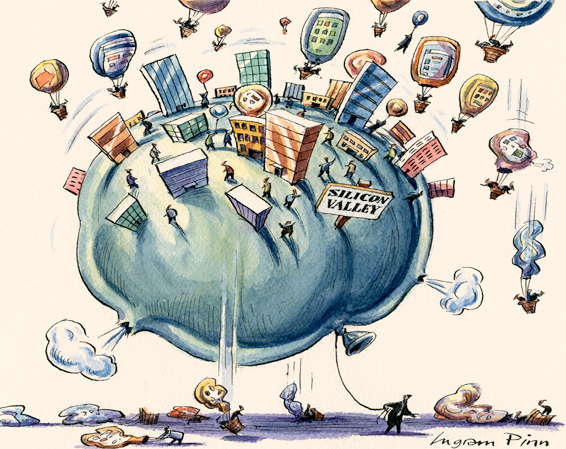
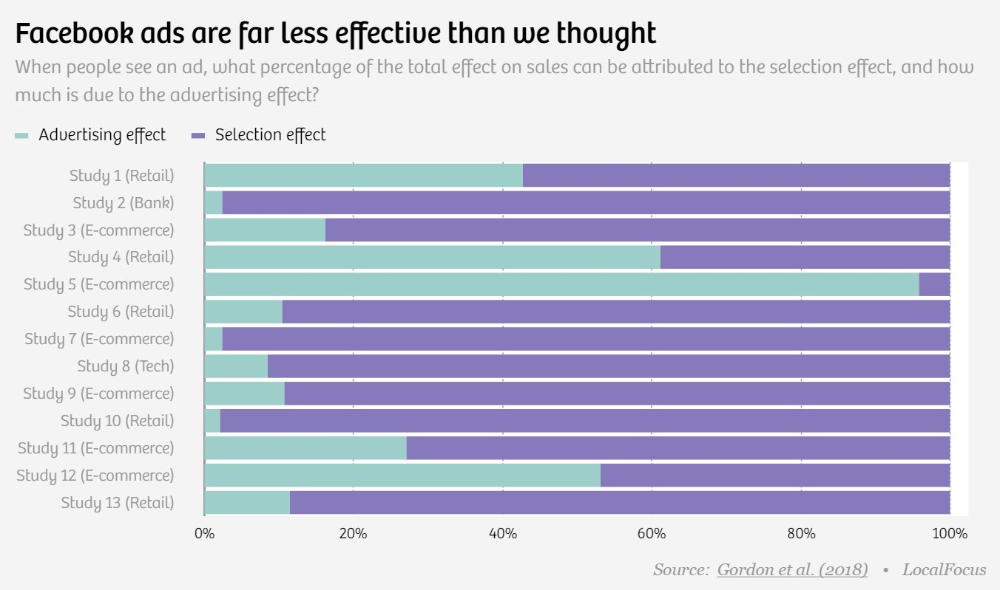
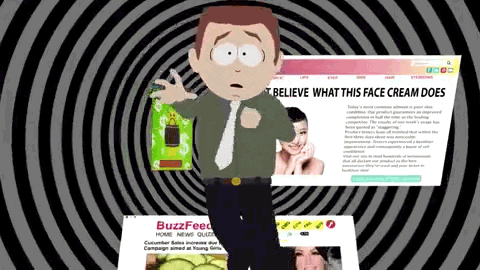

Consumers may not like crappy ads (of which, there are plenty). Consumers may not like it when their content is interrupted by ads (when will advertisers understand that pop-up ads are a nuisance for everyone). Advertisers may not like that consumers don’t “engage” with their ads. None of that really matters, as long as it works.  In 2018 $273bn was spent on digital ads globally. We delve into the world of clicks, banners and keywords to find out if any of it is real. But the question is - how effective is digital advertising ?

To answer that, let’s go back a little, to the world of traditional Tv advertising. The conventional wisdom says that it's got to be effective otherwise why do brands spend a ton of money on these advertisements but the data tells a different story.

Doubling the amount of advertising would lead to an increase in 1% of sales. (Meh, right?)

The objections that come up regarding facts like these are commonly - If you don't advertise your product and your rivals do, then where does that leave you? So this turns into a Nash equilibrium thing where one makes an ad, and the other makes an ad too, making it a lose-lose situation.

Was Tv advertising always so inefficient or did it lose its lustre with the arrival of digital giants like Google?

I don't know.

But what I do know is that people are spending more time online (thanks to the pandemic) and that digital adverts hold the promise of matching advertisers precisely to the kind of customers they want to target. 

The more relevant you're to your audience, more interest there will be around the message you are trying to communicate, and the more likely they're to buy your product

Thanks to cookies in your computer, you're constantly telling companies exactly what you're interested in. This is not new knowledge though.

The internet has made it almost too easy to sell to us, and sell to us they do.

That's how Facebook and Alphabet have become two of the most valuable companies in the world. With so many advertiser's spending billions, they must be getting healthy returns, right? Digital advertising must be effective, right?

Um, it's difficult to answer.

Ads definitely work but from where I stand there’s no definite answer as to how or why they work, or  give you any evidence for it.

There’s this experiment eBay did in 2011, where the questions around the efficacy of digital advertising actually started. Steve Tadelis was a professor of economics at the University of California, Berkeley and during one of his first conversations with eBay’s marketing team, they invited him to sit down with their consultants.

And what he learnt from the consultants, that the results  they were showing him was garbage. Correlation, as any Statistics 101 class will inform you, is not causation. 

What do these impressive numbers mean if the people who see your ad are the exact same people who were going to use eBay anyway? eBay is no small fry. Surely lots of people looking for shoes end up on the online auction site all by themselves, whether they see an ad or not?

Brand keyword advertising, was eBay’s most successful advertising method. Buying brand keyword ads had the highest bang for the buck, which of course didn't make sense from a common sense perspective because if I am already searching for eBay I know exactly where I wanna go so the fact that the ad intercepts me and I click on it is just coincidental and which cannibalizes what could have been a free click on the organic search.

eBay renegotiated there deal with Bing to turn off their brand keyword advertising, as an experiment. Not surprisingly, all the search that was taken away from ads ended up coming for free from the organic search.

If there is no competition for the keyword "ebay" and if we remove that ad, then the organic search is what the people are going to see firstly, so people will be going to ebay directly without eBay paying any fees to the search engine for advertising.

Imagine Amazon enters into an ad auction for the keyword ebay and Amazon wins that auction. People will ignore the Amazon link and move on directly to eBay.

So brand keyword advertising is a waste of money.

For non-branded search, here if I am searching for "microphone" I will get a variety of results, and if ebay doesn't pay for that ad, they may not even show up on the first page.

In another experiment, they targeted certain DMAs (Designated Market Areas) in USA where they turned off all their keyword search ads and measured actual sales. And surprisingly, the impact was pretty much zero.

Advertising works, we just don't have much of an idea about how it works. Potential for digital advertising seems large given how it can micro target consumers. Targeting really is key.

Do people ever see ads at all? A research study by Google says that close to 60% of the ads on the internet are never seen. The ads are delivered but it's dumped somewhere in the webpage.

When a user cookies are unavailable ad revenues only drop by about 4%. Why? Possibly because people pay a lot less attention to online ads as they used to.

When banner ads were first launched on the internet their clickthrough rate was 50% and then it fell a lot and is now around 0.01%. Of course, there's a challenge to accurately capture this - Like bots who click on the ads, Novelty wears off, habituation sets in - which is another problem of its own.

People increasingly don't want ads so they created ad blockers , whose adoption has increased rapidly.

Digital advertising is grotesquely overvalued because it is still so hard to measure. One reason why it's so hard to measure is because the marketplace is vast and opaque.

After months of [advertising boycott](https://catwomaniya.io/facebook-ads/), Facebook, Twitter and YT agreed to adopt a common set of definitions for hate speech and develop tools to let advertisers have more control over where their ads show up.

P&G also ran an experiment where it cut its advertising spend to check its efficacy and what it found was that there was no noticeable impact over their bottom line.

Behavioral advertising – in just the last few years – has been credited with:
- Shifting the outcome of a presidential election.
- Building dozens of “unicorns.”
- Helping thousands more companies survive a once-in-a-generation pandemic

Even if online advertising may be a bubble, we know that this bubble deflation will leave a huge impact. Journalism is supported by ads. Google is supported by ads. Nearly everything else you see online and don't pay for is supported by ads. 

Digital advertising is not perfect.

On the whole, it is improving (mostly) over time – largely due to major ad tech platforms building better, more accurate, and more complete data sets.

* Read about the detailed story of Ebay's experiment [here](https://thecorrespondent.com/100/the-new-dot-com-bubble-is-here-its-called-online-advertising/13228924500-22d5fd24). *