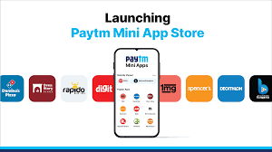

The global debate against app stores monopolistic practices and their control in distribution and managing of applications has been going for a some time now.

Brands started seeing the opportunity in apps a decade ago, further bolstered by the pandemic that created a huge boost in mobile commerce, which is not just to capture attention and brand loyalty but revenue as well.

Although branded apps, just like games live within the walled garden of app stores. And to have a place in the app store, a company has to comply with the rules set by whoever owns the app store.

The key issue pertains to the **30% commission fee**, which several developers term as "*extremely high*" and "*unfair*". Google and Apple currently dominate the mobile operating systems and their app stores have mostly become the default channel for developers to distribute their apps. This is a problem in a way, because people say that Google and Apple act like gatekeepers and they force developers to pay 30% commission from the revenue generated which can affect the developers' bottom line. Even though there are strict rules for billing , there are certain apps on the app store who do not necessarily follow this like Netflix, Spotify, Tinder among others. 

And Apple and Google have overlooked this for long. So it raised quite a lot of eyebrows when Apple picked a fight against Epic Games, the creator of Fortnite, for allegedly violating their app store policies.

## How the Epic Games lawsuit transformed into something huge

To bypass this 30% fee, Epic decided to enable the option for players to pay directly to the game developer for in-app purchases, cutting Apple out of sales. And Apple naturally pulled Fortnite out the app store. Post which, Epic Games hit back Apple with a lawsuit, alleging that it has monopolized the iOS app distribution.

#### What qualifies as in-app purchases?

In-app purchases of digital goods like buying game tokens, virtual items or subscriptions bought from within the app will be counted as in-app transactions.

#### What's strange ?

Apple has been strictly implementing this policy and charging the 30% fees, whereas Google has typically been lax about it, due to which companies like Netflix, Spotify, Tinder among others have bypassed this system to avoid paying the fee. 

Now Apple has overlooked that for quite some time now. 

**There's no specific reason why it has done that.** 

But if I take the example of Netflix, I know that the company doesn't necessarily depend on the app store for people to use their service. In fact, people would prefer watching Tv shows and movies on bigger screens, so even if Apple or Google forces them to abide by this rule, it doesn't affect Netflix much. But it does affect Epic Games, because currently you cannot download and play Fortnite outside the iOS or android ecosystem, they need to be listed on their app stores.

Also, Netflix is a huge company, not as big as Apple but definitely bigger than Epic Games, so essentially they can fight this fight against Apple. From a legal perspective, if supposedly Apple puts a case against Netflix for this cause, Netflix can fight back with an anti-trust lawsuit against Apple claiming they're pushing Apple Tv+ and suppressing other channels like Netflix.

Epic Games Vs Apple isn't like David Vs Goliath. Sure, it’s fiscally insignificant compared to Apple: revenue of $4.2 billion in 2019 versus Apple’s $260.2 billion. But we’re still talking billions, and it will have an impact far beyond these two companies.

**It goes to say, this has definitely created an impact, and it's not just limited to gamers or gaming companies.**

## All about the Google-Paytm fiasco

As if the timing for all of this was synchronized, concerns of app store monopoly recently emerged in India after Google briefly took down Paytm earlier this month for alleged violation of its app policies. 

Adding fuel to the fire, later on Google issued a clarification of its existing payment policy saying that everybody who is on the play store and sells digital content will have to use play-billing.

The policy has been there for a long time, but again it just chose to make the announcement at this time. 

It seems strange because Google never explicitly went out and say that it's pulling Paytm off the Play Store, it just issued a clarification on the Play store's gambling policies and pulled the app out from play store and it only got this much attention, because Paytm created a ruckus out of it. Similarly, when Google issued the play-billing notice, the app makers, especially Indian startups went ballistic and called out Google for this unfair policy.

Google replied back by saying they're allowing app creators till September 2021 to comply with this and provided an extra 6 months to Indian start-ups (March 2022).

Although Paytm First games is back on the play store now, but only a free version of the app is allowed. Paytm accuses Google of double standards in this matter, as according to Play store's regulations they cannot advertise the First games app on their Paytm app because it falls under fantasy gaming, but they can still do so on Youtube. This does make sense, because on one hand Google wants to take a stand against fantasy gaming but on the other hand it's willing to advertise fantasy gaming on Youtube for some fee.

#### Paytm's double standards ?

Paytm has become the front line figure for Indian brands who are fighting this fight, riding on this wave of "*Atmanirbhar*" India. The timing couldn't be better as they launched the mini app store, just days after Google removed paytm from the Play Store. This project was probably in work for some months now (probably to take on their rival PhonePe) but it chose this specific moment to advertise itself as an "Indian App Store", for obvious reasons.

The question arises, will an Indian App Store even be like ?

- Will it be owned by the government ? If it's owned by the government will there be certain restrictions on the data which the govt can access ? (There should be, ideally)
- Will it rather be owned by a single private body ? But if it is, the same issues that exist with Google today, will exist in this case too.

The mini app store of Paytm is a great example of this. Because firstly it is not an app store, it allows developers to showcase something in between websites and full-fledged apps that run inside the Paytm app, which means it's limited by what the Paytm app can allow it to do. 

Also, the number of features developers have access to on this mini app is limited, it's not like a full-fledged app which has  access to the data inside your phone. 

In a way, Paytm's mini app store is just **another walled garden**. 

It's no different from Google play store and Apple's app store. To be listed on the Paytm mini app there are certain rules one has to abide by, for example, if one wants to sell something or want people to subscribe to any service, they will have to use Paytm for transactions, which is literally the same thing Google is asking people to do.

Currently, Paytm is saying that it is not going to charge any commission for using Paytm or UPI and only charge 2% for transactions made through debit and credit card, which is much lower than what Google charges, but again there's nothing stopping Paytm from increasing these commissions in future, especially if in the future it's able to have a billion users.

Now, experts believe that this move definitely seems in sync with Paytm's [Super app strategy](https://openthemagazine.com/columns/indias-first-superapp-paytm/), so other than Paytm's core sell i.e., the wallet, a bunch of other things can be done through the app. This idea is not so new though, Paytm's rival, PhonePe has it’s own "**Switch**" platform which works exactly the same way and has existed since 2018 and has 220+ partners and services.

For the consumer at the end of the day, it can be a Catch-22 situation, with ultimately no useful solution.