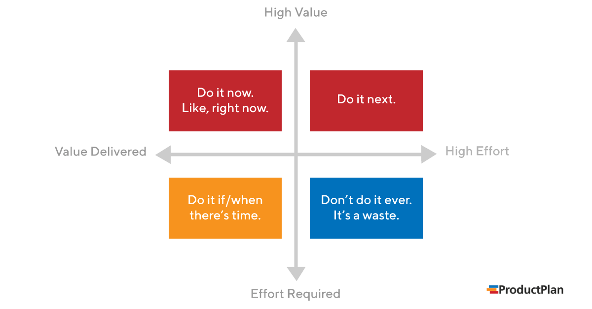

I have been researching a lot of early startups and talking to these folks, and I have noticed some patterns that I think you should avoid when you are trying to build a product first company.

If you are a subject matter expert in a field, this doesn’t necessarily mean you are an expert at understanding the behaviour & motivation of your users, understand this before you build. 

You may be a user of your product, but all of us have biases, so please talk to folks to whom your product could be useful , but they are tangentially different from you. When you think about users, know that research/patterns exist for a reason, don't build something overly new - in terms of designs, flows & usage,remember this - one small change at a time. Don't try to achieve a LOT in the first months of launching only.

Don't do anything until you document 
(1) Each feature 
(2) The behavior of each user interaction with the feature 
(3) The system response to each user interaction. 
(4) What data should be collected and saved. 

All this can be done in plain English and organized in a word document. With a table of contents.

People think about launches very differently :

- Build in public
- Waitlist
- Founder led hype

You can do all or none, however product needs marketing, because even a good product needs to be FOUND. And account for it, dont dismiss it.

Get your team in place. Do not think that you will have time to fix tech debt & build a bad system (unless ofc you are not a tech heavy product, then ignore this) Always build efficiently even at MVP stage people expect products to work as intended.

The 3 main ideas behind MVP development are: 

- Time
- Functionality
- Hypotheses

In a short period of time, from a minimum but sufficient functionality, a software development team makes a product to verify high-risk hypotheses.

However, what is the minimum number of features? 

Is it only an authorization flow and a start onboarding screen, or is it a full-fledged application with a limited amount of the most necessary features? The latter is the closest to the right answer. But how can we understand what functions are critical and what aren’t? Prioritization will help you resolve this issue. 

## How to Define Priorities

Here, you should define the product goal and the target audience, as well as to conduct competitor analysis. There are several questions that significantly simplify this task. 

- What problem does my product solve? 
- Who is experiencing this problem? You can’t create a product for everyone.(Stressing on this, a lot). It also makes no sense to deliver a service that nobody needs.
- How frequent is this problem? 
- How do people solve this problem now? Find the means that let customers cope with it. How can you facilitate this process? Is it possible to suggest a new, faster and more convenient way? How can the existing solutions be improved?

## Feature Priority Matrix 

Agile development teams use the 2×2 prioritization approach to determine which features, fixes, and enhancements to work on next.

An agile product team can use this approach to identify the limited number of features needed for a minimum viable product (MVP).
 
## Feature Buckets

- Metric movers: Features that are intended to positively affect the main KPIs. Your project success or failure will be judged by the KPIs, so this bucket is essential in terms of reaching business goals.
- Delights: Things that increase customer satisfaction, for instance, some cool animations, entertaining elements, leaderboard, etc.
- Customer requests: Features that users would like to see in the app. This functionality is not required to solve the principal problem, but customers do want to have it. In a messaging application, for instance, it can be integration with Instagram, new funny sticker packs, or the ability to design emojis. 

MVP is always a guess. The faster you present it to people, the less time and resources you spend to get into the learning lifecycle. Any additional work beyond what is required to start learning is a waste.
