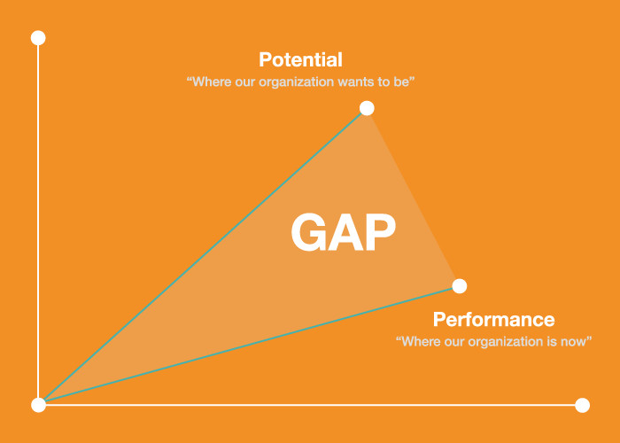
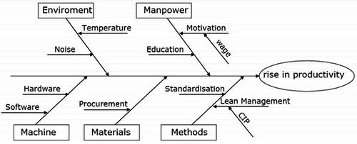

Digital transformation is a journey that involves ideas and processes used to optimize an entire business ecosystem around digital technology and customer-centricity. What triggers the need for digital transformation ? Most often, it’s social and behavioral changes in society ; that is a starting point for measuring the need to innovate.

Before a company can start working on this, they must also understand how to cultivate the right talent, which holds especially true for a service company, where the employees are the valuable resources who drive the company. So it’s imperative to provide prospective talent with the right resources and opportunities, which is why we are going to focus on how to implement a digital transformation strategy for the HR department.

## Accelerating Digital Readiness

1. Use an integrated framework to conduct a gap analysis
2. Develop awareness of how other companies overcame challenges and obstacles and leveraged opportunities
3. Develop an integrated action plan for successful implementation

## Conducting gap analysis

A gap analysis is an examination and assessment of your current performance for the purpose of identifying the differences between your current state of business and where you’d like to be. It can be boiled down into a few questions:

- Where are we now?
- Where do we wish we were?
- How are we going to close the gap?

It is a great way to visual your data and show where your organization is struggling and thriving. In our discussion around the gap analysis template below, we’ll talk specifically about how a gap analysis can be used within the HR department; it can also be used for your entire business or for a single process. 

I am also sharing the link to the gap analysis template I was using, [here](https://docs.google.com/spreadsheets/d/1fnybw9dsfwkSYZn9I4yNBDic1C6tfxKQ09W_5vM3HE4/edit?usp=sharing).

The four steps outlined in the template below will help ensure you know precisely what issues you’re facing and how to go about fixing them.

### Step 1: Identify the current state of your department

This may sound overwhelming, but bear with me. First, identify the priority of that plan by understanding the need of the department on a granular level, meaning understanding the processes/tools that are involved also.

For example, I worked on improving the processes of the HR department, and the first thing that I worked on was documenting and mapping all the processes that came under this department - Hiring, Compensation & Benefits, Attendance & Leave etc. These processes maps/ flowcharts helped in understanding the flow of work.

### Step 2: Identify where you want to be with your department

This future goal is sometimes called a desired state or future target. In order to accomplish this, you’ll want to think about how you are doing today in your current state (from step one) and where you really want to be within a reasonable timeframe. 

If you are doing a gap analysis within the context of your strategic plan, take a look at the targets on your plan. These targets may be three to five years out, which is ideal. 

Where are you with them? To answer that, go back to your current state areas of focus.

For the HR department project I worked on, I did a lot of external research to understand best practices, by talking to firms, reading Gartner, Forrester reports and also talked a lot with company stakeholders, to understand their viewpoint.

### Step 3: Identify the gaps in your department

Now that you’ve recognized where your organization is currently and where you want it to be in the future, it’s time to bridge the gap.

Take a look at the chart above; the “gap” is the gray shaded area, which demonstrates the difference between where you are and where you want to be. When identifying gaps in your department, you need to ensure that your goal and your current state exist in the same time period. 

So if your future goal is a year out, you need to extrapolate your current state out for a year to see the appropriate gap. 

This is a great time to figure out why there is a gap.

- Be specific about the gap. 

- Dig deeper and determine why this gap has occurred. Do this by asking questions—and questioning the answers to those questions—until the root causes of the gap become clear. You may have heard about asking “[five whys](https://www.isixsigma.com/tools-templates/cause-effect/determine-root-cause-5-whys/)” or “[Fish bone diagram](https://www.cms.gov/medicare/provider-enrollment-and-certification/qapi/downloads/fishbonerevised.pdf)”, both are great tools to track down reasons for imperfections, variation, defects or failures.

### Step 4: Devise improvements to close the gaps in your department

Now that you’ve discovered why the gap in your department is taking place, it’s time to figure out the proper course of action to close it. Use the following guidelines to ensure the improvements you come up with are solid:

- Base all improvements on the information you discovered while identifying the gaps. 

- Consider the cost of implementation for each solution. Perhaps you don’t have the capability to stop working with your current customers. Can you outsource the development of a new offering? Maybe partner with another organization?

- Identify end dates when you’d like to have the gaps resolved. Without setting an end date for improving the customer experience, it may end up being overlooked or ignored. Set a completion date—even if it is years in the future—and then set milestones to ensure success.

Be sure to follow up on the improvements. Otherwise, there’s a real risk that the solutions you’ve so carefully engineered will fall through the cracks. Also, be careful about trying to close too many gaps at once. 
