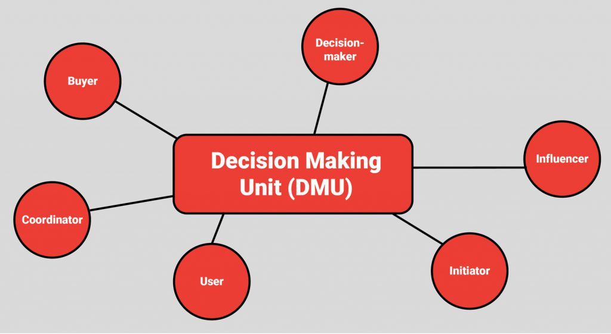
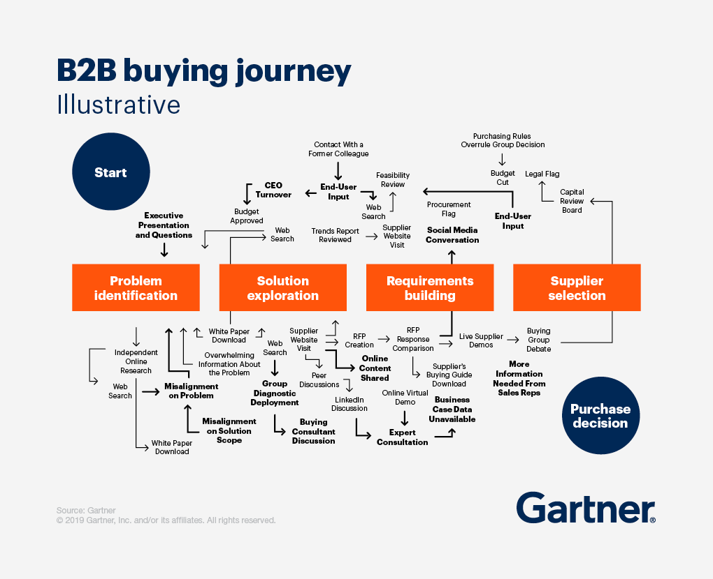

For an early age SAAS startup, looking to raise awareness about their product and getting it in front of more relevant eyeballs is a challenge. Content marketing tactics play a huge role across the marketing funnel to generate paying customers. But tactics never work without a solid strategy. While working on the GTM strategy, having clarity on a granular level helped us come up with better solutions. So what should you focus on first before jumping straight into using these tactics?

## Know your customer profiles

Trivial, but essential, personas depict customer profiles whose opinion matters when you’re creating an article, podcast episode, etc.

By understanding your persona’s informational needs better, you will have the option to  help them with the content that they will want to read, watch, or listen to.

Before going into a content marketing strategy, it’s better to set aside a few hours so that you and your team can create persona profiles. 

Remember! If you don’t have a product-market fit and customers, you will only end up assuming things (sure, there will be some of those but our goal is to bring some clarity in the matter). After some time, you will reevaluate them. It’s best to focus on closing first sales, testing out your hypotheses about who makes an ideal customer, and then moving onto a persona creation bit

Here are the essential aspects for creating customer persona:

1. Give it a name and demographic profile.
2. Role in the organization
3. What organization do they work in 
4. Details of the organization (Industry, No. of employees, etc.)
5. Pains that your product can remove
6. Pain relievers
7. Gain creators/ Value proposition
8. Jobs to be done

For example, in the demographics element you can consider including:

- a decision-making status (Chief technology officer, Head of HR)
- size of the organization (you target B2B customer is a company with 200+ employees)
- location (you want to focus on Asians or specifically Indians)
- industry (your leads are tech companies)

There is no one-fits-all solution, and you can have different criteria than those mentioned above.

An even better approach is to create personas for people involved in the B2B decision making unit.

## Converting MQLs to SQLs

These two lead stages are usually misused and misunderstood, and companies tend to reach out to customers too early in the process when they’re not ready to discover sales.

1. Here is a typical scenario of the company reaching out too early to their leads:
2. A contact subscribes for a webinar series and watches a webinar.
3. After the webinar, a sales rep reaches out to a lead.
4. Sales prequalify a user and initiate contact.
5. A sales rep tries to sell a product.
6. A lead usually rejects an offer.
7. A lead rejects the offer, and your sales or marketing assigns a lead to a nurturing campaign.

Even though sales can potentially reach out to people with an urgent need that your product can satisfy, this is still too costly and time-consuming.

Let’s see an alternative scenario: 

1. A lead subscribes for a webinar series and watches a webinar.
2. A lead sees a retargeting ad on Google and Facebook.
3. The lead starts to interact with educational blog articles and download some ebooks.
4. A lead receives some nurturing emails with value, not sales.
5. He then read case studies and your services.
6. He can compare your solutions to competitive services.
7. He wants to schedule a call or buy right away.
8. A sales rep talks to a problem and solution-aware prospect.
9. A rep qualifies a lead as an opportunity.

Having leads initiate contact by themselves results in sales calls that convert better. Instead of pushing your offer too early, nurture the interest of your leads..

Before we understand how to convert more MQLs into SQLs, let’s first examine a digital marketing funnel and how contacts move through its stages.

## Stages in a B2B sales funnel

Here are the core stages of the B2B sales funnel you need to know to better understand your customer buying journey:

### 1) Problem identification

The customer has a job to be done and needs to resolve a challenge connected with their role.

Example: *A startup founder is looking to develop a SaaS tool and has doubts about what tech stack to choose. Customers are researching topics like “Top 10 popular frameworks for building an enterprise app*.

### 2) Solution identification

With the content from the problem identification stage, you have built awareness about your prospects’ problem. Now show them the potential solutions.

Example: *You are selling computer software specializing in Node.js. Present this tech stack as the perfect way to companies that can use it to build their next app.*

### 3) Consideration

Consideration stage occurs when your MQLs are researching your company. This is the time when you should be presenting an expert image of yourself by creating whitepapers, guides, ebooks etc.

Prove your potential customers you have extensive experience and that you are reliable  by showing them your case studies and testimonials. 

Example: *A startup founder knows that Node.js is a perfect tech stack for building his app. He looks for different vendors and makes a list. Having come upon a great customer story of one dev shop in Poland, he decided to book a call to discuss the project details.*

### 4) Decision 

Your lead needs to make a final decision and choose you among a list of other companies.

Example: *A startup founder has met a CTO of one of the dev shops which portfolio he liked. It turned out the dev shop could meet all expectations and had sufficient experience to perform the job. Having evaluated different sales materials, they are now ready to make a choice.*

One important thing to keep in mind is that leads can join your funnel at any stage. 

For example, they might be looking for vendors (consideration stage) when they enter your page; that is why you have to ensure they can easily find a contact form and case studies.

## Improving buyer’s journey process - Revamp website

The structure and strategy for lead nurturing and lead scoring depends on a company’s growth stage. Lead scoring isn’t equally important for every stage of the company’s development. For an early stage start up this often involves seeking product market fit.

For companies in the early stage of seeking product-market fit, lead scoring isn’t usually a top priority. If you generate just a few leads daily and you have capacity to follow up on each and every lead, the importance of prioritization is greatly reduced. However, even at an early stage, it is beneficial to implement some very basic lead and user tracking system. By doing this, you can collect information on what journeys your prospects take before they buy. This means that when your company moves to the growth stage you have a few months/years of data ready to optimize your lead scoring.

To measure how your web page users’ behavior helps increase buyer intent, you have assumed your high-converting pages. For example, almost all of your leads who have visited a case study end up becoming your paying customers. In this case, you have to give a lead that has hit any of the portfolio pages more points. There is also a possibility there are some pages that disqualify your website users from becoming a customer. 

Here are some pages for which you can assign points for visiting:
- portfolio pages
- services pages
- pricing
- bottom of the funnel content (e.g., specific articles)
- pages with product testimonials
- contact page

When working on a scoring system, one needs to assess historical data by first pulling it from different sources. 

Once you have your strategy in place, you need to define how you will nurture leads so that they interact with your content more, and you can qualify them as hot.

### Mistakes with lead generation

You might think things are easy from first sight. However, once you get down to execution, you might notice some things are not working the way you expected. 

In the beginning, you have sketched a general strategy, made assumptions, and set your success metrics. However, a “brainy” plan can still fail. Let's see what works and what doesn't- 

#### Vanity metrics

You have just written an article and shared it with your audience on social media. It got fantastic traction and engagement. You feel terrific with five-digital numbers and are waiting for your sales to explode. 

But once you take a look at your goals in Google Analytics, you notice that nothing has been accomplished, and your article has not converted visitors in SQLs. There are at least two things that contribute to vanity metrics.

**1. Badly optimized content**

You have created a social media post but have not placed a relevant link that would lead your customers to the next step in the funnel. As a result, they have consumed content but haven’t taken the next step.

**2. Reaching the wrong audience**

You might have reached people who like to click but never buy. For example, one could write something that would appeal to a junior professional in a corporation rather than a person in a managerial position – a buyer.

As a result, you have generated interest but from the wrong people with the wrong content. Thousands of views mean nothing if you can’t make an impact on moving leads closer to the conversion point.

#### No traffic

You have built a fantastic strategy, but you haven’t attracted enough traffic to the page. You can not achieve conversion with too little audiences.

What might be a reason?
- your content has not got traction yet, and it takes time to start ranking on given keywords in Google
- your domain authority and backlink profile are low
- you have just bought a domain
- you don’t supplement your organic reach with paid ads

As a result, no one is visiting your website and goes through your beautifully designed funnel.

#### Average content

The user attention span has been decreasing over the years, but the amount of content on the Internet has increased. 

Don’t count on getting traction on traffic and leads if your content is bland, unoriginal, written by a content writer that bases his research mostly on a couple of blogs available online. 

Instead, have your content written by a tech writer who incorporates case studies, unique fundings, and makes content engaging.

#### Don’t expect overnight success.

Growing your domain authority, getting traffic, creating, and optimizing your content takes time. Treat this adventure as a marathon, not a sprint. 

However, create separate marketing campaigns with milestones, success criteria, and deadlines. This approach will help you move to your results in a consistent manner. 

That's all folks!

So now you understand how things work from a strategic point of view. In another post, I will finally dive deeper into tactics –  methods to execute your strategy and talk about lead generation tools.

