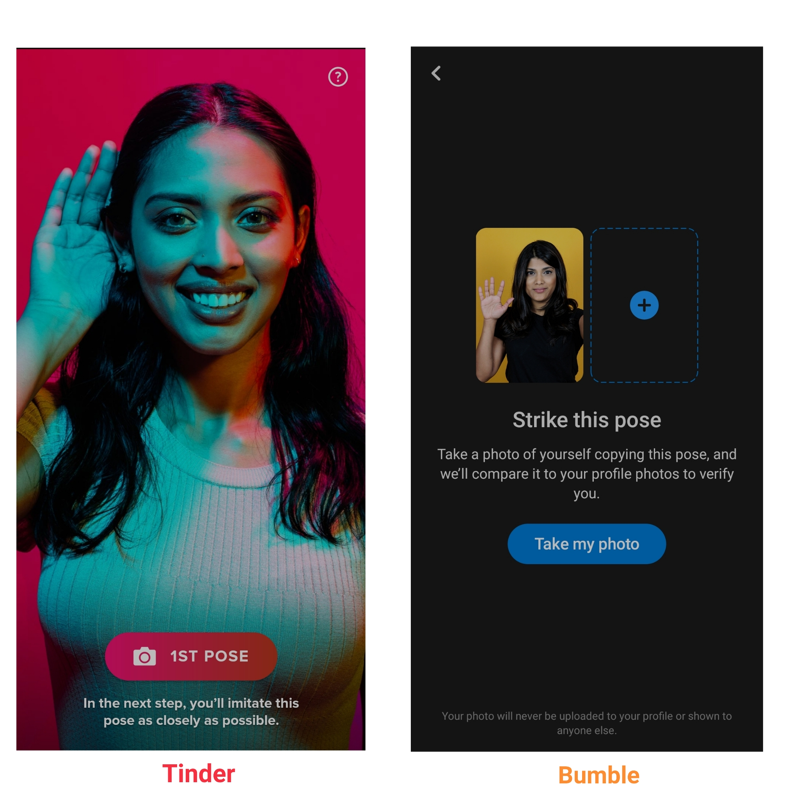

I am back with another App Vs. post, this time around dating apps, that people majorly use here in India. Why ? Because most of my single friends (sigh) are using them, and TBH I have admired the amazing gaming swiping technique that Tinder launched with, making search comparatively easy and without that dreaded feeling of getting rejected. 

Anyway, I decided I will pen down my thoughts and analyse the two apps - [Tinder](https://tinder.com/?lang=en) and [Bumble](https://bumble.com/en-in/), both having a large user base in India (Both rated 3.4 stars on the Google Play Store). I wanted to keep this simple, so didn’t include other popular apps like OKCupid (Rated 3.8 stars) or Happn (Rated 4.0 stars) here. 

Tinder is the most popular dating app in India, almost synonymous to online dating and is well-known for providing users to search for single individuals near them by swiping left or right. Bumble is an app that’s not only for dating (although we are going to focus on that in this article), but it’s also a platform for platonic friendships and professional communication, which is known across the world as a “feminist dating app”, where for heterosexual matches a conversation only starts when women take the initiative.

## Problem Space

I started off with the goals and did a quick research on why people may be using dating apps by talking to my friends and conversations/people they’ve encountered on these channels -

1. Find love
2. Casual hook-ups
3. Find people to hang out with
4. Kill time
5. Find followers for Instagram account (Tbh, it works)

For each of the listed goals above, there’s a specific app existing today yet people continue to go on dating apps, to achieve all of these goals at one single place. Specifically Tinder, as Bumble has segregated the apps into - **Bumble Date, Bumble BFF and Bumble Bizz**, assuming that these may be the major goals people have while wanting to socialize.

## Deepdive into design 

### 1. Login and Registration

Both Tinder and Bumble offer a very easy and simple onboarding process with minimalistic design and isn’t overwhelmed with a lot of UI elements. Of course, there are some variations in how the user flow will be like in both the applications.

For example, Tinder starts off by sharing a basic guidelines or “House Rules” while using the app in the immediate screen itself after logging in, whereas Bumble decides to do this as the last step of onboarding.

Tinder and Bumble both collect basic information like Name, DOB, Gender, Sexual orientation. 

Both Bumble and Tinder go the additional step of giving the option to choose from the whole spectrum of gender identities while choosing how to identify oneself. Tinder also provides the option to choose upto 3 types of sexual orientation, something which is absent in Bumble - Men/Women/Everyone. 

Tinder also uses active wording like - “My first name is …”, that helps create some kind of conversation with the user. Also, there’s a pretty cool progress bar that tells me how long the process will take.

### 2. Setting up a profile

While setting up your profile you need to upload a photo for your profile, and in case of Tinder you need to add a minimum of two. 

On Tinder, what I found truly annoying about the process, was that you had to upload the photo it had to be in your recent photos OR you could snap a photo from your camera right then. It didn’t have the option to go to your gallery and choose a photo, and as a user you feel restricted, as you have to scroll down, assuming you have a good photo lying down somewhere in your recent photos (As a person, who has hundreds of photos of her cats and maybe only 1-2 of my face, setting a profile on Tinder took some time).

Bumble has all the necessary functionalities I would expect while uploading a photo or basically any file into the app. 

Additionally, Tinder asks you to choose a maximum of 5 passions from the list present to match you better with people sharing similar interests (I think). 

The final step in onboarding is Tinder asking you if you want to avoid someone on Tinder by sharing your contact list, so both parties will not be able to see each other on the app. Pretty handy feature, if you don’t want to see a family member or an ex on the app.

Since both the apps are location-based, they ask permission to access your location as the final step before getting in the swiping game. Note the wording in Tinder, the grey button stating “Tell me more” leads you to the other screen.There Tinder explains why you should enable the location in terms of your benefits — that’s how you will see matches nearby. Interesting way to get permission, let’s allow it!

### 3. Welcome Onboard

Immediately, the apps give me a quick, interactive tutorial where I can see the card of my first potential match. Most of the card’s place takes the person’s photo. That’s the right way to attract any person’s attention. People evolutionally tend to notice and recognize other peoples faces.

Tinder’s match card design is pretty simple - photo, name, age, one-line description and/or a verified badge, passion tags. And if you scroll down the card, you see additional information like location, kilometers away from you, Spotify interests, Instagram account.

Whereas, Bumble’s match card is even simpler - photo, name, and age.

When you tap the card you see the next tutorial — how to interact with the card. Nice timing to show it — right when I would need it.

One sad thing, is you can’t undo your actions (unless you have a premium account), so if you swipe left a person that person is gone forever, and since this swiping activity is similar to scrolling Facebook/Instagram, you will have a fair idea of how you get hooked on it, and are mindlessly swiping people left/right, increasing the chance to make mistakes.

You can share the match profile with your friend to know their opinion. Very interesting idea on Tinder — when making a decision people are more likely to look for help from others. Also, it’s a good way to get your users to promote your app with their friends.

Anyway, once the pairing is successful, you go to the next level and start chatting. 

#### Inbox

As a female, my Bumble inbox is less clutter-y and filled with random DMs as compared to my Tinder Inbox. Tinder has also started off a new feature called “My move” - giving women that extra layer of security that allows them to start a conversation with a man, although it isn’t turned on by default.

While chatting, Bumble helps break the ice by providing random questions to ask another or just start off by saying a simple Hello through a funny GIF, to help make conversations easy. It has additional features of taking snaps, sending voice notes, starting a phone call/video call, without having to exchange phone numbers with each other. Bumble will also ask the user if they are willing to accept it, so the user will not be harassed and will not receive strangers' photos.

Tinder’s messaging channel is a bit limited here. The only options here are sending a normal text, GIF, starting a video call, which is weird to me. It’s like the app wants the users to shift to other messaging channels, other than Tinder’s.

#### Profile and filters

Given the rise of catfishing incidents, it’s nice that both these apps restrict users from allowing someone else’s photos. To be verified, the apps will ask you to take a photo of yourself and analyse it with facial recognition to ensure users are loading their own photos to the app.

Adding information to your profile, like linking your Spotify and Instagram account is relatively easy to find and do on bumble because of use of clear markers that highlights it as a key datapoint. You will understand what I mean by looking at the photo below -

On Tinder, you can add photos/videos to your profile, which is limited to recent photos OR capture from camera. You can also create a new prompt to add to your profile, for example, *“This week has me thinking about how baboons steal lion cubs”*.

There a ton of options you can choose to display on your profile or how you want to “filter” your matches.

On Bumble, you can exclude people who do not meet your desired criteria, such as height, zodiac star sign and much more things. Tinder doesn’t have this, which is why Tinder's large user base can be a disadvantage, as more than half the time gets wasted on filtering matches that are not suitable for you. This is a big drawback for a user who is usually busy with work or other daily errands.

### Extra thoughts

Tinder has definitely solved the pain points of modern people’s social lives, and optimized the UX of online dating apps, making the process super simple and fun, but it wastes a lot of time. Bumble goes an extra step here, with their filters, but, can it be better? Can a dating app offer a more meaningful experience?

For now, Tinder doesn’t know what happens after a match happens. I mean, of course assuming they have the textual data upto a  certain point, but they don’t know what happens next - If a meeting happened, was it good. And how can it be done without violating privacy ? By asking the user for their feedback, like after-match. May be an annoyance if you think about it, but maybe there’s a simple solution there.

