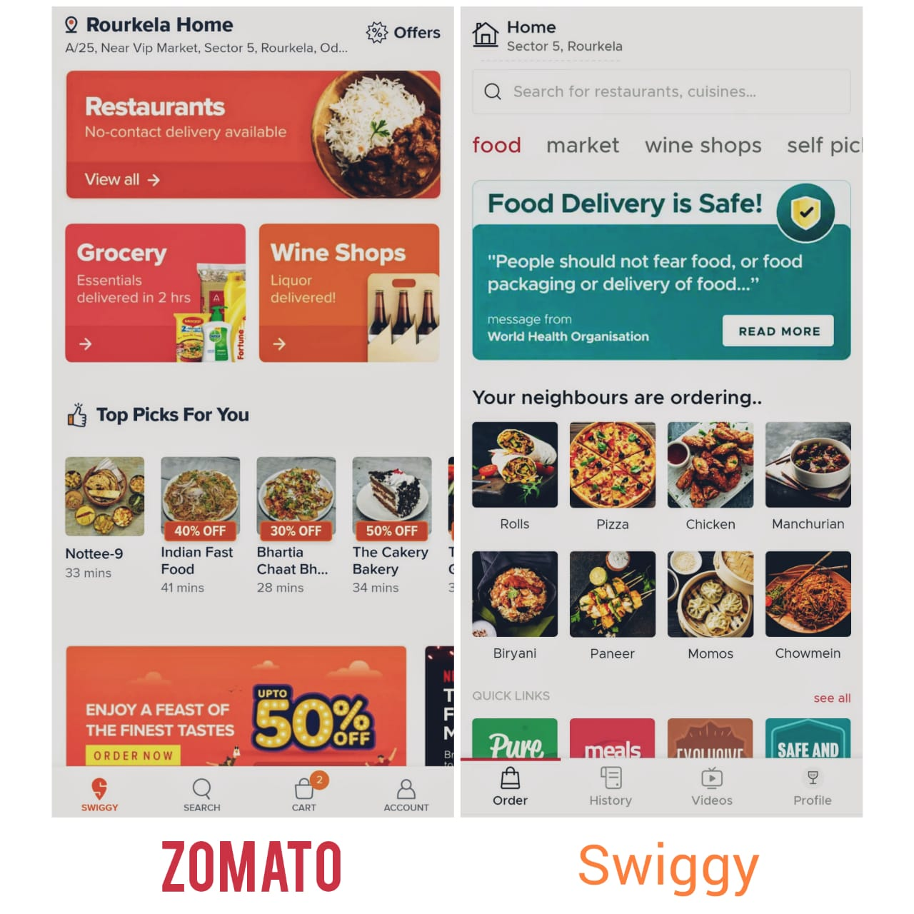
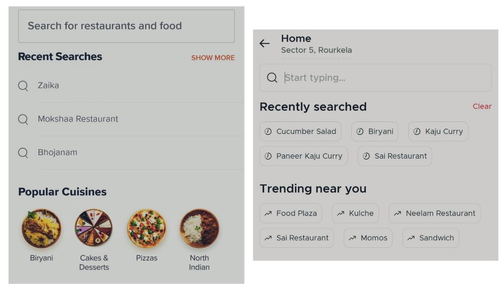
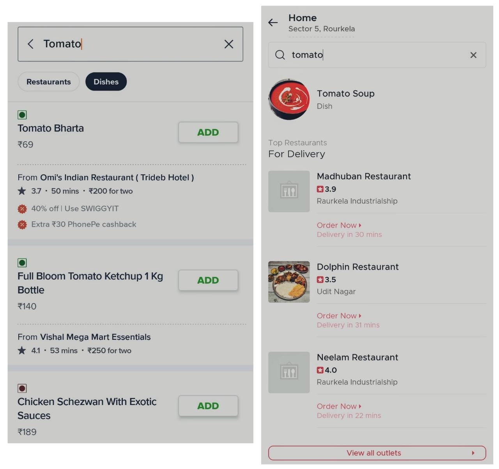
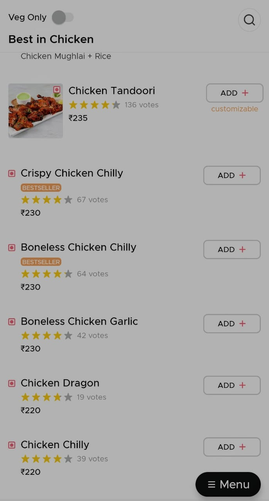

I'm a self-proclaimed designer. (I started an IG channel, a Patreon account and a Behance account in the small span of 2 months after I created a realistic looking egg using illustrator)
 
Keeping the amateur artist persona aside, for a long time now, I have passionately looked at apps and asked questions around their aesthetics and usability, like - 

*What is even the function of the "Inbox" tab option in Paytm*
 
OR

*Why is Google Pay's search button called "New payment" and why is it present at the bottom of the screen*

Anyways, so I decided I will pen my thoughts and analyse the two apps I have used significantly more since the lockdown happened - Swiggy and Zomato.

Swiggy is primarily a food delivery app. Zomato offers the service of food delivery and restaurant discovery.

The great thing about both these companies is that there's been a lot of changes in how the app looks, even if I compare it with last year. They always continue experimenting with new designs and have improved the whole experience of ordering food, if we compare it with the past versions.

## Problem Space

A key point to consider here is to firstly understand the needs of the customers. From my understanding, the primary objectives to judge food delivery apps include -
- Cost effectiveness
- Good quality of food

It feels necessary to mention this here that I will only be talking about the design of the applications in food delivery space and not review their service, and will be doing so solely from the perspective of a user or food-eater.

## UI Design
#### 1. Landing Page

First annoying thing about Swiggy is you cannot enter the app unless your location is switched on. Belonging to the class of people who religiously adhere to good battery backup methods, being forced to do something is annoying, even if it's turning the location on. Although, as a person who once had their food delivered to the wrong address by mistake, I think I understand where they're coming from :3. There's no two ways about this, it's an inconvenience, even if it's a necessity.
 
I remember the minimal, clean interface of old Swiggy. Since the past year/s, it has become very *Zomato-ish* lookwise. The font size for restaurant names have increased, even text and pictures take up more space now. They still stick to their color scheme (more or less).

On the other hand, Zomato straight up goes to the home page. And it's loud.

There have been some unmissable changes like how Zomato changed it's menu listing so now it allows images to capture more space on screen as opposed to the previous list that looked similar to Swiggy. It does feel like a lot of clutter and color.
 
On the restaurant listed, they have labels on top of the image to explain - COVID-19 precautions adhered by restaurant and coupon codes for particular restaurants. I am unsure if labels were the best way to do so, and on top of it using contrasting color labels.

#### 2. Search bar

In Swiggy, there’s a button for search at the bottom of the screen with the typical "Magnifying glass" icon.

Before you begin typing something in the search bar, it provides a list of my recent searches, which makes the experience more personalized and suggestions of popular searches in the area, which is great if I am unsure about what I want to eat.

One issue I did find is that since Swiggy ventured into grocery delivery, it lists the  grocery items and food items in the search results together,  which can be confusing.

In Zomato, the search bar is on the banner itself. Similar to Swiggy, it also provides a list of recent orders and popular ones in the area.

I noticed one thing here, if I enter *"Tomato"* in the search bar, it will suggest picking a dish name from the list shown, like "Tomato Soup" and I can't proceed further unless I pick something. This ignores the dishes which contain the word "Tomato" in their dish description, which Swiggy does pick up and provides a list of items that contain the search word, if it's in the dish name or description.

#### 3. Menu

Both apps have a simple menu design, with a list of dishes with images and/or description mentioned, and also labels the "Bestseller" dishes.

Zomato also provides ratings on specific dishes. But what exactly is the point of that ?

#### 4. Payment

Zomato remembers the last used option and uses it as a default option, unless changed by the user, this does reduce the time in placing an order. Swiggy doesn't do that and it directly provides you with a list of payment options to choose from.
 
Before finalizing the order, Zomato also provides suggestions to add to the bill based on popular add-ons.

#### 5. Changes due to pandemic - Extra

When you open the Zomato app, there's a large banner at the top that speaks in a large font - "Food Delivery is Safe", assuaging our fears around it.
 
As mentioned above, Zomato provides specific details about the guidelines a restaurant is adhering to, through labels, which makes sense as people also refer to Zomato before dining out and it provides details about a restaurant's hygiene and safety practices.
 
Swiggy shows a badge for specific restaurants, who adhere to safety and health guidelines, but doesn't go into much detail about it.

## Extra thoughts ?

I haven't dived deeply into the whole user journey, and picked up only major milestones in the user journey. There are plenty of things to look into and the following are suggestions for future features based on my personal bias/experience.

- **Save for later**

Having no feature to bookmark restaurants despite repeated orders seems like a no-brainer. Zomato has this option, but to bookmark, the  "More info" option has to be clicked after clicking on the restaurant name and then it gets bookmarked.

A food-enthusiast like me, used to screenshot the burgers which I wanted to try next from Truffles :3 (hopefully, there's a better way)

- **My own ratings**

There's nothing stopping me from ordering from a place which I previously rate as 1-star or 2-star. Why are my past ratings not visible to me?

Zomato doesn't have this. One can access this on Swiggy if they look at their past orders, but there's no preventive step here.

