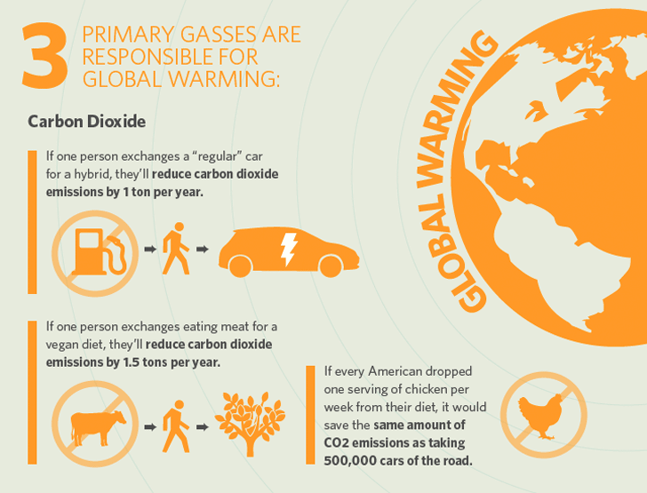

Avoiding meat and dairy products is the single biggest way to reduce your environmental impact on the planet. 

*I type as I gently weep while eating this chicken roast*

Now, I have been following this topic for a long time, and I know that to lead a truly sustainable life, I will have to switch to a meditareranean diet or a vegetarian diet soon.

According to a new [comprehensive study](https://science.sciencemag.org/content/360/6392/987), it’s been estimated that without meat and dairy consumption, global farmland use could be reduced by more than 75% – an area equivalent to the US, China, European Union and Australia combined – and still feed the world. 

The incessant manner in which mankind has continued grabbing land for the sake of cultivation or agriculture has become a leading cause for the current mass extinction of wildlife.

The new analysis shows that while meat and dairy provide just 18% of calories and 37% of protein, it uses the vast majority – 83% – of farmland and produces 60% of agriculture’s greenhouse gas emissions. The research also tells us that even the very lowest impact meat and dairy products still cause much more environmental harm than the least sustainable vegetable and cereal growing.

“A vegan diet is probably the single biggest way to reduce your impact on planet Earth, not just greenhouse gases, but global acidification, eutrophication, land use and water use,” said Joseph Poore, at the University of Oxford, UK, who led the research. “It is far bigger than cutting down on your flights or buying an electric car,” he said, as these only cut greenhouse gas emissions.
 
And surprisingly it’s not just land animals but also the large impact of freshwater fish farming, which provides two-thirds of such fish in Asia, and was initially thought to be relatively environment friendly, actually isn’t. This is because of the deposition of excreta and unconsumed feed down to the bottom of the pond, where there is minimal oxygen, making it the perfect environment for methane (a greenhouse gas) production.

Food insecurity already impacts more than 2 billion people, while nearly 690 million people are hungry — an increase of 10 million from 2019, according to the UN’s Food and Agriculture Organization (FAO).
 
It estimates the COVID-19 pandemic could add up to 132 million people to this number, depending on the economic growth scenario.

We know that the entire supply chain of the meat industry contributes to an array of environmental issues affecting climate change. 

And there are ways to deal with this problem like -  Labels that reveal the impact of products would be a good start, so consumers could choose the least damaging options. Similarly, subsidies for sustainable and healthy foods and taxes on food and dairy also seems fairly important to curb the demand for meat and dairy. 

But how about instead of reforming processes in the industry we shift our focus to something new entirely, an alternative source to the food that we eat ?

## Lab-grown meat

### What is it ?

The process of growing meat in a laboratory involves taking stem cells from a live animal and growing them in nutrient-rich conditions.
 
The cells are split into several cell types including muscle and fat cells. This biomass is then processed to form the edible final product.
 
Although it sounds complicated, cultured meat takes much less time to grow, uses fewer of the planet’s resources, and no animals are slaughtered. 

### Origin

Like many inventions that happened during or due to World War 2, lab-grown meat is also one of them. The Dutch researcher and entrepreneur, Willem Frederik van Eelen aka the godfather of lab-grown meat, came up with the idea of growing meat in labs after he experienced two things while being a POW in Indonesia: terrible hunger, which he said nearly killed him, and the mistreatment of animals.

As a result, he became determined to find a way to feed the world's population without harming animals.

### Innovation on the rise

It’s still going to be a while until we see cultured meat, aka cell-based meat, on the menu, but start-ups have been working on it for five years. They’re progressing fast and the industry is big business.

In June 2019, Israeli start-up [Aleph Farms](https://aleph-farms.com/) claimed to be the first company to have developed steak in a lab. It hopes to trial the steak in high-end restaurants in the United States, Europe and Asia in 2021, with an official launch in restaurants and supermarkets in 2023.

[Shiok Meats](https://shiokmeats.com/), based in Singapore, was founded in 2018 by two stem cell scientists, and the company says its patent-pending technology can grow crustaceans four times faster than the conventional method. Just a few weeks ago, the company managed to recreate shrimp in its lab.

Currently, there are some 55 countries across the world who are involved in developing some variety of cell cultured meat.

### What are the challenges?

To scale up production of cultured meat and lessen costs, there are a few innovative difficulties confronting organizations — and these are something the worldwide life science and healthcare company Merck is attempting to overcome. 
 
- Cell line development- Specific, food-grade meat producer cell lines are needed that are genetically stable; capable of differentiation and improved for large-scale production.
 
- Bioreactors and bioprocessing - Bioreactors, bioprocess design and automation platforms are needed that enable growth and differentiation of multiple cell types simultaneously.
 
- Edible scaffolds- Similar to tissue engineering and regenerative medicine are needed to enable the next generation of structured products such as biodegradable, edible scaffolds/biomaterials and 3D cell culture processes.

As the challenges are overcome, the cost of producing cultured meat will come down. According to reports, the costs have already reduced dramatically over the past few years, from estimates of hundreds of thousands of dollars per kilo to $25.

### People perception of lab-grown meat

Even if the cost comes down and the process becomes scalable, there’s still a question of demand. Will people necessarily want to eat something they know has been grown in a lab, rather than a field? 
 
The cultured meat industry has a literal image problem, which seems unfamiliar and unappetizing. Images in popular media of cultured meat today look sterile, scientific, unappetizing; something to touch with a rubber glove or eat out of a petri dish.

While the signs are promising, for now, it seems there are few technological and marketing hurdles to overcome before cultured meat will be feeding people, in the future.

### When will it be on our plate?

Many companies working on cultured meat — including [Mosa Meat](https://www.mosameat.com/) and US-based [Memphis Meats](https://www.memphismeats.com/), the two startups with the most funding — have a similar time in mind to launch their first product: 2021.

There is an exception, though. The American company Just says their first product — cultured chicken — has been market ready since 2018, but they are waiting for the regulatory requirements of cultured meat to be more clearly established in the US before launching commercially.

When we’ll actually see the impact of cultured meat, however, might take a bit longer.

“We have billions of animals that are being raised and are being eaten,” said Daan Luining from Meatable. “If you can just reduce that 10%, 20% it would be massive on the environment, but we don’t expect that to be done within 10 years. The only thing that is now on our horizon is just stopping the growth of animal consumption. If we can just do that it will be a huge win.”

### Will it be affordable?

Not likely.

The first products will likely be released at a small scale and with a premium price in select restaurants or retail vendors. Nonetheless, that may change a great deal depending on the type of meat and the technology used by each company.

Most organizations are attempting to deliver their own variants of beef. 

“Cattle are the least efficient links in production — pigs are twice as efficient, and chickens are four times more efficient,” said Peter Verstrate of Mosa Meat.

### So what now ?

It’s easy to get caught up in the latest food trend. We are being sold the message that in order to save the planet we need to buy alternative protein products, yet I truly think what we need to be doing is just buying less and using what we buy better, not buying what the big food companies tell us to. 

When I was young, I’d spend the summer months with my grandparents in the countryside. For them, meat wasn’t an everyday thing. It was a treat on a Saturday or Sunday. I think we need to return to that. Animal products are a luxury product, regardless of whether they come from the lab or the land.

Not that I think that this isn’t a truly remarkable invention in the field of science, I personally cannot wait to taste a lab-grown hamburger. But maybe a simpler solution exists, maybe it’s just as easy as a behavioral change.