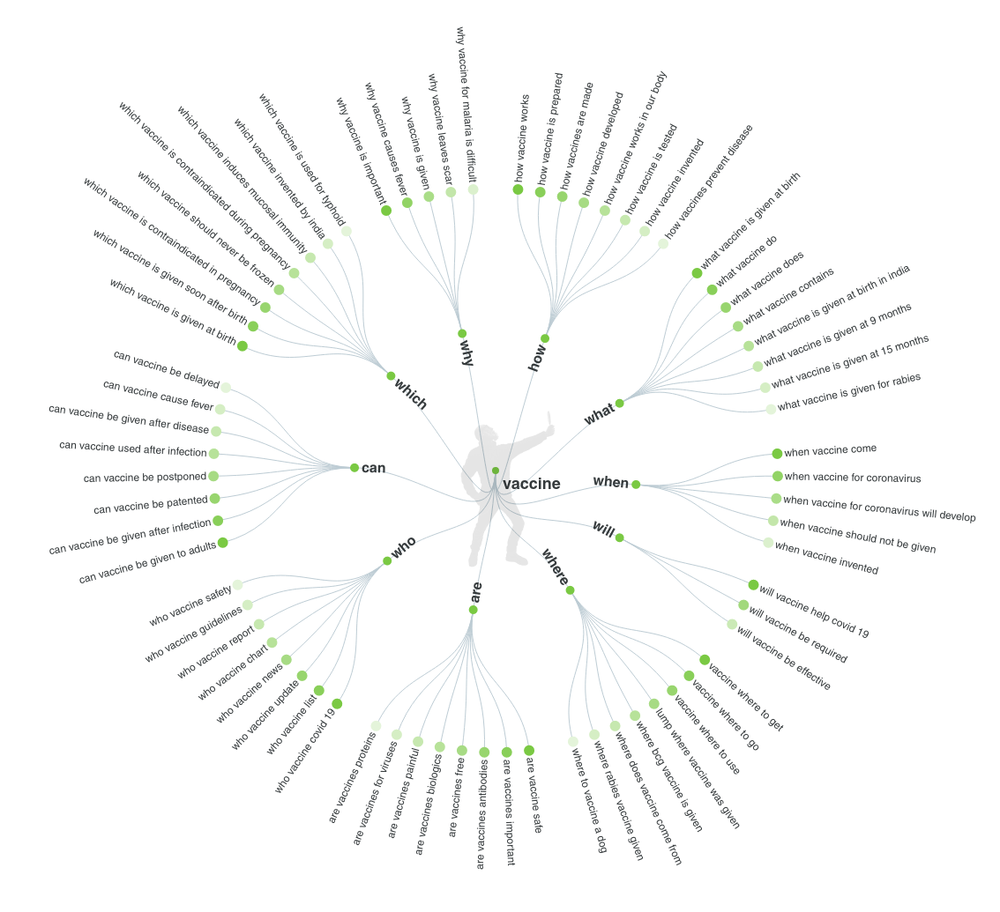

 
In the first class of Marketing 101, I learnt that customer insight is the core of any product/service you wish to sell. As a marketing student, my projects mostly involved doing surveys and focus group discussions and although not being a master at market research I did learn the basics of it. Although, there were many times I just couldn't find that niche group of people who I wanted to study nor did I have money lying around to pay someone to do it for me, I had to rely on other publicly available resources.

Three things really helped me to get some external input - 
1. Social media 
2. Research reports
3. Web Tools

#### SOCIAL MEDIA

There are a ton of websites where people go to share their feedbacks or raise complaints about products. Social media has given people a chance to express themselves, build communities, interact and involve with the communications giving scope to more engagement between people. This is a gold mine of information, that's waiting to be harnessed. This can be done in two steps - 

<strong> 1. Text scraping </strong> - Can be done using a tool webscraper.io, which has a chrome/firefox extension to extract specific data from websites. The tool allows the user to build Site Maps from different types of selectors. Creating a sitemap and selectors tells the system what to do during the scraping process so that data can be extracted.

<strong> 2. Text mining and visualization </strong> - The data can be cleaned later on in Excel by removing irrelevant data and segregating it. This data can be further visualized using a tool called VOSviewer to find the most occuring words and identify the broad theme of words/relation between them.

Popular sites where people provide feedback - Yelp, TripAdvisor, Google.

#### RESEARCH REPORTS

Not everyone has access to industrial reports from Gartner etc. One can still find multitude of reports on the internet to understand customer behaviour, although it takes a considerable amount of time to research and find the relevant ones.
Some sites that I have found useful include - 
<strong> 1. Think with Google </strong>
<strong> 2. Nielsen Reports </strong>
<strong> 3. Revuze blog </strong>
<strong> 4. Research papers of educuational institutes </strong>
	

#### WEB TOOLS

If a huge chunk of your customer base has access to internet, it's imperative to look into their search history. There are sites like AnswerThePublic (my personal favorite, see image below), which can tell you what people are searching for on the internet, by using search data from sites like Google and Bing. What stands out is the interface and the fact that it can shed out some cool infographics for easy visualization. It seriously is an underrated website, and can be useful for many, like if you want ideas for creating content for your Instagram handle or if you want to target the best SEO keywords. 

These are few resources which I found most useful in the past years. I am also thinking of doing a comparative study of different Web Tools, judging them based on content, credibility, free/paid service, interface and user experience.

