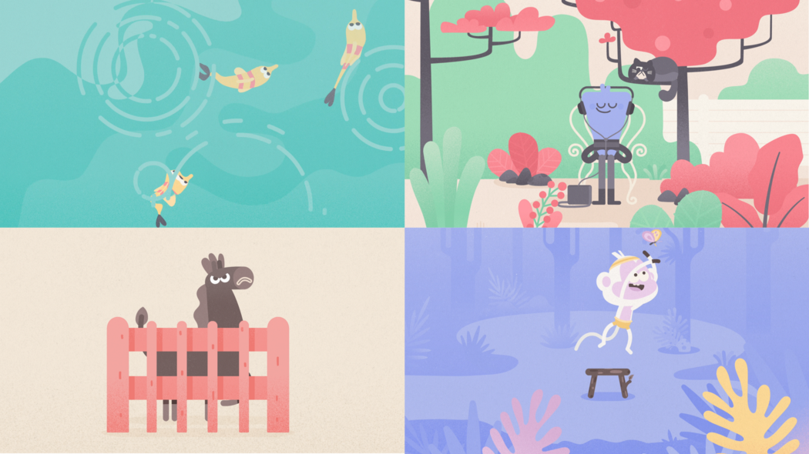

I discovered [HeadSpace](https://www.headspace.com/) in my first semester of MBA, I remember feeling the need to search for this proverbial “escape door” from the sheer amount of workload that I was consumed by, which led me to this. Although when I wanted to use the app (2018), I wanted to meditate for an hour but was restricted to a mere 10 minutes per day. Although I ditched the app then and there, this peculiar decision to restrict meditation sessions to 10 minutes was probably inspired by looking at earlier practices of users who possibly couldn’t afford to spend a lot of time on meditation.

So, when 2020 arrived and the world collectively decided to wreck things up a little more, the mindfulness market grew to a $1.2 Bn market, and we saw a surge in meditation and mindfulness app downloads amid the pandemic. So given how great Headspace is doing in the market, I decided to understand the app better (and give it another go).

To provide some context here, Headspace is a guided meditation and mindfulness app, which has 10M + downloads on Play Store.

Now, I do want to blab about how the app helps one achieve mindfulness, but I do want to focus more on the product management practices the company abides by (and hopefully learn something from it), so here’s a summary - 

### Hassle-free and simple onboarding

Any app that allows you to sign up in a single screen with minimal steps during form-filling gets a tick in my book. It gets to the point about what you might need from such an app and isn’t restrictive when it comes to the personal experience; you can answer a short series of nicely designed questions with large icons to personalise the experience from the very beginning, which leaves the first impression that you will get a great user experience out of it.

### Content is king

Headspace’s content marketing strategy is bang on! They have their own blog, a YouTube channel with many videos having 15M views and a podcast.

Within the app, the language feels safe, fresh and easy. Content in the app feels like you’re talking to that friend who gives you the advice you need, in a way that you can trust. An important lesson here is to know how your users talk and therefore how you should interact with them. 

Both in the app and outside, Headspace delivers what it promises on - *Making meditation simple*. 

### Focusing on primary component

Twitter has one key component - Tweets. It can add/remove other features, but tweets are an integral part of Twitter. For Headspace, this component is a small audio clip. After removing all the subscriptions, packages, designs, the only thing that matters is the guided meditation clip. This is a bit different from how people access content normally, most apps have text, picture, video or a combination of those, but in Headspace there’s only audio clips, which brings along a totally new dynamic on how users consume content and thus has been optimized in a unique way. 

And it wasn’t feasible to create content from scratch, which is where the expertise of Andy Cuddiombe’s (founder of HeadSpace) comes into picture. It’s interesting to know that Andy Puddicombe himself is a buddhist monk, having received his meditation training for more than 10 years in a few countries like Nepal, India, Burma, heartland of different branches of buddhism religion. He started his private meditation practice which subsequently led him to co-founding Headspace. Which is why the product is highly centred around this tested content.

### Achieving Design Zen

Despite being an audio based product, Headspace’s UI is surprisingly visual. The interface is clearly kept to a minimum to keep things simple. The user interaction is intuitive and logical, where with a maximum of 3 clicks anyone can get into the desired section

One of Headspace’s greatest strengths is that it has a truly unique identity. It’s all been so well-considered from a design point of view; everything from the muted colour palette to the beautiful illustrations helps to communicate a distinctive and calming presence.

### Rewarding good habits

Remember the [Hook framework](https://www.alexandercowan.com/the-hook-framework/) ? Crafting fulfilling rewards for the users is no easy task. Gamification is used in all kinds of apps, but getting it right is extremely hard.

It is something I believe is important and can be hard to achieve because there’s a really huge chunk of users who don’t meditate habitually and may require timely, impactful nudges to help them achieve their goals.

### Create scarcity

Now, I presume that Headspace is spending its bucks on -  user activation - turning users to paid users.

Headspace attempts to improve daily user engagement through a gamified, free 10-day beginner exercise: it encourages you to take one short session every day for 10 days, stressing that regular practice is important.  Once the user has gone through Headspace enough, a user craves for more but now it comes with a paywall. By this time, Headspace has helped the user (hopefully) understand the value it can provide.

### Keep users engaged

A great way to get users to come back to the app — get them to add their friends to your app! Headspace lets you nudge your friends and keep them informed about your progress. Sometimes having a community can be the difference between a great and excellent app.

I saw this is a newly added feature for group meditation , which drastically increases the sense of real time interaction with the couch as well as helps establish communities (it feels as if you are meditating with a group of people). Everybody wants to belong somewhere, right?

### More research, less assumptions

They have an entire section dedicated to this on their website, to show you what their ongoing research has found and how they are striving to get better. They rely on data to make strong decisions. While this is a difficult task to achieve, Headspace seems to be doing a great job.

