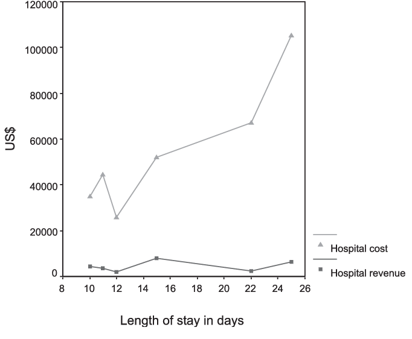

 

    

The demand for triaging technologies, like conversational bots, has risen substantially as the coronavirus pandemic rages on, which isn’t surprising. Tech giants like IBM, Facebook, and Microsoft have engaged in  partnerships with governments and private industry to roll out chatbot-based solutions, as have a number of startups.  For example, [Gyant](https://news.crunchbase.com/news/gyant-raises-13-6m-series-a-from-wing-venture-capital/), whose AI-enabled health platform is designed to drive patient-doctor engagement, closed a $13.6 million round recently. 

In India, startups such as Practo, DocPrime and Lybrate were operating under a regulatory grey area. Unlike US, doctors in India are allowed to practice in any state. So it was always legal to practice telemedicine, but the regulations were never formalised. **The Govt. Of India introduced a new comprehensive [framework](https://www.mohfw.gov.in/pdf/Telemedicine.pdf) on how to practice telehealth** in March, 2020.

Just imagine - a service that is as old as the telephone, is making a comeback - **Telehealth**. What cannot be ignored is, we may also look back on this challenging time as the moment when healthcare transformed to become more preventive, with a focus on health and care, keeping everyone in the community healthy and doing so more efficiently and cost-effectively.  Paperwork, payment, and other administrative burdens can be remotely automated by digital health services platforms, which will also, in turn help in lowering costs. Although this accelerated adoption, largely driven by the pandemic, is far from perfect, we’ve learned that much of our care can be delivered virtually. **Healthcare is the most information intensive industry, yet it uses very less amount if IT or new technologies**, for some weird reason. Many ailments can be treated without physically going into a doctor's office like back pain, headache, psychiatry, etc. 

We all know, other diseases haven taken a backseat as majorly all resources are going into treating Covid-19 patients. It's troubling to even imagine how many childhood vaccinations that didn't happen, screenings for cancer and other illnesses that didn't happen. These services require movement to happen and only pre-planning and innovation can help when the need arises.

During the pandemic, we also learned that it’s often healthier, both for the patient and the physician, to keep those who are sick and those who are vulnerable to health complications, at home, rather than coming to the doctor’s office, the ER, or the hospital. Paired with the fact that the single largest reason people do not access have to adequate healthcare, whether in urban settings or in rural ones, is transportation, virtual care is ideal. It's still unsure how these consultations will be charged, because as per the guidelines, they should be charged just as a normal consultation is, but as per my discussion with certain healthcare providers during last week, they simply don't have any idea about this.

    

Preventive care is not incentivised so no one cares about it, it's only when procedures are being done, that can help you earn money. Length of stay in a hospital is the first metric to look for if you're judging a hospital's efficiency; it costs more for the hospital to take care of a person, so they would want it to be as low as possible. So to reduce spending in medical care, it's important to get people out of institutions. **More preventive care with cheap and innovative inventions will help keep people out of institutions.** 

Pairing virtual solutions with more comprehensive at-home diagnostics and lab testing will free up our health and care system to focus more intently on what is most critical.

**References:**
*  Orthopaedic surgery in severe bleeding disorders: A low-volume, high-cost procedure - Scientific Figure on ResearchGate. Available from: https://www.researchgate.net/figure/Correlation-between-length-of-stay-hospital-cost-and-DRG-reimbursement_fig4_11053747 [accessed 16 Jul, 2020] *
  

