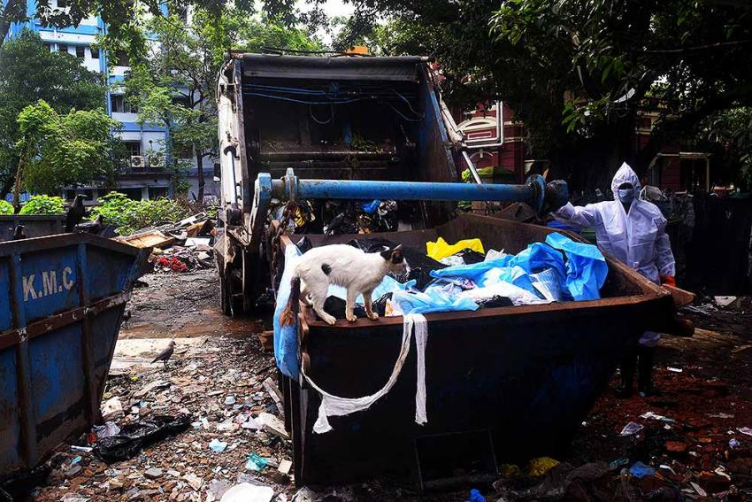
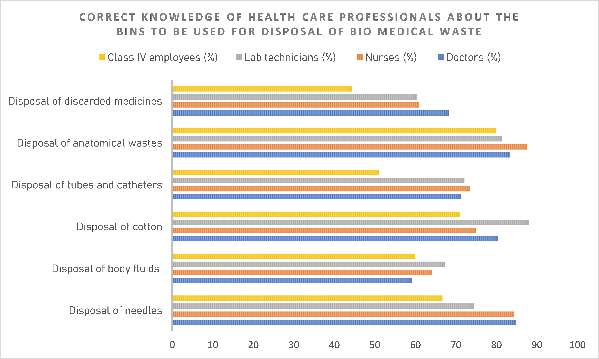
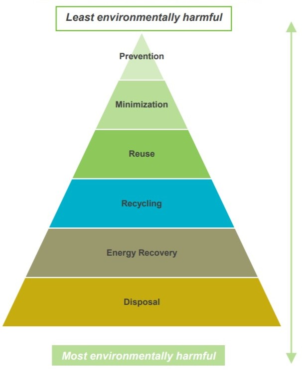

Hospitals, clinics, nursing homes and medical colleges were generating an increasing amount of biomedical waste in an unscientific manner, even before the pandemic hit. Although hospitals protect and save human life, the by-products generated cause great damage to the environment and especially to the people who work closely with this waste. The abysmal waste management practices in these institutions add to the problem and cause exposure to health hazards and environmental problems. The issue of medical waste identification, handling, and disposal needs to have a heightened review so that better management practices and protocols can be established, and necessary efforts should be made to execute them on the ground.

Wait, so what is medical waste? 

Broadly, any waste generated during diagnosis and treatment, which includes contaminated items such as human tissues, body fluids, blood, equipment (beddings, syringes, sharp objects, dressings, etc). 

Treatment and disposal of healthcare waste may pose health risks indirectly through the release of pathogens and toxic pollutants into the environment.

Improper segregation of biomedical waste and different medical waste streams from where they originate can trigger a domino-like effect on the environment which can later become a possible threat to people, animals, or soil and water sources. It has the potential to contaminate groundwater sources, which in turn may enter the ecosystem and then disrupt humans lives too. From hospital waste collection and storage to landfills, biomedical waste needs to be properly contained to keep it away from birds, rodents, and stray animals (as well as humans). This means emphasizing packaging and labelling of contaminants and helps prevent the spread of illness through human and animal populations – by air, land, or water.

If not properly contained, segregated, incinerated (on site/off site), environmental hazards associated with improper healthcare waste management has the potential to contaminate the air we breathe.

## Current policies
The Central Pollution Control Board (CPCB), released guidelines for handling, treatment and safe disposal of biomedical waste generated during treatment, diagnosis and quarantine of patients confirmed or suspected to have the novel coronavirus disease, during March 2020 itself.

It said that waste that can infect people with coronavirus needs to be segregated through color coding; they fall in Red and Yellow categories. 
RED bin—used PPE such as goggles, face shield, splash-proof apron, plastic coverall, hazmat suit, gloves, lab equipment like plastic vials, tubes, pipette tips etc. 
YELLOW bin—masks (the N95 included), head cover/cap, shoe cover, disposable linen, gown, non-plastic or semi-plastic coveralls, faeces from COVID-19 patient using bed pans or disposable diapers.

The pollution watchdog recommends fast disposal of such waste. But do the hospitals actually comply with these rules ? CPCB doesn't have an answer.

## Current methods

There are various processes like on-site incineration, steam disinfection, microwave disinfection, autoclave disinfection, and mechanical/chemical disinfection that are currently in use for managing harmful waste in developing countries. Mostly incineration practices are found in Argentina, Brazil, India, and Bangladesh. Although, hospital waste incinerators operate under sub-optimal conditions and are non-functional due to different reasons. The irony is that the hospital administration emphasizes only the installation of incinerators and often pays attention to its functioning and maintenance. Hospital personnel are reluctant to safely dispose and engage in proper handling of hospital waste, from the director to waste-collector level . So the common methods which are used in developing countries are burning, selling, burial, and dumping to dispose of medical waste. Mostly government hospitals collect their waste in open bins/common places and leave them for 1–2 days.

The preferred method with the least impact on the environment is having it treated by an autoclave. These devises use pressurized air and steam to sterilize the waste and can be used to treat 90% of medical waste. The waste is then shredded, reducing its volume significantly, and taken to a landfill.
There are 199 common bio-medical waste treatment facilities (CBWTFs) in operation and 23 are under construction (CPCB, 2017). However, as per CBWTF operators, setting up such facilities is not economically feasible for considering non-availability of funds for operation, non-compliance with segregation of such wastes at the HCFs level and non-payment of fees by them to the CBWTF personnel. A lenient behaviour is observed in waste segregation by the HCFs which makes using these incinerators, not as productive 

There are various gaps which need to be focused upon. One such is that in most of the hospitals enforcement and monitoring of rules that are in lax. Defaulters (HCFs, CBWTFs) are mostly, either suspended or their contracts are cancelled through District Magistrate (DM) but, are never levied heavily for their non-compliance
HCFs and regulatory authorities have to take stringent measures in order to ensure safe disposal of BMW in the country.

The awareness of biomedical waste practices among healthcare professionals is alarmingly unsatisfactory in India. Health care professionals comprising of doctors, nurses, lab technicians and class IV employees were tested and it was found that nurses had more awareness about the proper disposal of waste than other healthcare personnel. Also, Class IV employees had lower knowledge, which is a trend found in most countries around the world. The unsettling thing here is that the study was conducted in Mangalore, a place well-known for superior healthcare facilities, so one wonders how the numbers will be affected if one moves to a medically-poorer region in the country.

## Impact on environment  
#### Water pollution
Incineration of biomedical waste contains a high concentration of heavy metals and polycyclic aromatic hydrocarbons (PAHs), and results in unfavourable amounts of hazardous materials and may pollute surface and groundwater. Hence, it is important to eliminate the toxicity of ash before disposal into landfills or reutilization. 

The worst part about dumping in landfills is the presence of heavy metals from biomedical waste cause a risk to the environment especially in unlined landfills where dissipation of leachate into ground water might occur.

#### Air pollution
Incinerated materials containing or treated with chlorine can generate dioxins and furans, which are human carcinogens and have been associated with a range of adverse health effects. Incineration of heavy metals or materials with high metal content (in particular lead, mercury and cadmium) can lead to the spread of toxic metals in the environment.

## Treating medical waste during Covid-19
Though it is early to have exact figures, by some estimates, medical waste generation has increased six-fold compared to pre-COVID-19 times. 

As per the reports of The South China Morning Post, during the height of the outbreak in Wuhan, the city was dealing with 240 tons of medical waste per day, versus 40 tons prior to that. In the Indian scenario, there is lack of exact data on the subject, but conservative estimates draw a grim picture. 

The Covid outbreak has put India’s unsophisticated garbage treatment system — especially its inadequate handling capacity for biomedical waste—to a massive test. The country has produced nearly 1,700 tonnes of biomedical waste a day between 2016 and 2018, according to Parliament data. 

The bigger challenge here is: the lack of waste etiquette among the people. There is a alarmingly lack of awareness among the people as well as ground-level garbage collectors. Masks and sanitiser bottles have become a common sight on roads. There have been instances of waste from “containment zones” or inf­ection hotspots getting mixed with those from “safe localities” despite express dir­ections to sanitation staff to separate the two. Besides, as seen in mnay instances, people hardly follow the rules, the standard operating procedure.

Society’s perception and practice of ind­iscriminate disposal of items can be a potential source of infection to municipal workers, thus increasing the [number of deaths among sanitation workers](https://www.thenewsminute.com/article/covid-19-deaths-6-chennai-sanitation-workers-unrecorded-no-solatium-families-127892). People should dispose of used napkins, tissues, empty sanitiser bottles in a separate bag, to ensure the safety of municipal workers and ragpickers and keep it untouched for at least 3 days before disposing them off to ensure garbage collection and plastic recycling doesn’t get affected.

Around 15,000 more waste management personnel have a risk of contracting secondary infection every day from the plastic bags filled with used syringes, sharps, catheters, face masks, hazmat suits, and all conceivable clinical garbage. They cover up in overalls, but the risk they take is not covered—no insurance, poor pay, and no acknowledgement either from the government or people.

Much of the garbage collected is plastic -- N-95 masks are made up of polyisoprene (natural rubber) and polypropylene (thermoplastic); face shields are all plastic. The protocol says used disposable masks, gloves, aprons, head covers and so on should be incinerated or given a burial—at least 100 feet deep. India has over 1,200 registered plastic recyclers. But the PPE suits manufactured in India cannot be recycled. A company owner says: “Polypropylene is used for the kits that are available and cheap.” Recycling of poly materials is high and India currently has no facility for this. Since coveralls are widely used now—from beauty parlours and salons to weddings and hospitals—the question remains where will the waste go?

