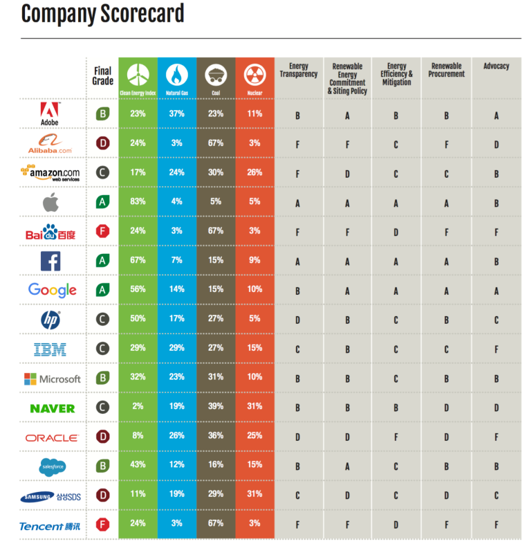

So funnily enough, I am currently typing this on my laptop which consumes around 0.6kWh of power which also includes the Wifi router connection, in a day. That connection runs through an access point, which is powered by a switch that connects to the fiber optic cable used by the ISP. After which, there’s a complex labyrinth of routers and servers (which is beyond my capabilities to explain).

Everything involved in this process draws power, and particularly the computer power is spent in service of using the web - as I’m using Google Docs at the moment. Does that mean I should include all of that while computing for the energy the web consumes ? I say, yes, because without it, I wouldn’t be using the internet at all.

This should make it abundantly clearly that the fundamental calculation to arrive at a number is ...tricky, to say the least. Not that it has stopped people from actually finding that number, but it does involve some difficulties and a clear set of assumptions.

## Factoring in all the energy

When it comes to the actual energy consumed, it should be made known that the internet is a hungry system. It’s a network of networks and each network consists of computers. And all these computers consume a huge amount of power. 

To actually estimate the amount of energy consumed, we need to consider every component that connects to the system. Furthermore, we need to think not only about what it takes to keep internet devices powered on but also what it takes to keep them in operation. 

Specifically, let’s look at **data centers**.

The internet relies on massive data centers that contain thousands of computers.

The entry of cloud services has been a boon for many of the businesses today, to cater their data center needs, which means that they hire some other company to provide the physical devices upon which the business's data and services reside.	

Cloud service companies will store a customer's data on multiple machines, for the purpose of redundancy. If a computer fails for some reason, the customer's data remains intact because it exists on another machine. 

The downside of this arrangement is that each computer requires power to operate.

Computers also generate heat, which can be bad news. If electronic components get too hot, they can malfunction. To keep the machines operating at a safe temperature, data center owners must invest in cooling systems like -  **air conditioning**. We should also factor in the energy costs of air conditioning data centers in our final estimate since they are necessary to keep the Internet running.

Now, getting an exact count of data centers is impossible - many companies keep the information about their data centers private as it can be a competitive advantage for them. It’s also impossible to say for certain how much power each data center requires without knowing all the details. And, again this hasn’t stopped people from trying.

***Fun fact*** : *Underwater cables are the invisible force driving the modern internet, with many in recent years being [funded](https://blog.telegeography.com/rising-tide-content-providers-investment-in-submarine-cables-continues) by internet giants such as Facebook, Google, Microsoft and Amazon.*
 
## Considering existing studies

[A study](https://wireless.kth.se/wp-content/uploads/sites/19/2014/08/Emerging-Trends-in-Electricity-Consumption-for-Consumer-ICT.pdf) from the KTH Royal Institute of Technology in Sweden, inferred that the internet was accounting for about 10% of the world’s energy use, up from 8% two years prior. However, this study was first published in 2014 — and given the pace of technological advancement, it’s hard to estimate how things have changed in 5 years.

Or we could look at a [since-updated 2016 study](https://www.researchgate.net/publication/320225452_Total_Consumer_Power_Consumption_Forecast) from Huawei researcher Anders Andrae, in which he determined that the ICT industry accounted for 3-5% of the world’s power expenditure in 2015, but could rise to as much as 20% by 2025. 

But what is this disparity in numbers? 8% in 2012, 10% in 2014, 3-5% in 2015? 
This clearly shows that here’s no clear methodology for answering this titular question.

To answer it, we’d need to agree upon the factors, what matters and what doesn’t, and in what specific ways the measurements should be made — except infrastructure is updated so quickly that what you were measuring would change before you were finished measuring it.

In [another study](http://www.cs.berkeley.edu/~jtma/papers/emergy-hotnets2011.pdf) published in 2011, Barath Raghavan and Justin Ma of ICSI and University of California, Berkeley did the same study to find internet energy consumption was 2 percent then. They also pointed out that in their report the internet’s energy consumption is a fraction of that of the transportation industry. 

The two researchers suggest that because the Internet uses less power and causes a smaller environmental impact than transportation, moving more tasks to the Internet makes sense. Using teleconferencing rather than travel for meetings could save quite a bit of energy. 

## What about the future?
The real picture that emerges when you look at how much energy the Internet uses is that it's a complex issue. Without the Internet, we would have to rely on other methods to communicate and access data. Those methods might in turn require more energy and cause more pollution than the Internet does. If that's the case, decreasing our reliance on these activities and focusing more on the Internet makes sense from an energy perspective.

The more emails we send, television and music we stream, and google docs we edit - the more devices, servers are needed to satisfy this growing and seemingly limitless hunger for data. (thanks Jio?) The internet improves the energy efficiency of a lot of non-digital industries. But we are connecting so many people and objects now that there are some [predictions](https://www.researchgate.net/publication/320225452_Total_Consumer_Power_Consumption_Forecast) saying that global communication technologies' impact on carbon emissions will grow immensely.

The good news is that many major Internet companies are becoming more energy conscious, and choosing more renewable sources of power for data centers and operations.

Greenpeace’s report, Click Clean, assesses the energy policies of major Internet companies – including how many of their data centers are powered by renewable energy. In 2017, Apple, Google and Facebook earned the highest grades, while Chinese giants Tencent and Baidu ranked lowest.

It’s important to prioritize sustainability, as the internet expands into new territory. 

Cryptocurrency mining is a high energy intensive process and has taken on industrial proportions in countries with cheap electricity and political favour. 

Hardware production requires a lot of energy (so many phones and devices) even if it is easier not to think of the landfills filled with e-waste whenever we buy a new gadget.

## Towards the Internet of Energy (IoE)

Due to everything we’ve seen thus far, trying to get into specifics with the main question here is a fool’s errand. Regardless, one thing that can be determined is this: the internet draws a lot of power, and one thing’s for sure that number is just going to increase. (Given the covid-19 pandemic is pushing for remote activities, which may cause a behavioral shift)

Consequently, finding ways to run it more economically is important for various reasons, which is when we must look at the Internet of Things (IoT), which from the outside does seem like it’s adding to the energy drain, but it isn’t all bad. 

When applied to energy production infrastructure, it gives rise to the Internet of Energy (IoE) — a system for optimising the generation, storage and distribution of energy. Through using widespread sensors and machine learning, we can massively reduce energy waste, and ensure that the ever-increasing power demand of the internet is put to the most efficient use.

Just think about how much power is wasted by systems who continue to operate in a state of readiness when they’re not required to. Smart low-powered background systems could enable and disable power supply as needed, significantly reducing demand. 

The next item to look into is energy flow: when electricity is distributed throughout a grid, conductivity issues along the way often lead to energy loss. There are numerous systems in testing and development, such as ultra-high voltage transmission (UHV), which can transmit electricity significantly more rapidly and effectively than comparable systems, and it’s being [rolled out in China](https://www.tdworld.com/overhead-transmission/article/20972092/worlds-biggest-ultrahigh-voltage-line-powers-up-across-china) to serve power to isolated regions. Couple some similar updates to physical infrastructure with some AI-driven efficiency improvements, and we could see some major progress.

The sheer magnitude of the internet poses some major problems when it comes to energy consumption — and while we can’t usefully tell exactly how much it consumes, we do have some idea of how big the problem will get if we don’t take any action to address it.
