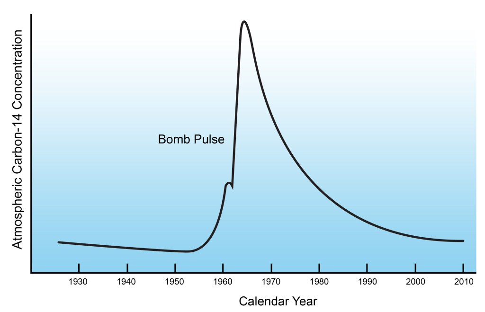

Around 75 years ago, a patch of the New Mexican desert was incinerated during the first trial of the most destructive weapon ever created.
 
By the time the US signed the UN Nuclear Test Ban Treaty in 1996, American physicists and engineers had conducted more than 1,000 tests.
 
They blew up nuclear weapons in the ocean, on land, in space even and underground. 
 
Atmospheric nuclear tests have been internationally banned since the early 1960s because of worries about radioactive fallout and different risks. These weren’t baseless fears. In the 1950s, US physicists drastically miscalculated the explosive yield of a thermonuclear bomb during a test in the Pacific Ocean, and the ashy radioactive fallout was detected as far away as India.
 
What the experts and scientists of the time didn’t realize is that they had actually launched two experiments. Not only were they measuring the deadly power of these nuclear weapons, but they had also radioactively labelled the entire human race unknowingly. Some years later (and for a limited window), those bombs would reveal new insights about the human body - like how we become fat.
 
The scientists working on these tests spent comparatively little time considering nuclear fallout.

## What is nuclear fallout ?

Radioactive fallout is radioactive material produced by a nuclear explosion or a nuclear reactor accident that enters the atmosphere and eventually falls to Earth. This fallout consists of minute, radioactive particles of dust, soil, and other debris. This isn't like the ash generated from an ordinary fire. Because the high-energy nuclear explosion actually creates very minute particles. In fact, one particle of fallout dust is hundreds of times smaller than a single blood cell in your body.
 
Because fallout particles are so small and light, they can drift in the atmosphere for years and settle anywhere in the world, which is exactly what happened. Radioactive carbon peaked in the mid 1960s, and was still dwindling in the air, slowly for decades after.
 
Eventually, fallout settles. Plants absorb it, and then we eat the plants (or we eat other animals that ate the plants).

## Radioactive carbon in our bodies

Carbon is an essential ingredient for life, and your body uses it to forge the walls of every cell it creates.

When your body creates a cell, it uses whatever carbon it has on hand, whether that’s radioactive C-14 or ordinary C-12. Of course, the vast majority of all the carbon in your body is C-12. However, that all changed in the 1950s with the increased levels of C-14 in air, due to the nuclear tests.

You may have already heard or read about carbon dating (a technique used to calculate the age of ancient artifacts and human remains)  and it's essentially relevant here, because scientists use it to measure the ratio of C-14 to C-12. By examining the amount of C-14 in a human cell, it can tell whether the cell was created before the era of nuclear testing, during the mid-1960s spike, or sometime after. It’s as if the U.S. and Soviet governments had labelled every cell in every person’s with a ”date stamp”.

## All about those fat cells

Our bodies are made of billions of fat cells. Each one is a miniature fat-storing reservoir.

Other cells, like those in the adult brain and nervous system, remain forever. Or so scientists thought.

For a long time, before the C-14 study, no one knew how long fat cells lived. Were you born with an allotment of fat cells that you kept for life? Or did they live, die, and multiply throughout your life?

To answer this question, scientists went looking for C-14 in all the fat cells and tried to measure the amount of C-14 to figure out the average fat cell age.

The results show that our bodies manage fat with precision. 

Basically, whether you’re fat or thin, gaining weight or losing it, your body works to keep a steady number of fat cells alive in your body.

The study also revealed that fat cells don’t last forever. On average the fat cells in our bodies can live for 9-10 years, and they only shrink or grow in size as your diet, lifestyle etc. changes.

## Your fat cell count

Although, there was a lingering question still unanswered.

If your body works so hard to maintain a specific number of fat cells, what determines that number? 
 
After all, researchers know that an obese adult body has more fat cells than a lean one. So what tells your body how many fat cells to create - or whether you should be thin or obese 

The answer is not entirely clear.

Experts believe that it may be linked to childhood. 

Some studies show that your body does add fat cells while you’re young, and all the way through adolescence. Worryingly, children that are obese have more fat cells from an early age — and they’re at a far greater risk for adult obesity, thereby boosting the chances of a lifetime struggle with weight.

But the complete answer is likely more complex.

Sadly, the effects of the Cold War surge of radioactive fallout are dwindling. Scientists estimate that by 2050 the effect may disappear altogether. The air will be cleaner and less radioactive, and we’ll lose a valuable window to the innermost workings of our bodies.
