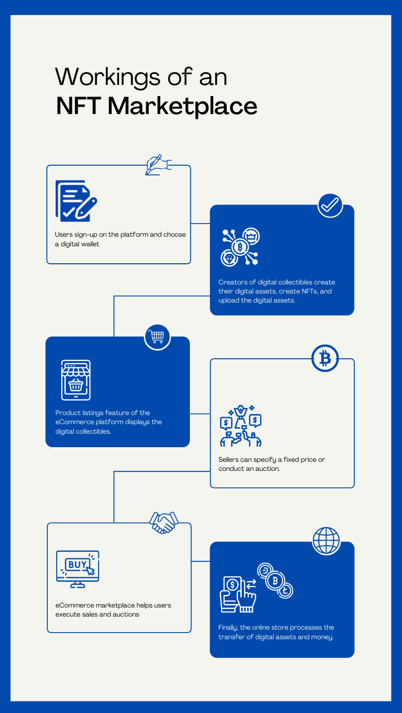

Last week, WazirX launched South Asia’s first non-fungible token (NFT) marketplace with 15 creators hailing from multiple categories including digital artists, muralist photographers, canvas artists, space 3D artists, street artists, and visual artists to sell their work. 

### Overview of the NFT marketplace domain

An NFT marketplace is a dedicated platform for storing and trading non-fungible tokens. Items either have a fixed price, or can be bought at an auction.

It is worth noting that buyers should have a crypto wallet to carry out transactions.

### How does an NFT platform work?

Obligations of parties are represented in smart contacts in the form of if/then. For example, if a buyer transfers the payment for a digital item, then a seller grants the right to this NFT crypto asset. Provided that the condition is met, the smart contract conducts the transaction independently.

Non-fungible tokens are implemented via smart contracts. Each item comes with unique metadata. This set of specific information related to supply, provenance, and authenticity is written in smart contracts. Blockchain technology carefully protects this data.

For token marketplace development, we need to create a token protocol. As a rule, these protocols are created on the Ethereum network, which is a particular group of smart contracts. They enable the implementation of certain marketplace functionality. Later on, token protocols will be integrated in the process of NFT marketplace development.

Now let’s discuss how NFT marketplaces work for users. Here we should say that the flow is similar for all non-fungible auction websites.

**Step 1** Users register an account on an NFT platform

**Step 2** Setting a crypto wallet is required.

**Step 3** Here comes the NFT creation process. For this purpose, users upload digital items to showcase their work.

**Step 4** Users list items for sale. Here they have two options: choosing a bid for an auction or setting a fixed price.

**Step 5** Items pass moderation.

**Step 6** As soon as new NFTs are approved, potential buyers can see it in the list for sales.

**Step 7** The tokens’ owner can start accepting bids.

**Step 8** When the auction closes, sellers are notified about top bids.

**Step 9** The NFT platform regulates the transfer of digital assets and funds.

### What features should you offer in an NFT marketplace website or an app 

What functionality for your crypto marketplace should you implement in the first place? Your primary task is to allow users to create and sell collectibles. Then, extra features can be added to offer website visitors an excellent user experience. An NFT marketplace website or app should offer the following features:

- An eCommerce storefront;
- Search functions, including the advanced ones;
- Various filters while searching;
- The creation of product listing;
- Displaying the status of the product listing;
- The buying functionality including features like the shopping cart, checkout, etc.;
- The auctioning functionality;
- Integration with popular digital wallets;
- The payment functionality including the integration with payment gateways like PayPal, Stripe, etc.;
- Synchronization of the offline activities;
- Product rating capabilities.

When it comes to the business part, it remains the same as for any other software product. You need to define the right audience for your platform and the challenges you are going to solve with its help.

### Decide on the business model and project scope of your proposed NFT marketplace

Onboard a team that includes a competent project manager (PM), an experienced software architect, and a few smart business analysts (BAs). This team needs to determine the marketplace business model. It should document the scope of the project, furthermore, it needs to decide on the best approach to execute the project.

This might involve various questions, e.g.:

- Who are your target audiences?
- What is your key value proposition?
- Do you want to operate a multi-vendor marketplace?
- Do you want to operate as an aggregator as Uber does in the cab-hailing space?
- What are the different pricing mechanisms that you want to use?
- Will you charge a listing fee?
- Which characteristics of the sharing economy do you plan to use?

Well, that's about it. 

After having an understanding on the key features of non-fungible token platform, and the functioning you want it to have, next step is to move ahead with the development process.