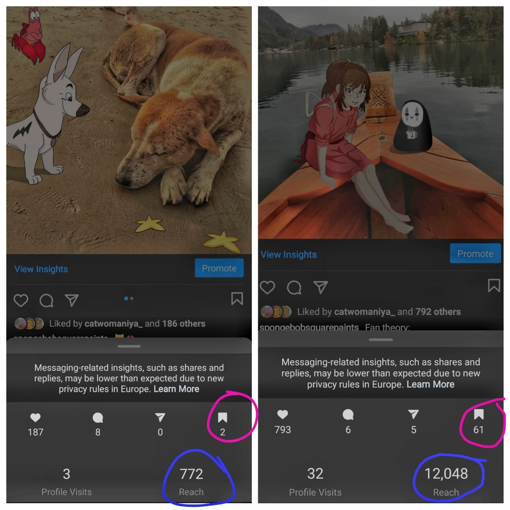

I spent a better part of 2020, on exploring my artistic side for which I created and promoted digital content on Instagram. Now, I had a lot of time during the initial months so I spent those in perfecting my strategy to grow my account and I learnt that there’s a bunch of ways to grow an IG account, and a bunch of ways to tank one. 

This post will be a summary of key factors I believed played a role in growing an account organically.

### UNDERSTANDING THE AUDIENCE

Super basic thing, but getting a professional account is needed, for tracking the key metrics that’s relevant to gauge the growth of an IG account. Other than IG Insights, there re a bunch of free IG tools that help ease this process like - Keyhole, Social Bakers, Squarelovin.

It really doesn't matter all that much what you're using your IG account for, whether it's to sell a product, to increase brand awareness,or just to generate hype, it’s vital to understand your audience. For which, you should get an overview of the demographic makeup of the follower base (of course, this only plays a role after, you already have gained some followers to look into). It’s also necessary to keep an eye on what competitors with a similar target audience are doing - When are they posting ? Do they post captions ? If yes, is that one sentence or a paragraph? 

It really helps focusing on the most successful post of competitors and then breaking it down to understand the most probable reasons why that post worked so well.

**THE IMPORTANT THING IS TO COME AT IT WITH A STRATEGY.**
 
If you want to know something, just ask! Ask your existing audience about their favorite kind of Instagram content and the accounts they’re following. Ask them in your next Instagram post or Story, and wait for the useful insights to roll in!
 
### INSTAGRAM ALGORITHM

*Disclaimer* : The IG algorithm changes every few months, so what worked last year or even last quarter, probably won't work the exact same way now.

Generally, variables such as time of post, total likes and comments, hashtags, location, details on the account that posted, are used to boost or demote a post. What I saw specifically this year, is the role of the **“SAVE”** option which is basically like a *Super-like*. Same goes for **“Share this post as a message or story”** feature, it holds a higher ranking than likes and comments, in the list of things that can increase a post’s engagement.

[*There's a strong relation between "Saves" and the reach your post will have, as you can see. This is from a first-hand analysis of my own posts.*]

### POST FREQUENCY
 
TBH, I have seen varied advice on this. I don’t have the bandwidth to post daily so I post only once a week (DO NOT do this in the initial weeks/months of your new account,, it will slow down your growth).

In general, posting once a day is a safe option.I've had success with even posting 3x a week. But make sure you aren't oversaturating your feed. You can easily lose followers by making too many low quality posts. 

**Quality > Quantity**

Also, learn to plan ahead, and try scheduling posts to be shared across the day/week. 

Plus, if you don’t plan and just post everything at once, you’ll run out of content (talking from A LOT of personal experience), and that sure ain’t gonna bring you new followers. A fellow IG influencer friend of mine told me I should ideally create 50 art posts, in the initial days of my account, so that I will always have something in my back pocket, in case I fall short of content.

### TIME OF POST

This also depends on where your followers are. For me, 6pm-9pm IST , was the ideal time to post. This is also when most people tend to be on IG. 

Generally speaking, Sunday tends to be the least engaging day of the week, but I've still found plenty of success these days.

### CONTENT

Always tag people in your posts as well. So find influencers in your niche and tag them in the photo and/or the caption. Certain accounts likes have more value than others, so use this to your advantage. Find pages your audience follows, and tag them.

Specifically, for these portfolio IG accounts, be aware of trends or challenges that’s going on so you can create content around these to reach a larger base. In 2020, I saw these trending #toonme, #mermay2020, #sailormoonredraw and of course #DIYchallenges.

If you’re a fairly huge account, sometimes you can repost past posts, it doesn’t matter.
 
Also, post multiple photos with every post, even if they're only slight variations. You want users to engage with your post, so if someone scrolls the other photos, then it basically tells the algorithm that its an interesting post. likes/engagement. Same goes for putting captions, I normally have seen putting long captions help, especially in videos, as users are looking at your post more.

### HASHTAGS
 
Post your tags in your caption and not your comments. You can edit your caption and update your tags throughout the day. This boosts your post multiple times. Also use hashtags relevant to your niche.
 
How to choose hashtags ? I like to use the 25/5 strategy where I will use 25 hashtags under 100,00 and 5 over, or all hashtags under 100,000. This works for me, but there are other strategies too like 10/10/10 - basically means to use 10 big hashtags, 10 small, and 10 medium sized ones to properly market your post. 

The important thing with hashtags is to keep experimenting and find what works. Not all posts are going to do well in a good set of hashtags, and not all good posts require a good set of hashtags to do well. 
 
Also, base your tags on what larger accounts in your niche are doing, then test + discover your own.

### OTHER TOOLS BESIDES POSTS
 
This is going to be things like Stories, Live, IGTV, Reels. 

Post stories once a day or 5x a week, as a general rule of thumb. An easy strategy with stories is to just do reposts on similar accounts and encourage them to engage with you. 

Live feed maybe once or twice a week, or more, if you have the content/activity. Things like talks, walkthroughs etc. 

Definitely use Reels, I posted 2 reels with not so amazing content and they still managed to garner a lot of views.

### OUTSIDE ENGAGEMENT
 
Your ultimate goal through organic growth is to consistently get on the explore page and get promoted this way. 

This is where you'll really separate your account and make huge strides in growth. You should be spending 30 mins to an hour a day, going out and liking and commenting on other people's posts, to help drive engagement to your page. If you haven't noticed by now, the key word in IG is engagement, and you have to give if you wanna get. 

You can open a post in the explore page or on any big account, like it, leave a comment that opens/starts a conversation, and move on in literally less than 10 seconds. Great, swipe right, and do it again. and again. and again for the next 30 minutes. I've seen this strategy work, but also doing this multiple times throughout the day. But don’t go overboard with it, there are limits to how much one can comment/like/follow in a specific time frame, otherwise IG will block that action temporarily.
 
Also make sure that you’re replying to all your comments on your posts. This will not only increase loyalty and motivation among your followers, but also trick the algorithm. if you get five comments on a post, and reply to all of them, you now have 10 instead of 5. Always be engaging and active with your followers, and try to reach out to other accounts in your niche and bring them in.

### LIST OF DONTs
 
- Don't buy followers. Most of them tend to be bots, or the wrong type of followers, and won't engage with you at all. 
- Don't forget about it or give up. Stay consistent.
- Don't post just to post. 

*****

*Just in case, you want to go through my Instagram account, here is the [link](https://www.instagram.com/spongebobsquarepaints_/).*

