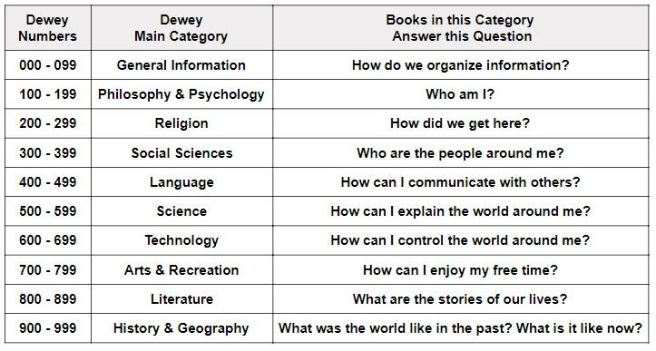

It’s all too common to find oneself wading through the organization’s shared folders in search of the file you’ve been asked to review:

**PROJECT-PROPOSAL-NEW-v5.doc**

**Project_proposal_2020(old version).doc**

Why does this happen? Why can’t everyone just use proper file naming conventions? The reasons can be lack of proper internal policy or procedure for naming and organizing files, lack of any consideration for folder or information architecture, and sometimes, just plain carelessness.

## Establish your information architecture

“Information architecture” - Fancy term right there, but quite useful. It means the way you organize your internal information, in terms of how you *design* the system that allows you to access and manage that information.

Websites are a great, pragmatic example of informational architecture – they’re quite literally formal systems of information organized into an interface, that’s navigable and interactive-friendly.. Hyperlinks and site maps, all represent the architecture (the links between different pieces of information) of the websites you’re viewing.

One key point to consider here is who will need to access this information. Will there be multiple iterations of similar files, many files across different areas of the organization, multiple departments accessing the same area? And that will help you improve the efficiency of the whole process.

Efficiency can be understood as the shortest time possible taken to access any given file. 

*How many clicks is also a relevant metric. *

Is the folder structure unnecessarily complex, taking 10 clicks through empty category folders before reaching the destination file? Consider if more horizontal organization is a better option, with a couple of clicks to relevant files.

Effectiveness can be understood as whether or not the file naming conventions help or hinder the completion of daily tasks. 

How many different files do you have to open before you find what you’re looking for? 

Is the file naming convention intuitive, or do you need to spend extra time learning how to make sense of **210221_SA_P-01_Project_1_Draft.doc**, when **Sales_Project_Deck_June_v1.doc** would do just fine?

## Readability: Humans vs Robots

One of the most important questions you can ask is: 

Who are you organizing your files for? 

It may be that you’re organizing internal media files in a remote organization, or for a local intranet – in that case, you probably want the files to be human-readable. In that case, something like this might make sense:

On the other hand, perhaps you’re tasked with managing large batch files for automatic processing or robotic search, in which case, human readability might not be your primary concern (though it’s probably still useful, in the least for debugging and error-chasing purposes.)

You can also browse Wikipedia using other categorization systems like Dewey Decimal, or by simply searching. 

Wikipedia is demonstrating that it’s more effective to utilize a range of different categorization and search methods, and that search is perhaps one of the most user-friendly solutions for navigating huge, complex databases of information.

### Dewey Decimal file naming convention

“Dewey Decimal” refers to a file naming convention. Originally, it was a method of organizing information (books) based on 10 main classes that attempted to cover… well, pretty much everything.

We should remember that the Dewey Decimal Classification (DDC) was first and foremost a system designed to be used in libraries.

Here's how it works -

Essentially, using numbers to divide main categories into smaller, more specific divisions and sections That’s the Dewey Decimal system in a nutshell.

As a SMB, you don’t have so many internal processes, so it’s easier to manage them all and get to the point where you have everything under control.

If you run a small business, you don’t need five different documented processes for storing documents or dealing with different projects and clients. Even if you manage two or three similar establishments like this, it’s easy to be sure that all of these use the same methods.

The challenge you face will come when you reach the point of having 1,000 different establishments in different countries, that need to follow different laws and regulations, or sell different products or services. This becomes a question of process standardization vs process harmonization.

Process standardization means making one process for one job and keeping it the same, no matter where you use it. Obviously, this won’t work if you need to work across different countries or navigate different regulations. Process harmonization, then, is about setting a standardized core, but allowing for subtle changes as and when to accommodate for different use cases and scenarios.

