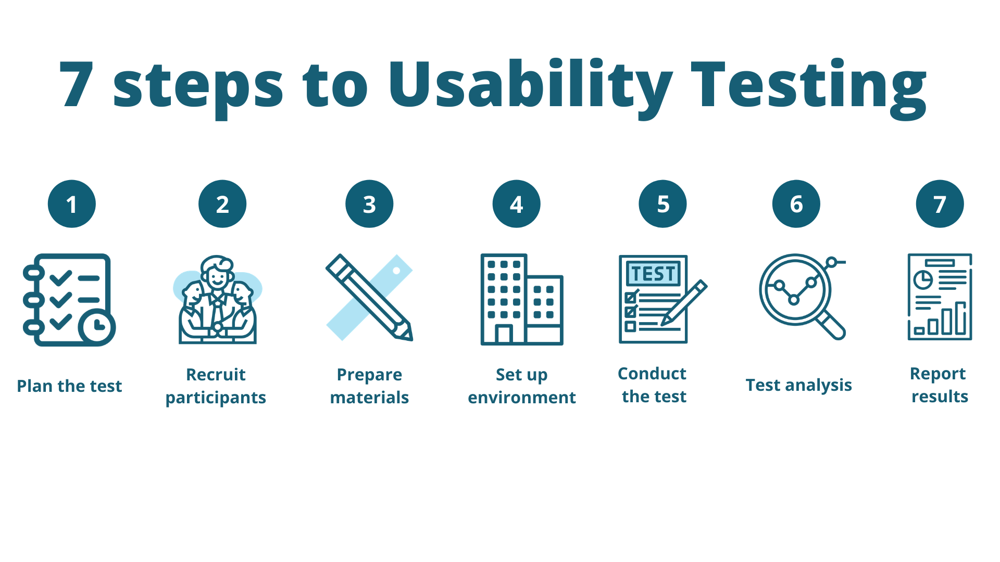

A business website has the potential to generate a significant amount of traffic with content marketing and paid channels. That is why you decide to redesign the page or slightly tweak some elements to squeeze more of your page traffic. In the redesign process, you need to account for a lot of aspects to ensure your page finally starts to convert at a higher rate. In this article, I will show you the roadmap for redesigning a SaaS website to reach a higher conversion. 

Let’s get started by defining what makes a great B2B SaaS design, before approaching the page redesign process.

1. [Helpscout](https://www.helpscout.com/)

Helpscout does a great job of connecting their copy with reinforcing visuals that make me want to see how they do it. They also win the sidecar prize for least annoying GDPR notification.

2. [Basecamp](https://basecamp.com/)

Basecamp is bold. They have always been, and this homepage is a case study in knowing who your customer is and speaking very directly to them through powerful copy and imagery. As a low touch, low priced product they are also aggressive in pushing users to evaluate the product immediately. 

3. [Proof](https://useproof.com/)

Proof uses numbers to show the result new users can achieve with the tool. The page includes two calls to action, giving users a choice to either explore the functionalities or book a demo right away. Further down the page this SaaS presents success stories of their customers helping instantly build trust with new page visitors.

## What makes a great SaaS design?

As you may have noticed, the design of SaaS pages mentioned above (and many more) have a lot in common – it’s minimalistic, intuitive, and includes modern geometrical elements. 

Let’s explore some examples of SaaS pages that can serve a good example for SaaS page industry standards for 2021 and beyond.

Knowing what is a standard in the SaaS industry, let’s see what it takes to get to the end effect – a better converting and aesthetically pleasing SaaS sales page.

### 1. Research

When thinking of redesigning your SaaS website, you have to start with the foundations – research.

You need to understand what needs to be fixed on your page.

Your users need to easily find the necessary information on your new website. By looking into data, you can build assumptions about what blocks users from reaching their goals, what they expect from the page, and what annoys them.

You have a set of tools at your disposal to gather information and build assumptions about what needs to be changed on your SaaS sales page.

Let’s look into these two crucial types of research you can make – qualitative and quantitative. 

What is qualitative research and how to use it?

Qualitative research helps identify the reasons behind users’ behaviour. This type of research includes usability tests and heatmaps.

These tools will help you identify how your users interact with the page and understand why they are interacting with the page in this way and not the other. 

#### Heatmaps in SaaS web page redesign

For example, by analyzing heatmaps, you can understand where a user spends more time on the page. Heat maps can help you identify if your users read the whole page or just 15%. 

This may lead you to making an assumption that your users don’t find the rest of the page interesting. You can consider moving the most important information to the top of the page and cut your copy. 

#### Usability tests in webpage redesign

Usability tests are the tool SaaS businesses can use to evaluate the webpage they create with real users before a design sprint. 

They will help you understand how users interact with your page, how they perceive its different elements (structure and copy), and most importantly, why they interact with the page in their particular way.

When conducting usability tests you have to set clear goals of what exactly you want to learn about user interaction with your page. 

For example, you want to identify if users can easily find something in the menu or on the main page. By asking them to perform some actions, you will understand if this is easy for them to find the necessary information on your page.

What is quantitative research and how to use it?

Quantitative research helps you analyze a big amount of data and understand how all page users interact with your SaaS page.

Remember that quantitative research won’t tell why users behave in a particular way. Instead it will present your with a bigger picture of what users do on your page.

To conduct this type of research you can use web analytics, surveys, and funnel analytics.

After you have analyzed both qualitative and quantitative data, you can make assumptions about where users get stuck and identify reasons for your page underperformance and low conversion. With this analysis in place, you now can make assumptions about how your new page should look to better satisfy user needs. 

### 2. Navigation for SaaS pages

The navigation of SaaS business pages is different from other industries. SaaS pages focus on presenting the main elements of SaaS software – app’s functionalities and integrations.

When marketing a complex SaaS tool, you might find the process of creating your page navigation overwhelming. What if you have 20 different features and need to show your users all of them at the same time? 

Including too many different features in the menu can overwhelm a user as well! 

However, more complex features can be organized into clusters – segmented by solutions, customer profiles, or industries. The SaaS tools such as Hubspot have found a way to present the features to their users in the main navigation menu by simply grouping features for their main target groups – marketing, sales, and customer service.
 
A more complex navigation menu can result in users clicking through multiple pages and spending more time looking for the features they need. Time spent on your page doesn’t really matter as long as your page converts well. 

### 3. Copywriting

Before submitting a brief to designers, you should have a functional copy for your SaaS page. The amount of text and its structure can significantly affect the design. That is why your designers will require a finished version of the copy they could use in their design.

Let’s explore the best practices of web copywriting.

- **Writing copy to a web reader**

Users consume information on the web in a different way compared to reading physical books or magazines – they read by skimming and scanning copy. 

I have never understood why some tech businesses decide to go with a long pitch for their main page. In my opinion, it makes it cluttered, difficult to read, and boring.

While longer copy might be a good idea for email sequences (still, run A/B tests to make sure it works for your SaaS!), the main page is not the right place to keep a user reading for ages before understanding your offer and value proposition.

Include shorter paragraphs and actionable headlines. Explain your value proposition and present reasons to believe on the first screen (above the fold area).

- **Using value language**

Avoid using fluff language and talk too much about your brand. I would cut down on the phrases “we”, “us”, and “our company”. 

A user doesn’t care about your business, but has their pains, problems and challenges to solve.These are the areas you have to focus on. Paraphrase your “we” sentences in “you” sentences and try to emphasize more with a user.

Show the benefits of how your solution can help solve problems. Avoid long introductions and setting up the scene – get down to the core of users’ challenges and present solutions.

- **Short actionable headlines**

Each section of your main page and feature pages should include headlines that would make it easier for a web user to find the right information fast. 

Don’t write generic headlines that would mean nothing. Include actionable phrases such as “Use”, “Generate”, “Start now”.

- **Include social proof (case studies / testimonials)**

Build trust with your user by including success stories and client testimonials. Show the impact of your tool on their bottom line. 

For example, on your main page include case studies showing numbers “How XX increased conversion on the page by 20% within 3 months”. Numbers are attractive and help present the end result in a measurable way.

- **Show your business statistics**

If you have some achievements you can brag about, expressing them in numbers. For example, a customer support tool can show the statistics of their agents speaking 40 different languages.

If you have decided to write a new copy for your page, consider delegating this work to a professional copywriting who has worked on writing the SaaS page copy before and can deploy their knowledge and experience to your SaaS from day one.

### 4. Wireframes and usability tests in SaaS design

Before jumping to the design phase of your page, you should first understand what users need to find on the page and how they will interact with it.

Wireframes represent a structure of your website and help define the elements that have to appear on the page.

With wireframes, you can easier introduce changes and prevent burning budget. Before moving wireframes to the design stage, you should test them with real users. By sticking to a lean design framework you will be able to adjust your website to the needs of your users and meet their expectations better.

Just imagine building a page, investing all your budget in it, and see users complain about not finding or understanding the value that your business represents.

When designing wireframes, you can work with a UX strategist or designer who would be able to prepare a plan and implement the project with wireframing tools such as Figma, InVision, or similar.

Once you have wireframes designed and approved, you can run usability tests with users and gather their feedback. Then, you can iterate on the wireframes (depending on how many iterations you are able to make) and slowly move to a design phase.

### 5.  Preparing a design project

If you have gone through the four steps mentioned above, you can be sure your page structure is aligned with your clients’ expectations. Now, it’s time to put your validated idea into action. Let’s get down to the design process!
 
**Choosing a designer**

If you have some time and prefer to coordinate the design process on your own, you can do your research and run interviews with the designers from the portals such as Dribble, Behance, and some freelance marketplaces.

However, if you value your time and don’t want to go through trial and error, you should work with an agency to help you run this process from A to Z. 

If you need a few recommendations of great designers or help with running the design process, hit me with a message to get recommendations for the best designers. 

**Filling in a brief**

When starting work with a designer you should fill in the brief. Having worked with different designers, I have recognized not all of them require clients to fill in the brief. Unfortunately, getting too little information about the project in the beginning can lead to many misunderstandings with a client and usually rounds of reworks.

By writing a brief a client can define his requirements better. Filling in the brief is some kind of thinking process you have to go through to make your goals a bit more specific. In the brief, you can also mention some examples of designs that you like and want your designer to use in the concept phase.

In this way, depending on how many corrections you want to run with a designer, you run a design-feedback cycle to finally receive your project files and implement it on your page.

