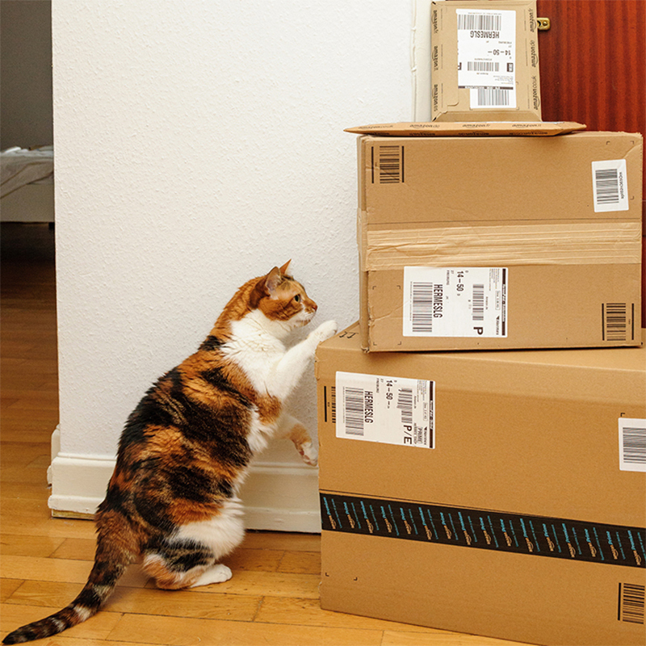
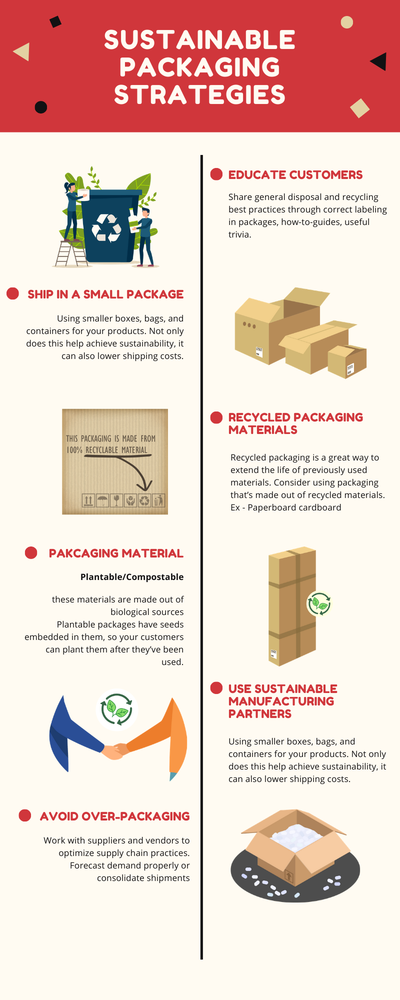
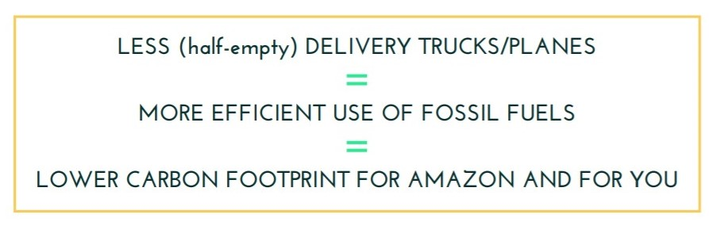

Due to physical distancing measures during the COVID-19 pandemic, E-Commerce orders have skyrocketed and so has the packaging waste that comes with it. My orders at Amazon have become 4x more than what they were before. (Also, because of the Prime account). Anyhow, even though I love how easy they make it to get pretty much everything I need, I can't help but feel a little guilty while opening up deliveries. There's just so much packaging waste. After Prime day, my garbage bin was full and overflowing with Amazon’s packaging waste.

The industry has huge environmental costs and there are no estimates about the amount of packaging and waste. Let’s try to unpack the problem. (PUN intended :P) firstly, and then discuss the new wave of packaging solutions that are popping up now.

## PACKAGING WASTE FROM E-COMMERCE

We all are drowning in a sea of packaging waste, and too much of it is ending up in landfills, or even worse, oceans. With no significant rules around this particular problem, over-packaging is a sought-out solution for many companies, to cater to the growth of priority customer services, that place a premium on ultra-fast delivery which effectively do not allow for consolidated delivery of goods.

Retailers/Sellers are keen on ensuring that their goods arrive in pristine condition, to minimize costs, keeping “customer delight” at the core of it. And to protect those products, online retailers resort to piling on packaging - Bubble wrap, Styrofoam, Air packets, Massive cardboard boxes. Highly effective, but highly wasteful.

This affects not just by creating gregarious amounts of waste but also has the potential to lead to considerable loss of forest cover, since wood pulp is the primary raw material for producing packaging cardboard.

In short, the status quo of packaging has devastating consequences

## SUSTAINABLE PACKAGING STRATEGIES

According to the [Sustainable Packaging Coalition](https://sustainablepackaging.org/wp-content/uploads/2017/09/Definition-of-Sustainable-Packaging.pdf), to be sustainable one has to follow the 8 criteria for packaging mentioned below :
1. Is beneficial, safe & healthy for individuals and communities throughout its lifecycle.
2. Meets market criteria for performance and cost.
3. Is sourced, manufactured, transported, and recycled using renewable energy.
4. Optimizes the use of renewable or recycled source materials.
5. Is manufactured using clean production technologies and best practices.
6. Is made from materials healthy throughout the life cycle.
7. Is physically designed to optimize materials and energy.
8. Is effectively recovered and utilized in biological and/or industrial closed-loop cycles.

## COMPANIES SHIFTING TO SUSTAINABLE PACKAGING

Companies that utilize e-commerce should look towards more sustainable packaging that has the strength to protect their products effectively and mitigate losses but also ensure recyclability to curb the negative environmental effects. 

This can be done by factoring in three different aspects of sustainability - 
- Reduce the amount of packaging material used
- Increase in recyclability of packaging materials
- Use of recycled packaging materials

These companies should also explore the possibility of implementing buy-back policies, or even provide customers with the choice to opt for more sustainable methods of packaging.

### Benefits

1. Consolidated Storage

Reducing packaging materials and minimizing waste are two big components of sustainable packaging. And when implemented correctly, they lead to more efficient storage, so you can limit the space required to house your products (thus lowering storage costs), or open up additional space to store more merchandise.

2. Lower logistic costs

This one is pretty intuitive. 
Shifting from a box to a bubble mailer can knock anywhere from four to six ounces off the total weight of the package and reduce weight-based costs significantly while shipping. Multiplying this saving across millions of packages a year and the overall reduction in costs can be dramatic.

3. Expand customer base and increase loyalty

Upgrading packaging not only decreases a business’ carbon footprint but also can help a brand stand out to customers
A research by Nielsen found that 48% of consumers are willing to change their consumption habits to lower their impact on the environment. 

Start-ups are popping up in the field of responsible packaging. [Packmile.com](http://www.packmile.com/) is a leading sustainable packaging company in India, with clients including Amazon, Bosch and Decathlon and has a portfolio of innovative products like Paper Bubble Wrap and Corrugated Box Recycling Machine.

### How Large and Small Scale Businesses can Use Eco-Friendly Packaging

#### Large-Scale Businesses

For a large company like Amazon, or Alibaba, there are two primary problems in adopting sustainable packaging. Firstly, these sites have a huge supplier base (maybe in thousands), that are scattered around the country (Or the world), all of whom have to comply with the same regulations. Making a wholesale packaging switch might be a slow and painful process. 
Second, as these sites offer millions of products, the next go-to option is to find a producer who can create packaging that’s flexible for every item, and most importantly, has the ability to do so at scale.

#### Small-Scale Businesses

A small e-commerce business might look like anything from an individual’s craft store - selling just a few items a month - to an independent bookstore that sells a few hundred products a month.
However, for the most part, these  businesses will deal with a much less varied set of products, comparatively, meaning it's possible for them to depend on a single packaging system.

### Focusing on AMAZON

Amazon does have its fair share of eco-friendly initiative in this area, but many of them haven’t been implemented in India. (but let’s keep fingers crossed).

On Amazon India’s website, they say “ PFS is a sustainable packaging solution in which customer orders are shipped in their original packaging without any additional packaging or significantly reduced packaging.” They had first launched the program in India in June 2019 in nine cities and have now moved to 100 cities.

The sustainable packaging initiatives like 'frustration-free packaging and ship-in-own container,' have also been able to reduce packaging waste by 25 percent since 2015.

I am unsure how that works though, because when I searched for ‘ Frustration free packaging’, the results were spread across only 19 pages, and the numbers do not make sense. 

Anyway,..

Amazon also has other initiatives that aren’t active in India currently, like providing customers to group their orders together or to opt for no-rush shipping, which empowers the customer to make better decisions.

## WHAT NEXT ?

A carefully drafted law and genuine cooperation among all stakeholders, including e-commerce companies, consumers and local municipalities will be the key to ensure that the law is successfully implemented. 

But more importantly, for effective transformation of e-commerce into Green commerce, companies need to invest in packaging innovation and sustainable supply chain mechanisms to promote reuse and recycling, while consumers also need to display sustainable consumption behavior.
