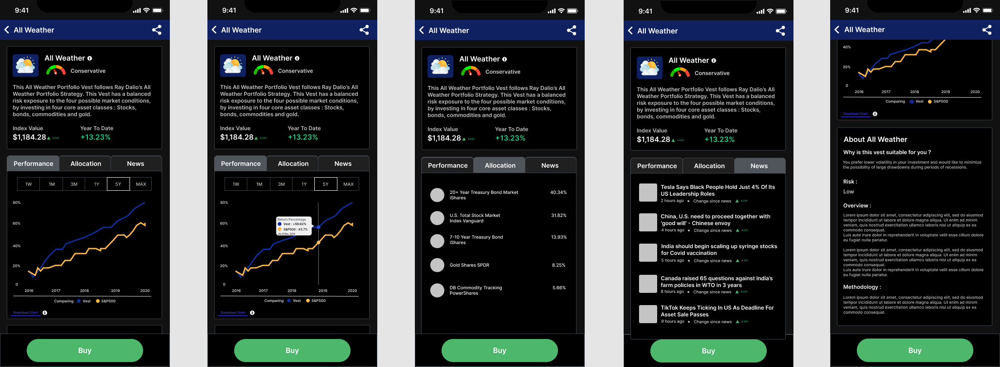

## A Quick Brief Intro

Vested wants to empower users who want to invest in the US stock market in an easy and safe manner. They have built an investing platform for new and expert investors alike, that lets you buy and sell stocks, exchange-traded funds and Vests (curated portfolios for different risk types) all commission free.

I decided to conduct a two-week case study to enhance the Vested Android experience.

TL;DR — As a user of Vested, I wanted to learn if there were any usability problems that could be fixed. Through research, I was surprised to identify three pain points that most users were experiencing. I then prototyped my solutions and validated them with user data.

## Goals

My goals for this project were to :
1. Consider UX methods to uncover user problems
2. Come up with solutions based on observable data
3. Prototype and test solutions to enhance the UX while using Vested

## Starting with UX research

I decided to use Guerrilla usability testing, with the limited amount of resources I had with me. According to a study, it is estimated that [testing with just five users will reveal 93% of what can be discovered in a product](https://www.nngroup.com/articles/why-you-only-need-to-test-with-5-users/).

I performed a usability test with 6 people and asked them to perform specific tasks to test the core functions of Vested like - “You were referred to Vested from a friend of yours. Please show me how you would go about buying a share of Amazon.”

I also surveyed with 26 additional people (n=26) to gather more information about the app.

#### Guerilla Usability Findings

I found that 50% of the users tapped on the non-interactive chart to find more information. They wanted additional data like numbers, percentages wrt the 2D chart present.

#### Survey Findings

For new investors (especially), additional resources were specifically asked for as a feature to make better decisions while choosing Vests. Around 65% users wanted to save the data for doing independent analysis on the performance of stocks/vests.
A whopping 78% users felt that the app had unnecessary features like "Referrals" as a main feature.

## Main User Stories

As a user,
- I can only see a simple 2D chart, where I cannot even zoom into specific details. I would like to see some specific instant data from the charts.
- I would like to analyse and compare the vest’s performance, by myself.
- I would also like to have more aid to help me choose and buy a Vest.

## Solution

My solution is to increase the clarity of navigation. I accomplished this by bringing a pop-up feature, with return percentage values of Vest and S&P500, when user hovers over the line charts. I also introduced a pinch-to-zoom gesture to zoom in and out of the chart (which was missing from the existing app). As you can see, I have also changed the background layout of charts to be consistent with the rest of the app, which wasn't initially as it may not have a fully functional dark mode setting despite claiming to have one.

I have introduced time period options to be selected by the user to check performance, as I noticed this feature is present across ALL the other investing apps in the market (during my short competitor research stint), leading me to conclude that it’s a necessary feature. Here's a before-after comparision -

[BEFORE](https://imgur.com/a/H5gls1d)

[AFTER](https://imgur.com/a/7etbUIb)

I have also added a link to download data of Vest and S&P500, in form of a .csv file, as I believe that option will be useful by experienced users.

Personally, in my opinion having a "Referral" feature in the main menu really bugged me in the existing app, as I believed it wasn't in sync with what users found useful and it wasn't very relevant to the app's offering so I went back to the users I tested with and asked about their opinion on this and they agreed that "Watchlist" was a more useful feature they would like to see on the app.

I really enjoyed refining my design methods through this case study and I had fun uncovering ways to improve Vested.