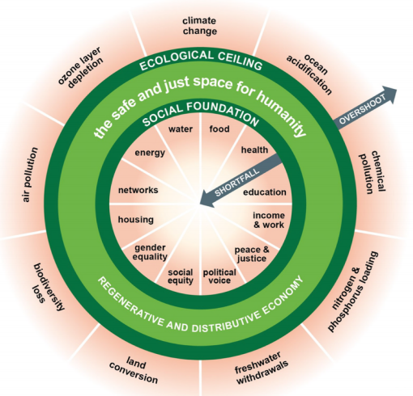
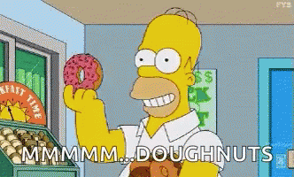
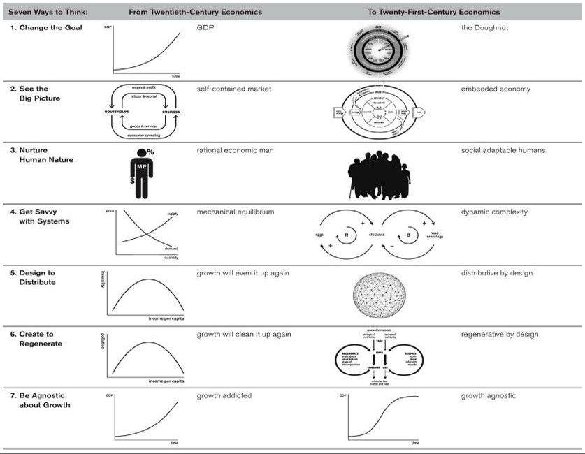
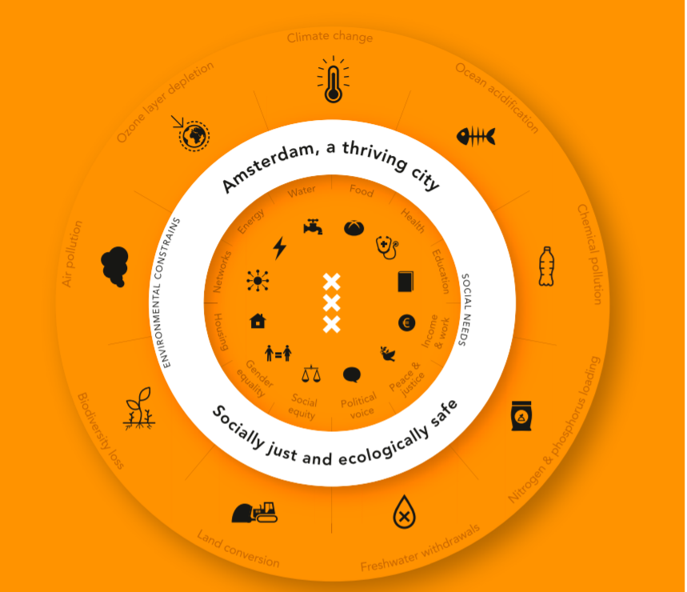

 

    

While in college, they taught me about basic economics, supply-demand, etc. And I have long believed that GDP is a really important factor for the economy to function and that it can tell me about the well-being of the people of a nation.
 
The Circular Flow of Income shows households providing labour and capital to firms, in returns for wages, which they later spend on goods and services, and so it goes round.The unpaid work of carers - particularly housewives - is ignored, no economy can function without them .
 
This portrayal of the economy as a closed loop of money and resources has been lodged into the brain of every individual, and just like me, hardly anyone questions it.
 
### PANDEMIC

I am seeing endless debates on news channels and reports about the pandemic's effect on economies around the world.

***"According to the International Monetary Fund (IMF), the global economy is expected to shrink by over 3 per cent in 2020 – the steepest slowdown since the Great Depression of the 1930s."***

***In India, the unemployment rate reached 27.1 per cent in early May, as nearly 122 million Indians lost their jobs between March and April. Experts beleive a significant perecentage of these jobs will not be recovered.***

It's kind of hard to imagine the social and economic effect that is coming our way, it doesn't look good at all.

[COVID-19 Risks Outlook - A Preliminary Mapping and its Implications](http://www3.weforum.org/docs/WEF_COVID_19_Risks_Outlook_Special_Edition_Pages.pdf) raises the alarm bell on a potential vicious future cycle of "continued environmental degradation, biodiversity loss and further zoonotic infectious disease outbreaks”
 
 
While it's definitely tempting to compare current economic projections with the 2008 financial crisis, it's not going to be the same. The aftermath is going to be more problematic.

To quote Nobel laureate economist, Joseph E. Stiglitz, ***"In many ways, it's far worse than 2008."***
 
While it's tempting to fall back to old methods and rely on the economist's traditional toolbox to fix these problems, this may be an opportunity for institutes and think tanks around the world, to make a case for a shift in economic thinking. In the wake of a dire socio-economic crisis, what seems impossible or what was deemed unnecessary a few months back, is now on the forefront.
 
The answer is a **doughnut**. 

    

 
The brainchild of Kate Raworth, an English economist working for the University of Oxford, authored the book **“Doughnut Economics: Seven Ways to Think Like a 21st-Century Economist”** which was a hit and is again gaining quite some eyeballs after the pandemic hit.

Raworth’s bestselling book ([Amazon](https://www.amazon.in/Doughnut-Economics-Kate-Raworth/dp/1847941389)) has graced the bedside tables of multiple economists and politicians. It is described as a “breakthrough alternative to growth economics”

Drawn as two concentric circles (i.e., donut) explaining the flow between materials and energy, to remind us that we are more than just workers and cash generators/consumers. It's a graphical representation of the world we should create. The inner ring of the doughnut is inspired by the UN's Sustainable Development Goals (SDGs) and represents the minimum things we need to lead a good life –clean water, shelter, gender equality. The outer ring of the doughnut is defined by the ecological limits one oughts to respect to avoid damaging the environment and disrupting the climate. The ‘dough’, therefore, represents the resources we can use.

### KEY TAKEAWAYS FROM THE BOOK

- Questions present images of the exclusive goal of economy as growth, of economy as a self-contained system and humans as rational, self-interested and dominant over nature.
- Talks about market organism, rather than market mechanisms. Wonders if economists would see themselves as gardeners who are stewards rather than believing that things will self-regulate.
- Explore the dynamics of a complex organic economic system, that is distributive and regenerative  by design. Regenerative by design gives a way for people to become full participants in regenerating Earth’s life giving cycles so that we thrive within planetary boundaries. 
- Wonders about an economic design that promotes human prosperity whether GDP is going up, down, or holding steady.

    

### NO CRITICISM?
Well, of course, there is. 

Free-market economists have criticized Raworth’s theories, stating that her ambitious programs needed to meet social needs and protect the environment are impossible without massive economic growth.

Also, it fails to give a clear explanantion about the socially-contructed desired minimum levels and the thresholds above which environmnetal problems are likely. These values, especillay the critical natural thresholds (OCean pH, carbon footprint etc.)
Despite its conceptual strength, the doughnut model fails to explain how such a transformation can be managed.

### SEEING THE DONUT IN ACTION

    

Amsterdam offers an example of how this may actually work in practice.

Through the strategy, Amsterdam aims to cut food waste by 50 per cent by 2030, from 41 kilos of annual food waste per person today, with the surplus being carried over to residents who need it the most.
 
Amsterdam plans to implement stricter sustainability requirements in construction tenders. For instance, buildings will get a ‘materials passport’ so that demolition companies can determine whether materials are still valuable and/or where reusable materials can be found. 
 
The municipality also plans on reducing its own use of new raw materials by 20% and by 2030, only make circular purchases. (What the heck are [circular purchases](http://circularpp.eu/)?) This is not just applicable to the procurement of products such as office supplies, computer equipment but also to infrastructure projects such as road-building.
 
Amsterdam has already started working with businesses and research organisations on over 200 circular economy projects
 
Although, experts also suggest that this isn’t going to be easy. This strategy is asking the people of Amsterdam to venture out and experiment, accept risk and break old habits, towards a better future, whose benefits may not even be visible in the near future or in the local vicinity.

More so, France used it to report on its sustainable development last year, allowing the country to take a look at the interactions between human needs and overall respect for the environment.

In a poll of 29 countries, 65% of the people said they want their governments to prioritize Climate change during pandemic recovery. Germany is already planning to use stimulus money to build green infrastructure. 

