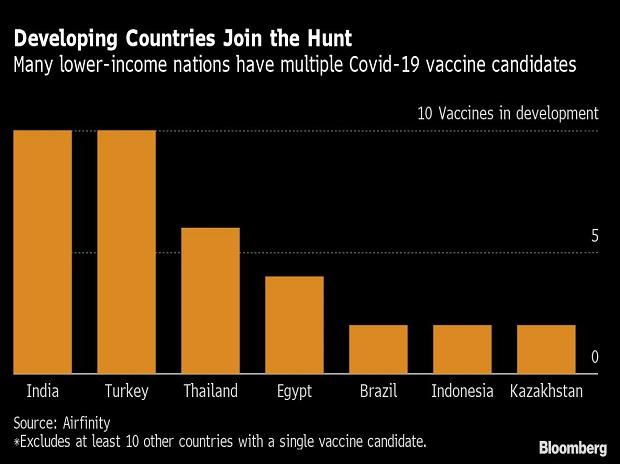
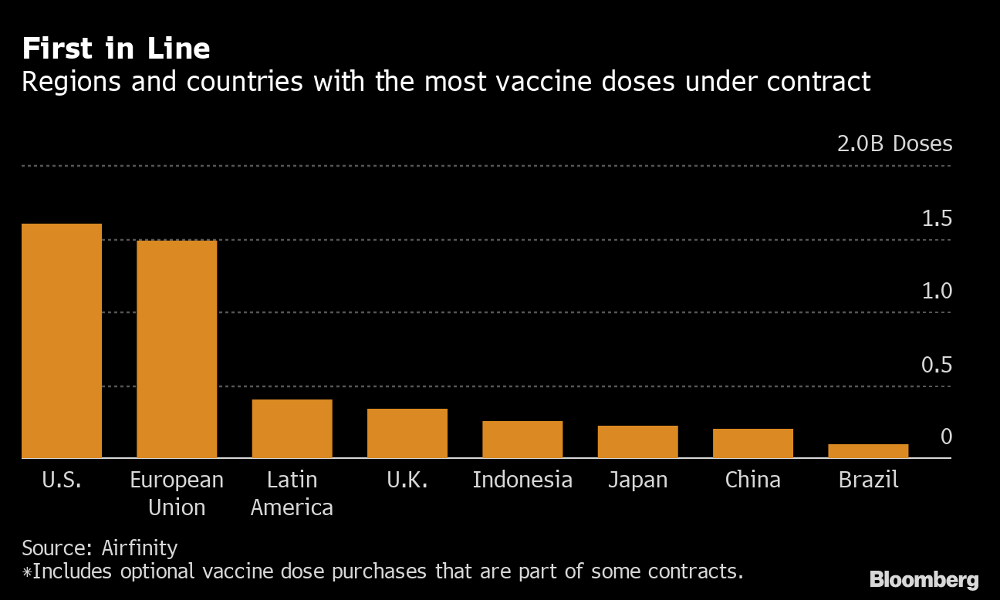

"[13% of developed wealthy nations have already claimed of over 50% from possible vaccine candidates, for their citizens](https://www.livemint.com/news/world/rich-nations-representing-13-of-population-bought-off-52-of-covid-vaccines-report-11600417915134.html)" - Oxfam
 
Since the beginning of the pandemic, poorer nations have been worried about their chances to obtain vaccines at the time of need. This has led to many countries like India, Thailand to develop their own vaccines. The current count of vaccine developers in the world is roughly 170 but according to Airfinity, the count is around 280 - including about 50 in lower-income nationals such as Turkey, Egypt, Kazakhstan.

There’s also the feeling of “not wanting to be left out”. One doesn’t want to depend on the largess of other countries to protect their own people. 

## Concern for “Vaccine Nationalism”

Even if every single vaccine currently in Phase 3 trials is successful, we will still not have enough vaccines for about half of the world's population that consists of poor countries. Which begs for a massive uptake in production all over the world. 

Poor countries will be left out in the cold.

An estimated one billion vaccine doses have to be manufactured just to vaccinate workers in health care and other essential industries globally, assuming that only a single dose is required.

The ones who actually turn out to be successful in a timely manner will be in great demand, especially from countries that have entered into advance agreements to enable increased supplies for more money. This would further drive up the prices of the vaccine, making it potentially unaffordable for a large number of countries.

And if the past is to take into account, the memories of 2009 swine flu outbreak still breeds fear, when vaccines barely made their way past the top tier of wealthy countries. Many countries in Africa had no access to these vaccines for months. Later on, US and some European countries finally agreed to release 10% of their stocks for other countries, but only after it had become evident that they didn’t need vaccines for them any longer.

Similarly, when anti-retrovirals were found to treat HIV, rich countries were able to supply it to its people whereas in poor countries, people continued dying without it, because prices weren't affordable. And, in Africa, which was the worst affected region, these drugs were unavailable for several years after being developed in the 1990s. Even when they were first introduced in 2006, the early versions weren’t as effective there as in high-income nations, although subsequent shots have yielded positive results.

## Why do countries hoard vaccines?

The coronavirus vaccine is being used by governments across the world as an opportunity to make an impression on their own people, as well as the international community. 
 
To their citizens, the governments want to show how concerned they are about their safety and health, for which they would likely want to hoard as many vaccines as they potentially can. 
They also want to flaunt their scientific capability and expertise, in front of their international neighbours. 
 
This is also the reason why China and Russia have gone ahead in approving vaccines that have not yet completed necessary trials to prove they are safe and effective. And why Donald Trump is promising vaccine distribution in early November, just when the voting session begins. 
 
There are political dividends for declaring oneself the first one to develop a vaccine.

## Call for equitable vaccine distribution

The task of producing vaccines for the 7.1 billion population, has motivated countries to prepare for large-scale production, as well as pitted them against one another amid fears of a potentially limited vaccine supply. 

While Brazil, China, and India all have large vaccine industries, they also have the largest populations in the world, and they could reserve their vaccine supplies for their own citizens before opening them up to others. Some other countries are seeking to [strike monopoly agreements](https://www.brookings.edu/blog/future-development/2020/04/24/funding-the-development-and-manufacturing-of-covid-19-vaccines-the-need-for-global-collective-action/?utm_campaign=brookings-comm&utm_source=hs_email&utm_medium=email&utm_content=87098309) with vaccine manufacturers to avoid domestic shortages. Brazil, US, and the European Union have all struck deals with AstraZeneca for hundreds of millions of doses of the University of Oxford vaccine. 

Experts including CFR’s Bollyky have warned that [bidding wars](https://jamanetwork.com/journals/jama/fullarticle/2765944?resultClick=1) over a vaccine will lead to inequitable distribution and, ultimately, fail to eliminate the risk of new outbreaks.

The hard truth is that there is limited capacity to produce a vaccine. The wait for a vaccine for these countries could get prolonged because whatever doses are produced in the first few months or years would have to be sent to the richer countries to fulfil the contractual obligations.

And, if some parts of the world continue to reel under the epidemic, due to lack of access to the vaccine, it would result in keeping the virus in circulation for a much longer time than necessary. That would mean that other countries too would remain at risk, at least economically if not health-wise, as it would lead to continued disruptions in global supply chains due to movement, work and trade restrictions in large parts of the world.

"Covid-19 anywhere is Covid-19 everywhere." - Robert Silverman of Oxfam America said.

Companies are investing billions and are fast-tracking the process of vaccine development and of course they would want to make the most of this opportunity and rightfully, deserve to be compensated. But that doesn’t mean it has to come as the cost of lives of people who cannot afford or even access the vaccine. 

The current need is for a solution that advocates the following -
1. More transparency in biotech companies and their systems
2. Sharing technology with the world and limiting patent protection, to ramp up production, when the need arises. 
3. Public health agencies play critical roles in vaccine research, supplying funds to develop a COVID-19 vaccine. A reminder here, is that a huge chunk of public money was also invested in building these vaccines. 
 
Wealthier countries under-writing making doses available to countries who are less likely to afford them. Not everyone will be able to access it, but the priority here is to ensure that front line workers, elderly people etc. have access to it.  An ideal situation would involve ensuring that the vaccines are first made available to whoever needs them the most. 

## Global Vaccine Plan

In June, the WHO, CEPI, and Gavi launched COVAX, a global initiative seeking more than $18 billion in funding to procure two billion doses of a vaccine by the end of 2021.
172 economies are now discussing the possibility of participating in COVAX, a global initiative aimed at working with vaccine manufacturers to provide countries worldwide equitable access to safe and effective vaccines, once they are licensed and approved. 

Currently, COVAX has the world’s largest and most diverse COVID-19 vaccine portfolio - including nine candidate vaccines, with a further nine under evaluation and conversations underway with other major producers.

The goal of COVAX is by the end of 2021 to deliver two billion doses of safe, effective vaccines that have passed regulatory approval and/or WHO prequalification. They aim to provide these vaccines to all participating countries, proportional to their populations, with the priority on healthcare workers and then expand to cover vulnerable groups, such as the elderly and those with pre-existing, comorbid conditions. 

While, this is certainly a step in the right direction. But it's actual effectiveness remains a question. 

COVAX doesn’t prevent countries from signing their own independent deals with manufacturers, which can possibly put a strain on the already limited supply. Countries realise that the division of vaccines will leave them with only a small fraction, thus their need to seek independent deals with manufacturers still remains. Moreover, the count of 2 billion doses is a small number, when we consider the fact that the vaccines currently in Phase 3 trials require 2-3 doses to confer immunity. 

By itself, COVAX isn’t enough. The need is for a global commitment and better framework for how governments will upscale manufacturing and distribution in a safe and effective way.

